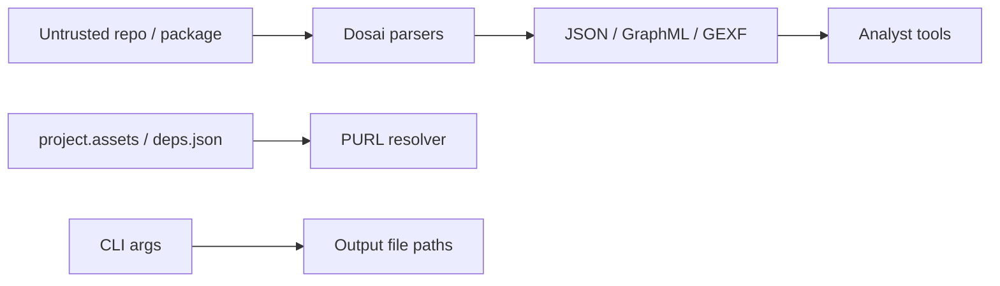

# Dosai Threat Model

## Scope

This threat model covers Dosai as a local/CI analysis tool that parses .NET source code, assemblies, NuGet restore metadata, and package files to produce JSON and graph outputs.

## Assets

| Asset                                     | Security goal                                                                      |
| ----------------------------------------- | ---------------------------------------------------------------------------------- |
| Analyst workstation / CI runner           | Avoid code execution, path traversal, resource exhaustion beyond expected analysis |
| Source code and assemblies under analysis | Preserve confidentiality and integrity                                             |
| Generated JSON/graph outputs              | Maintain accuracy and prevent misleading metadata injection                        |
| Package/PURL metadata                     | Preserve supply-chain correlation correctness                                      |
| Temporary files and output paths          | Avoid unsafe writes/deletes                                                        |

## Trust boundaries



## Entry points

- `methods --path <file|directory|nupkg>`
- `dataflows --path <file|directory>`
- `--patterns <json>`
- `--o`, `--callgraph-out`, `--graph-out`
- assembly loading/reflection for managed assemblies
- source parsing via Roslyn
- XML/graph consumers downstream

## Threats and mitigations

| Threat                                   | Scenario                                                            | Existing mitigation                                                                                                                                    | Future hardening                                 |
| ---------------------------------------- | ------------------------------------------------------------------- | ------------------------------------------------------------------------------------------------------------------------------------------------------ | ------------------------------------------------ |
| Arbitrary code execution during analysis | Malicious assembly triggers code execution                          | IL call graph and data-flow analysis read metadata and method bodies; reflection inventory avoids running target code intentionally                    | Prefer metadata-only loading everywhere possible |
| Dependency load confusion                | Analyzer resolves unexpected local assemblies                       | Search paths are local to target/runtime, and `.deps.json` scoping prefers project assemblies in app output directories                                | Add strict mode limiting assembly load roots     |
| Path traversal in nupkg extraction       | Malicious archive entry writes outside temp dir                     | Current extraction should be reviewed for canonical path checks                                                                                        | Add explicit full-path containment validation    |
| Resource exhaustion                      | Huge source tree or malformed syntax                                | Roslyn parsing may consume memory/CPU                                                                                                                  | Add timeout/max-file/max-size options            |
| Output injection                         | Source strings appear in GraphML/GEXF                               | XML output uses escaping; Mermaid labels are escaped                                                                                                   | Add tests for more special characters            |
| False confidence                         | Missing refs or inferred runtime behavior produce incomplete graphs | Invalid-operation fallback captures some legacy cases; evidence kinds separate direct, framework, reflection, and heuristic facts; diagnostics emitted | Add more confidence scores per edge and slice    |
| PURL misattribution                      | Namespace prefix maps to wrong package                              | Longest-prefix best-effort matching                                                                                                                    | Add ambiguity list in diagnostics                |
| Pattern abuse                            | User pattern regex causes backtracking                              | Regex patterns are supported                                                                                                                           | Add regex timeout                                |

## Data-flow specific risks

Dosai data-flow slices are triage artifacts, not proof of exploitability.

False positives can occur when:

- validation/sanitization is not modeled or a custom validator has different semantics than a configured sanitizer pattern
- a variable is tainted by name but constrained by control flow
- syntax fallback captures an unresolved API shape
- inferred framework, DI, dispatch, or reflection evidence over-approximates runtime behavior

False negatives can occur when:

- flow crosses method boundaries without explicit passthrough
- taint is stored in object graphs not tracked field-sensitively
- dynamic/reflection calls hide sink invocations
- dynamic framework dispatch is driven by configuration not visible in source or IL metadata

## Supply-chain/PURL risks

PURL fields correlate symbols to packages using restore/deps metadata. They do not imply vulnerability by themselves.

Recommended analyst workflow:

1. Match `Purls[]` against vulnerability intelligence.
2. Confirm package version from SBOM/package manager.
3. Review slice code and endpoint exposure.
4. Verify exploitability manually.

## Security objectives

- Do not execute analyzed code.
- Do not write outside requested output paths/temp directories.
- Keep graph outputs structurally valid.
- Make uncertainty visible through diagnostics and metadata.
- Preserve enough source location data for human review.

## Non-goals

- Perfect static vulnerability detection.
- Full interprocedural alias analysis.
- Runtime exploit simulation.
- Replacement for SAST, SCA, or manual review.

## Abuse cases

```text
Attacker publishes malicious repo
        │
        ▼
CI runs dosai on PR/source
        │
        ├── tries parser crash / DoS
        ├── tries graph output injection
        ├── tries path traversal in package archive
        └── tries misleading package metadata
```

Dosai should fail closed where feasible: preserve host safety, emit diagnostics, and avoid producing malformed output.
