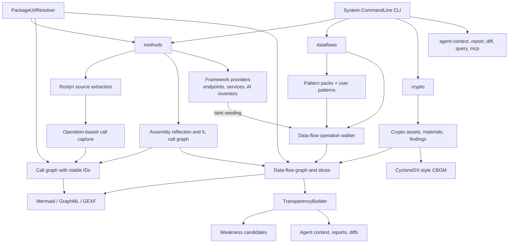
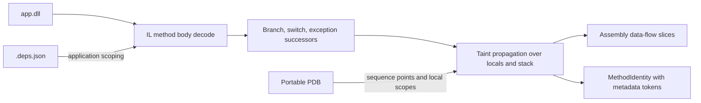
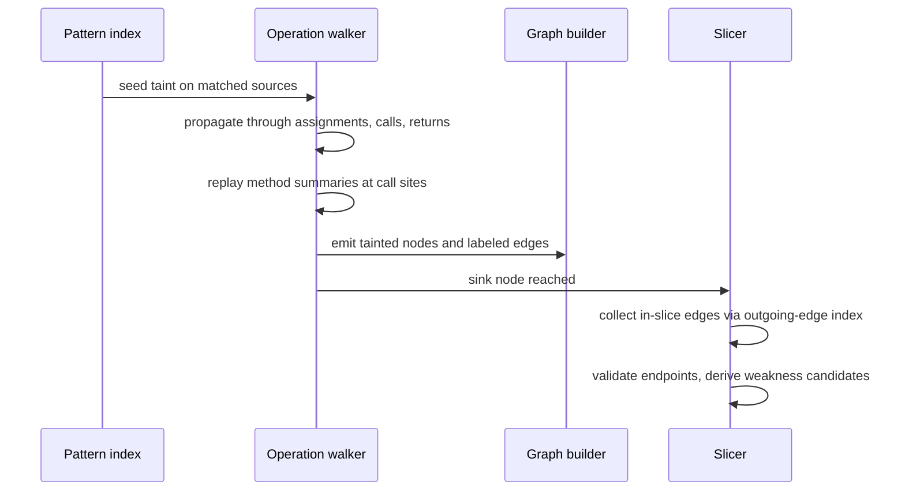
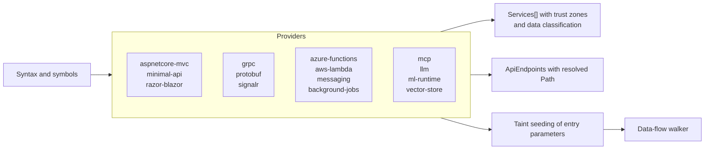
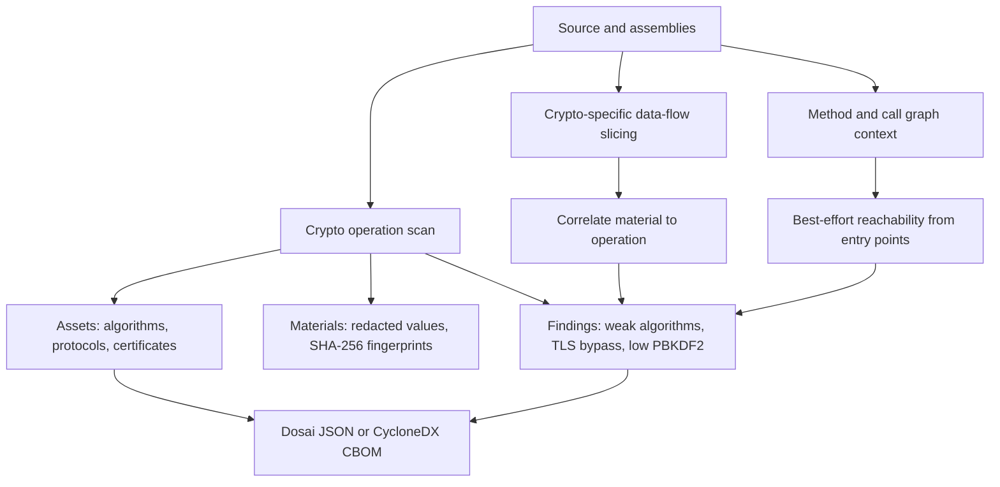

# Architecture overview

Dosai turns .NET inputs into review evidence through a small number of cooperating stages: frontends that understand inputs, a shared evidence model, analysis engines that derive facts, and a transparency layer that packages those facts for humans, scripts, and agents. This page walks through those stages with diagrams. The [compiler engineering notes](compiler-engineering.md) go one level deeper into implementation details.

## The whole system in one picture

```text
┌──────────────────────────────────────────────────────────────────────────────┐
│                                    Inputs                                    │
│   .cs / .vb        .dll / .exe         .nupkg        .fs / .R / .c / .cpp    │
└──────┬──────────────────┬──────────────────┬─────────────────────┬──────────┘
       │                  │                  │ (extract entries)   │
       ▼                  ▼                  └──────────┬─────────┘
┌─────────────┐    ┌──────────────┐    ┌───────────────────▼──────────────────┐
│   Roslyn    │    │  Reflection  │    │            Language frontends        │
│  operation  │    │  + IL method │    │  F# compiler service, Rscript parser,│
│   walkers   │    │  body decode │    │  conservative VC++ extraction        │
└──────┬──────┘    └──────┬───────┘    └───────────────────┬──────────────────┘
       │                  │                                │
       ▼                  ▼                                ▼
┌──────────────────────────────────────────────────────────────────────────────┐
│                        Unified evidence model                                │
│   Methods  MethodCalls  CallGraph  ApiEndpoints  Services  AiComponents      │
│   DataFlow nodes/edges  MethodSummaries  AssemblyInformation                 │
│   every record carries evidence kind, confidence, and PURL where known       │
└──────┬───────────────────────────────────────────────────────────────────────┘
       │
       ▼
┌──────────────────────────────────────────────────────────────────────────────┐
│                          Analysis engines                                    │
│   DataFlowAnalyzer        CryptoAnalyzer        Framework providers          │
│   taint + slicing         assets/materials      route + trust zones          │
│   pattern packs           misuse findings       taint seeding                │
└──────┬───────────────────────────────────────────────────────────────────────┘
       │
       ▼
┌──────────────────────────────────────────────────────────────────────────────┐
│                        Transparency layer                                    │
│   EntryPoints  PackageReachability  DangerousApiReachability                 │
│   WeaknessCandidates (CWE mapped)   AgentContext   reports   diffs           │
└──────┬───────────────────────────────────────────────────────────────────────┘
       │
       ▼
┌──────────────────────────────────────────────────────────────────────────────┐
│                                 Outputs                                      │
│   dosai JSON   CycloneDX CBOM   Mermaid / GraphML / GEXF   Markdown   MCP    │
└──────────────────────────────────────────────────────────────────────────────┘
```

The same evidence model serves every output, which is why a weakness candidate, a GraphML edge, and an MCP tool response can all reference the same slice ID.

## Component flow



## Inputs and frontends

Dosai accepts four broad input shapes and normalizes them into one model.

| Input                   | Frontend                    | Notes                                                                     |
| ----------------------- | --------------------------- | ------------------------------------------------------------------------- |
| C# and VB source        | Roslyn `IOperation` walkers | Full compilation with metadata references for cross-file symbol binding   |
| Managed `.dll` / `.exe` | Reflection plus IL decode   | Call graph and data flow reconstructed from method bodies, never executed |
| `.nupkg` archives       | Temporary extraction        | Relevant entries unpacked to a temp directory, then analyzed as usual     |
| F#, R, VC++/C/C++       | Dedicated frontends         | Conservative evidence that tolerates missing project metadata             |

The frontends degrade gracefully. When a legacy project cannot compile cleanly because framework assemblies are missing, Roslyn still produces `IInvalidOperation` trees and Dosai matches sinks on syntax as a fallback, so high-value flows survive. Assembly analysis prefers project assemblies over framework internals by reading adjacent `.deps.json` files.



## Method identity and evidence

Every method gets a stable identity that includes containing type, name, parameter types, and return type for non-constructors. Ids never contain absolute paths, line numbers, or timestamps, so the same tree analyzed on two machines produces identical ids and meaningful diffs.

```text
Namespace.Type.Method(ParameterType1,ParameterType2):ReturnType
Namespace.Type<T>..ctor(T)
```

Because evidence arrives from several engines, every record can say where it came from. The `AnalysisEvidenceKind` enumeration distinguishes direct observations from summaries and heuristics:

```text
SourceRoslynDirect            AssemblyIlDirect
SourceRoslynSummary           AssemblyIlSummary
SourceRoslynVirtualCandidate  AssemblyIlVirtualCandidate
SourceRoslynDelegateTarget    AssemblyIlDelegateTarget
                              AssemblyIlGeneratedState
ExternalSummary   FrameworkModel   ReflectionHeuristic   LanguageFrontend
```

Direct and summary evidence outranks candidates and heuristics when records merge. This is what lets source and binary analysis combine into one picture instead of two unrelated views.

## The data-flow engine

The engine is a pragmatic, symbol-aware taint slicer, not a full SSA solver. One pass of the walker follows this lifecycle:



Taint enters from matched parameters, attributes, request objects, CLI arguments, and framework entry points. It moves through local variables, field and property assignments with receiver-sensitive keys, passthrough calls, object creation, return values, and simple interprocedural summaries that record parameter-to-return and parameter-to-sink relationships for local helpers. Sanitizer patterns stop flow, and validator guards such as `Regex.IsMatch` suppress taint on the validated branch while preserving the unvalidated branch.

```text
   source seed            propagation                sink
┌──────────────┐   ┌──────────────────────┐   ┌───────────────────┐
│ args (cli)   │──▶│ cmd = args[0]        │──▶│ Process.Start(cmd)│
│              │   │ ToString(), Concat() │   │ weakness CWE-78   │
│ [HttpGet] id │   │ helper summaries     │   │ confidence High   │
└──────────────┘   └──────────────────────┘   └───────────────────┘
        │                    │
        │            sanitizer match
        │                    ▼
        │            ┌──────────────────────┐
        └───────────▶│ stop taint, or       │
                     │ suppress validated   │
                     │ branch only          │
                     └──────────────────────┘
```

## Framework providers

Framework detection is a provider model rather than name matching. Each provider emits services with resolved routes, a confidence tier, and a trust zone, and seeds taint on framework entry-point parameters so data-flow analysis sees them as sources.



Confidence is tiered honestly. A symbol-resolved base type is `high`, an attribute or name match is `medium`, and textual inference is `low`. Providers never silently promote a heuristic to high confidence, and `Authenticated` stays null unless anonymous access is positively established.

## The crypto pipeline

The crypto analyzer reuses the method and call-graph context for reachability, runs its own operation scan, and correlates material sources to crypto operations with data-flow slices.



Material values are never emitted in the clear. Dosai emits redacted values and fingerprints, and reachability is best effort by design: it must never fail the analysis, only enrich it.

## Performance architecture

The data-flow path is expected to run against whole source trees in CI, so the hot loop is indexed end to end.

```text
patterns ──▶ DataFlowPatternIndex ──▶ pre-split by role and hot lookup kind
syntax   ──▶ cached text per node  ──▶ materialized only for code-like matches
edges    ──▶ de-duplicated set     ──▶ indexed by source node for slices
assembly ──▶ .deps.json scoping    ──▶ project assemblies preferred
```

Slice construction walks trace nodes and pulls in-slice edges from the outgoing-edge index, keeping it near-linear in trace size rather than scanning every graph edge per slice. Repository CI runs `dataflows --path ./Dosai` as a scaling regression guard, and the harness documented in `scripts/README.md` measures precision and runtime when the pipeline changes.

## Output contracts

Three JSON shapes carry almost everything: `MethodsSlice` for inventory, `DataFlowResult` for flows and derived facts, and the crypto result with its CycloneDX mapping. Schema evolution is explicit through `Metadata.SchemaVersion`, and output-visible changes are documented per version in the [migration guide](migration-4.0.md). Graph exporters guarantee that every edge endpoint exists as a node, and XML exports escape source-derived text so output injection is not a vector.

## Where to extend

The cleanest extension points are custom data-flow [patterns](dataflow-patterns.md) and [pattern packs](pattern-packs.md) for new source and sink knowledge, framework providers for new hosting surfaces, and crypto misuse rules for new weakness classes. The [compiler engineering notes](compiler-engineering.md) close with the current limitation list and recommended next steps for analyzer work.
