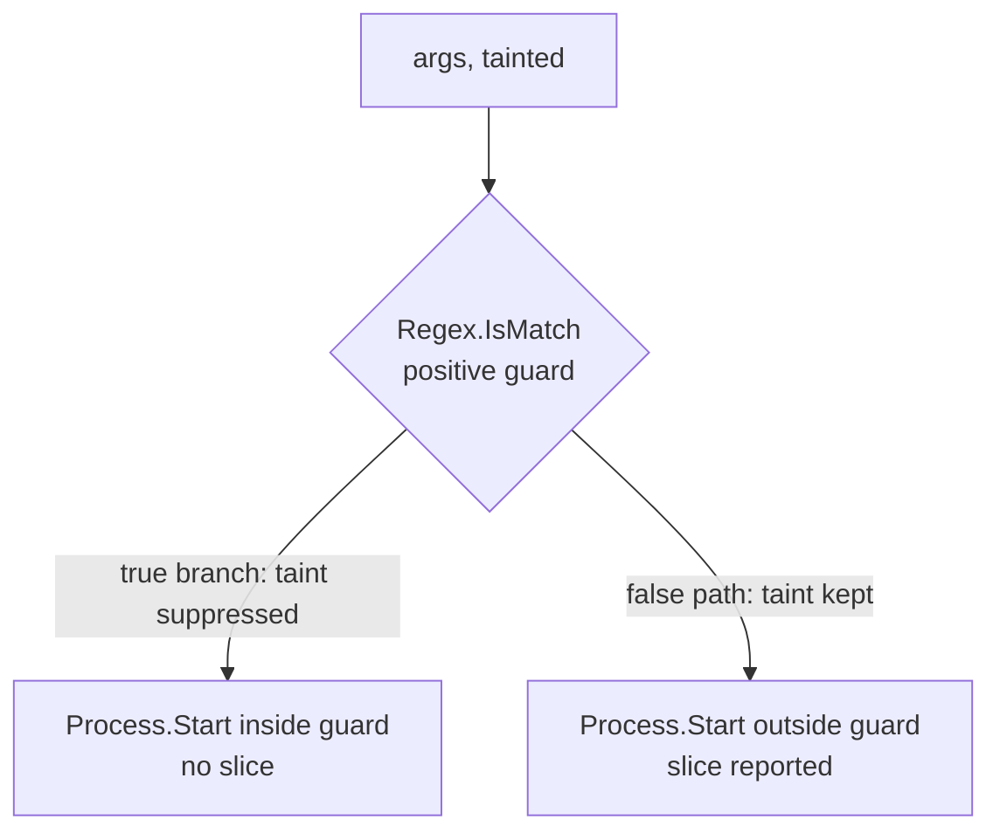

# Lesson 1. Your first data-flow slice

## Learning objective

In this lesson we generate a source-to-sink data-flow slice, read it like a stack trace, inspect its JSON, and see how a validator changes the result. The vulnerability class is command injection, CWE-78, because the flow is short enough to verify by eye.

## Prerequisites

```text
.NET SDK 8.0 or newer
The Dosai repository cloned locally
```

## Create a vulnerable app

```bash
dotnet new console -o /tmp/injector
cat > /tmp/injector/Program.cs << 'EOF'
using System.Diagnostics;

string command = args[0];
Process.Start(command);
EOF
```

The whole app is four lines. Whatever the user passes on the command line goes straight to `Process.Start`, and two of the built-in always-on patterns apply to it: the CLI entry point is a `cli` source and `Process.Start` is a `command` sink. The program has no declared `Main`, but the compiler synthesizes `<Main>$` for top-level statements, Dosai reports it as a method and a `Cli` entry point whose id matches the call graph node, and its `args` parameter is seeded as the source.

## Run the analysis

```bash
dotnet run --project ./Dosai/Dosai.csproj -- dataflows \
  --path /tmp/injector \
  --o /tmp/injector-dataflows.json \
  --print
```

You should see a summary line and one stack-trace-style path:

```text
Dosai Data-flow Analysis
Summary: 1 flow, 1 source, 1 sink, 1 file analyzed, 1 weakness candidate
Output: /tmp/injector-dataflows.json
Data-flow stack traces:
└─ DataFlow dfs1: cli → command (Medium)
   Summary: cli data reaches command sink Start.
   Argument[0]: command
   PURLs: pkg:nuget/System.Diagnostics.Process
   Stack (3 frames, 3 transitions):
     at Source/cli args [dfn1] in Program.cs:4:5
        code: args
        symbol: string[] args
     via VariableAssignment [dfe1] from dfn1 to dfn2 in Program.cs:5:13 label=command
     at Assignment command [dfn2] in Program.cs:5:13
        code: command = args[0]
     via SinkArgument [dfe3] from dfn2 to dfn3 in Program.cs:6:9 label=fileName
     at Sink/command Start [dfn3] in Program.cs:6:9
        code: Process.Start(command)
        symbol: System.Diagnostics.Process.Start(string)
```

Read it from the top. The `at` frames are places where the tainted value lives, and the `via` lines are the transitions between them. The confidence in parentheses is `Medium` here. Confidence and severity answer different questions: confidence tracks how well the flow is tied to an entry point, while severity (`info`, `low`, `medium`, `high`, defaulted by sink category) says how much risk the sink class carries, and both live on the slice and weakness records in the JSON and the report. Because the synthesized `<Main>$` entry point matches the call graph node, this program also gets an exploit chain linking the CLI entry point to the sink, with exposure `cli`.

## What the JSON looks like

The printed trace is a presentation. The JSON is the record, and the slice inside it follows this shape:

```json
{
  "Id": "dfs1",
  "SourceId": "dfn1",
  "SinkId": "dfn3",
  "NodeIds": ["dfn1", "dfn2", "dfn3"],
  "EdgeIds": ["dfe1", "dfe3"],
  "SourceCategory": "cli",
  "SinkCategory": "command",
  "SourcePurl": null,
  "SinkPurl": "pkg:nuget/System.Diagnostics.Process",
  "Purls": ["pkg:nuget/System.Diagnostics.Process"],
  "SinkArgument": "command",
  "SinkArgumentIndex": 0,
  "Severity": "high",
  "Summary": "cli data reaches command sink Start."
}
```

`SinkArgumentIndex` tells you which argument received the taint. A value of `-1` means the tainted value was the receiver object itself, as in `model.File.CopyTo(stream)`. `Severity` is one of `info`, `low`, `medium`, or `high`, defaulted by sink category; a custom pattern can override it, and a match from a Low-confidence pattern is demoted one rank so heuristic matches cannot trip a high-severity gate on their own.

## The weakness candidate

Because the sink category is `command`, Dosai derives a weakness candidate of kind `CommandInjectionCandidate` with CWE-78, a severity, a confidence, reasons for that confidence, the source and sink locations, and the PURLs involved. Weakness candidates are review artifacts, not verdicts: they tell you where to look, and the slice is the evidence you use to decide.

```text
   args ──▶ command = args[0] ──▶ Process.Start(command)
    │                                  │
    │ source: cli                      │ sink: command
    │                                  │
    └──────── weakness candidate ──────┘
              CommandInjectionCandidate
              CWE-78, severity high
```

## Watch a validator change the story

Add a guard and a second, unguarded sink:

```csharp
using System.Diagnostics;
using System.Text.RegularExpressions;

string command = args[0];

if (Regex.IsMatch(command, @"^[a-zA-Z0-9\-\.]+$"))
{
    Process.Start(command);   // validated branch
}

Process.Start(command);       // unvalidated
```

Run the same command again. The sink inside the guarded branch is suppressed because `Regex.IsMatch` is an always-on validator and the condition is a positive guard. The sink outside the guard still produces a slice. This is branch-aware sanitizer behavior: validation suppresses taint on the validated path while the unvalidated path keeps its taint, which is exactly how a reviewer wants to see it.

Nothing is hidden when a guard suppresses a flow. Every suppressed slice is recorded in `SanitizedFlows[]` as negative evidence, with the sanitizer symbol or guard, its location, and which taint kinds it removed. When a flow you expected is missing, `sanitizedFlows` in the query language answers "where did it go" without re-reading the code.

One more thing to know about regexes: the literal pattern above is safe because it is anchored and bounded, but a catastrophically backtracking literal such as `"(a+)*$"` is itself detected statically and reported as a `ReDoSCandidate` weakness (CWE-1333, severity medium). `RegexOptions.NonBacktracking` or an explicit match timeout suppresses that finding.



Real allow-list helpers are not `Regex.IsMatch`. When your codebase validates through a custom method, teach the analyzer about it with a [sanitizer pattern](dataflow-patterns.md), and the validated branches will be suppressed the same way. And when a reviewer looks at a finding and accepts it, record that decision in a suppressions file (`--suppress`) rather than deleting it from memory: entries match on file plus line, slice key, weakness id, or category, and an optional `expires` date resurfaces the finding later, which turns the file into a review backlog.

## Try next

Filter the JSON with the query language, then move on to [lesson 2](LESSON2.md) for a web-shaped flow with SQL sinks and parameterization sanitizers.

```bash
dotnet run --project ./Dosai/Dosai.csproj -- query \
  --input /tmp/injector-dataflows.json \
  --query 'slices[sinkCategory=command]' \
  --o /tmp/command-slices.json

dotnet run --project ./Dosai/Dosai.csproj -- query \
  --input /tmp/injector-dataflows.json \
  --query 'weaknesses[severity=high] count' \
  --o /tmp/high-count.json
```
