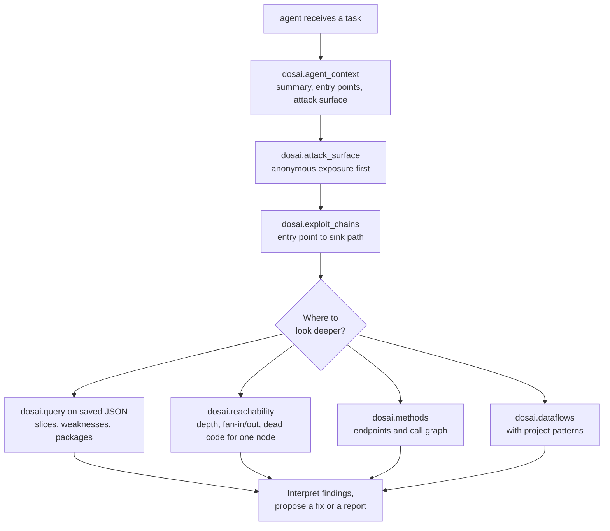

# Lesson 10. Driving Dosai from an AI agent over MCP

## Learning objective

In this lesson we run the Dosai MCP server, walk an agent through a triage loop with real tool calls, and close with the two operational rules that keep the setup safe and cheap: path confinement and prompt-size discipline.

## Start the server

The `mcp` command is a line-delimited JSON-RPC server over stdin and stdout. No network, no daemon, just a process an agent can spawn:

```bash
printf '{"jsonrpc":"2.0","id":1,"method":"tools/list"}\n' | \
  dotnet run --project ./Dosai/Dosai.csproj -- mcp --path ./src
```

Ten tools come back:

| Tool                   | Answers                                                                          |
| ---------------------- | -------------------------------------------------------------------------------- |
| `dosai.methods`        | What is here: methods, endpoints, services, call graph, reachability, dead code  |
| `dosai.dataflows`      | Where can untrusted input go: slices, weaknesses, exploit chains, attack surface |
| `dosai.crypto`         | Crypto assets, materials, findings, CBOM                                         |
| `dosai.agent_context`  | Compact triage context, including a bounded attack-surface view                  |
| `dosai.services`       | Service inventory with trust zones and data classification                       |
| `dosai.ai_components`  | Models, MCP tools, prompts, agents                                               |
| `dosai.exploit_chains` | Entry point to sink chains with exposure classification                          |
| `dosai.attack_surface` | Entry points grouped by exposure with the chains and weaknesses that reach them  |
| `dosai.reachability`   | Per-node reachability facts; pass `nodeId` for one node                          |
| `dosai.query`          | Filter any Dosai JSON to just the relevant records                               |

Call one for real:

```bash
printf '{"jsonrpc":"2.0","id":2,"method":"tools/call","params":{"name":"dosai.agent_context","arguments":{"path":"./src","patternPacks":"all"}}}\n' | \
  dotnet run --project ./Dosai/Dosai.csproj -- mcp --path ./src
```

The response's `result.content[0].text` is a JSON string holding the artifact. Agents should parse the outer JSON-RPC envelope first, then parse the text payload as JSON.

## The agent loop

The loop that works in practice starts broad and cheap, then pays for detail only where it matters:



Concretely, an agent triaging an injection report would call `dosai.agent_context` once, read the suggested next commands and the attack-surface view, pull the route-to-sink path with `dosai.exploit_chains`, then call `dosai.query` with `slices[sinkCategory=command]` against the data-flow JSON, and only then open the three or four files the slice points at. When a specific method needs context (how deep is it, who calls it, is it dead), `dosai.reachability` with its `nodeId` argument answers in one small payload. The agent never loads the source tree into context, and it never queries vulnerability databases, because Dosai intentionally does not either.

## Prompt-size discipline

Full `dataflows` JSON can be large. The ordering that keeps prompts small is: `agent-context` first, `attack_surface` and `exploit_chains` to scope, `reachability` with a `nodeId` for single-method facts, `query` for exact records, `report` when a human handoff is needed, and full `dataflows` or `methods` JSON only when exact nodes, edges, and method summaries matter. `dosai.query` can also generate and filter in one step when `input` is omitted, which saves a round trip, and aliases like `exploitChains`, `sanitizedFlows`, `attackSurface`, and `deadCode` keep each response to one collection.

## Confine the server

Tool output carries source-derived text: code snippets, endpoints, raw URLs, and hardcoded secrets that appear in data-flow nodes. Treat the server as a read-capable channel into every directory it can reach, and confine it when the client is not fully trusted:

```bash
dotnet run --project ./Dosai/Dosai.csproj -- mcp \
  --mcp-root /workspace/app \
  --path /workspace/app
```

With `--mcp-root` set, every `path` argument and the `input` file of `dosai.query` must resolve under that directory, or the tool call fails. A second flag bounds what the transport-integrity analysis treats as approved: `--mcp-allowlist FILE` lists the stdio transport commands (one per line) your policy allows, and MCP transport findings mark anything outside it. Two defaults stay locked regardless of flags: prompt text is never exposed through MCP, and the server is designed for local stdio use, not as an authenticated network service.

```text
   Agent (trusted client)
        │  JSON-RPC over stdio
        ▼
   ┌─────────────────────┐
   │ dosai mcp           │
   │ --mcp-root /ws/app  │
   └─────────┬───────────┘
             │ every path must resolve under /ws/app
             ▼
   /ws/app/source  /ws/app/tests    other paths: tool call fails
```

## The threat model in one paragraph

An agent that can point Dosai at any path is an agent that can read any path. Confinement turns that from a matter of trust into a matter of configuration, and the redaction defaults mean the output leaks less than a `cat` of the same tree would. For the full exposure analysis, read the [threat model](THREAT_MODEL.md), and for agent-side orchestration patterns beyond MCP, read the [automation workflows guide](agent-workflows.md).

## What this lesson taught

MCP turns Dosai from a command you run into a service an agent can reason with. The agent-context-first loop keeps prompts small, the query tool keeps payloads exact, and `--mcp-root` keeps the blast radius of a misbehaving client inside one directory.
