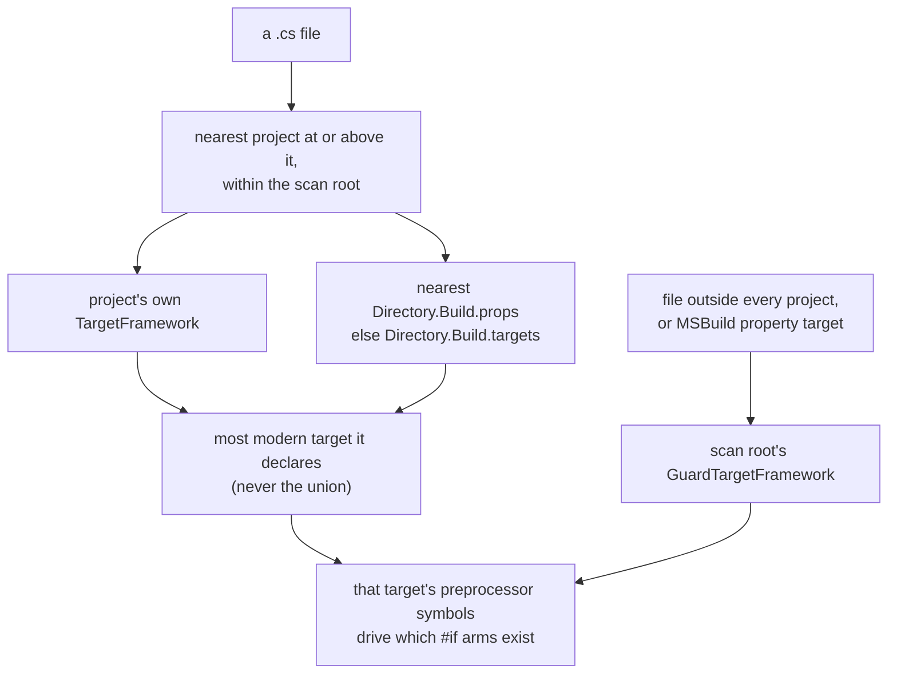

# Lesson 11. A whole solution in one scan

## Learning objective

In this lesson we scan a solution whose projects target different frameworks, verify which `#if` arms each project kept, read the call graph's names for lambdas and local functions, and see what Dosai does with a tree that carries its own API stubs. These are the situations that decide whether a whole-repository scan tells the truth, because each of them used to silently remove or merge real code.

## Prerequisites

```text
.NET SDK 11.0 or newer
The Dosai repository cloned locally
```

## Create a mixed-target solution

Real repositories rarely target one framework. A legacy library stays on .NET Framework, a plugin ships a netstandard2.0 build, the application moves to modern .NET, and a linked file sits outside every project. Recreate that shape in four small projects so the behavior is observable rather than asserted:

```bash
mkdir -p /tmp/mixed/Legacy/Internal /tmp/mixed/Modern/Sub /tmp/mixed/Modern/Plugins /tmp/mixed/Shared

cat > /tmp/mixed/Legacy/Legacy.csproj << 'EOF'
<Project Sdk="Microsoft.NET.Sdk">
  <PropertyGroup>
    <TargetFramework>net48</TargetFramework>
  </PropertyGroup>
</Project>
EOF

cat > /tmp/mixed/Modern/Modern.csproj << 'EOF'
<Project Sdk="Microsoft.NET.Sdk">
  <PropertyGroup>
    <TargetFramework>net8.0</TargetFramework>
  </PropertyGroup>
</Project>
EOF

cat > /tmp/mixed/Modern/Plugins/Plugin.csproj << 'EOF'
<Project Sdk="Microsoft.NET.Sdk">
  <PropertyGroup>
    <TargetFramework>netstandard2.0</TargetFramework>
  </PropertyGroup>
</Project>
EOF
```

Now put the same guard-shaped class in five places, renaming the class to match its file: `Legacy/LegacyCode.cs`, `Legacy/Internal/LegacyInternal.cs`, `Modern/Sub/ModernSub.cs`, `Modern/Plugins/Plugin.cs`, and `Shared/Linked.cs`, which deliberately belongs to no project.

```csharp
public static class LegacyCode
{
#if NETFRAMEWORK
    public static void FrameworkArm() { }
#elif NETSTANDARD
    public static void StandardArm() { }
#elif NET8_0
    public static void Net8Arm() { }
#else
    public static void OtherArm() { }
#endif
}
```

No project builds, and nothing needs restoring. The point is only that each file belongs to a project with a different target.

## One scan, several guard truths

Point the `methods` command at the root of the tree, the way a whole-solution review does:

```bash
dotnet run --project ./Dosai/Dosai.csproj -- methods \
  --path /tmp/mixed \
  --o /tmp/mixed-methods.json
```

Then look at which method each class kept:

```text
LegacyCode      FrameworkArm    Legacy.csproj is net48
LegacyInternal  FrameworkArm    a project subdirectory follows its project
ModernSub       Net8Arm         Modern.csproj is net8.0
Plugin          StandardArm     Plugin.csproj is netstandard2.0
Linked          Net8Arm         outside every project: the root-wide guard
```

Each file's preprocessor symbols come from its nearest project at or above it within the scan root. That project's own target framework wins; a project that declares none readable inherits from the nearest `Directory.Build.props`, else `Directory.Build.targets`; a project whose target is an MSBuild property reference such as `$(NetCoreAppCurrent)` falls back to the scan root's detection, as files outside every project do. A multi-target project resolves to one representative target, its most modern, and never the union of everything it declares, because a union defines a symbol whenever any target defines it and thereby hides every `#if !SYMBOL` arm, which is the most common shape in real multi-target libraries. A single-file scan (`--path src/App/Program.cs`) reads its project context from the file's own directory, so even one file analyzed alone follows its project instead of a modern-net fallback.



The decisions are reported, not implied. `Metadata.TargetFrameworks` lists every target detected under the root in declaration order, `Metadata.GuardTargetFramework` is the root-wide representative used for project-less files, and on a tree with more than one readable project `Metadata.ProjectGuardTargetFrameworks` lists each project with the target its files' guards used, sorted by path:

```json
"ProjectGuardTargetFrameworks": [
  { "Project": "Legacy/Legacy.csproj", "TargetFrameworks": ["net48"], "GuardTargetFramework": "net48" },
  { "Project": "Modern/Modern.csproj", "TargetFrameworks": ["net8.0"], "GuardTargetFramework": "net8.0" },
  { "Project": "Modern/Plugins/Plugin.csproj", "TargetFrameworks": ["netstandard2.0"], "GuardTargetFramework": "netstandard2.0" }
]
```

Why this matters for review: before guards resolved per project, a net48 project scanned beside a net8.0 one lost its `#if NETFRAMEWORK` members entirely, and a multi-target library like Hangfire.Core (`net451;net46;netstandard1.3;netstandard2.0`) was read as if it were net8.0, erasing members that ship in most of its assemblies. When a whole family of methods is missing from an inventory, check the guard metadata before concluding the code is unreachable.

## Lambdas and local functions get real names

The second whole-solution hazard is quieter. An anonymous function's symbol has no name, so a lambda's call-graph id used to be built from its shape alone, and every same-shaped lambda of a type collapsed into one node. A lambda declared in an unreachable method then looked reachable through its twin in a reachable one, and its callees merged across every member declaring such a lambda. Try the difference:

```csharp
using System;
using System.Linq;

public static class Pipeline
{
    public static void Run(string[] items)
    {
        Func<string, bool> filter = s => s.Length > 2;
        var kept = items.Where(filter).Select(s => s.ToUpper()).ToArray();
        int Helper(string value) => value.Length;
        var lengths = items.Select(Helper);
        Console.WriteLine(kept.Length + lengths.Count());
    }

    public static void Other(string[] items)
    {
        Func<string, bool> filter = s => s.Length > 3;
        Console.WriteLine(items.Count(filter));
    }
}
```

Scan it and list the call graph nodes:

```bash
dotnet run --project ./Dosai/Dosai.csproj -- methods \
  --path /path/to/this/file \
  --o /tmp/lambda-methods.json

dotnet run --project ./Dosai/Dosai.csproj -- query \
  --input /tmp/lambda-methods.json \
  --query 'callGraph.nodes[id~=Pipeline.<]' \
  --o /tmp/lambda-nodes.json
```

The two `Func<string, bool>` lambdas are distinct nodes, each named after the member that declares it, the way the compiler names the methods it generates: `Pipeline.<Run>lambda1(string):bool`, `Pipeline.<Run>lambda2(string):string` for the `Select` projection, `Pipeline.<Other>lambda1(string):bool`, and `Pipeline.<Run>Helper(string):int` for the local function. The declaring member holds a `DelegateInvoke` edge to each lambda it creates, so the callback relationship is an edge you can filter on rather than a guess, and the ordinals come from syntax once per type, so the ids are the same in every run, for every worker count, and on every OS. Query expression clauses get the same treatment (`<Run>query1`), and dead-code reporting excludes all of them as compiler-generated. One related fix lands in the same place: calls in a primary constructor's base-type arguments, `class D() : B(Sink.M())`, were never walked before and now count as the constructor's calls, like a `: base(...)` initializer's.

## Trees that carry their own API stubs

The third hazard comes from trees like dotnet/runtime, which keep a library's public API surface under `ref/` as GenAPI-generated stubs beside the implementation under `src/`. The stub redeclares every type the implementation declares, so one compilation holding both declares each member twice, calls on those members bind ambiguously, and Roslyn resolved the ambiguity differently between runs, which made the call graph itself change from run to run.

Dosai recognizes the shape syntactically, and `Diagnostics` says what it did. A stub whose every type is implemented elsewhere in the tree is skipped. A stub that also declares types nothing else declares is trimmed instead of dropped: the redeclarations are blanked token by token with line breaks, comments, and directives kept, so the API surface only that file describes is still analyzed, the types left keep their line numbers, and a diagnostic names the trimmed files and the types they keep. On all of dotnet/runtime `src` this cut unresolved call sites from 120428 to 66213, because the duplicate declarations had made calls on every public base-class-library type ambiguous. The same pass reports types still declared non-partially by more than one file, which is usually per-platform or per-target variants no single build compiles together. Nothing here requires configuration; the diagnostics exist so that an inventory gap on such a tree reads as a documented decision rather than a mystery.

## What this lesson taught

A whole-solution scan is honest only when conditional compilation, compiler-generated members, and duplicated API surfaces are handled explicitly. Per-project guards keep each project's framework-specific code, member-named lambda nodes keep reachability truthful, and stub partitioning keeps binding deterministic. All three are visible in the output: `ProjectGuardTargetFrameworks` in the metadata, `<Member>lambda` and `<Member>Helper` ids in the graph, and skip, trim, and duplicate-type notes in `Diagnostics`.

## Try next

[Lesson 12](LESSON12.md) stays with large real trees and covers the operational side: reading a `--debug` phase log, the determinism contract, memory behavior, and running Dosai on a host with no .NET at all.
