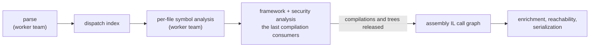

# Lesson 12. Big trees and constrained hosts

## Learning objective

In this lesson we read a `--debug` phase log line by line, learn the parallelism and determinism contract behind every scan, watch where memory goes on a very large tree, prune a tree with `--exclude`, and run Dosai as a self-contained binary on a host that has no .NET at all. This is the operational half of large-tree analysis: lesson 11 covered whether the results are truthful, this one covers how to run them at scale and in awkward places.

## Prerequisites

```text
.NET SDK 11.0 or newer
The Dosai repository cloned locally
Any large .NET repository for the timing exercises (optional but useful)
```

## Read the phase log

Every command accepts `--debug` (or `DOSAI_DEBUG=1` in the environment, for callers that cannot add an argument). It costs a little stderr noise and changes nothing in the JSON. Run it on the Dosai tree itself, which is big enough to show every phase and small enough to finish fast:

```bash
dotnet run --project ./Dosai/Dosai.csproj -- methods \
  --path ./Dosai \
  --o /tmp/dosai-methods.json \
  --debug
```

The log that matters looks like this, trimmed to the interesting lines:

```text
[dosai +0.005s] dosai 5.0.0.0, .NET 11.0.0-rc.1..., macOS 15.8.1 Arm64, 14 processor(s)
[dosai +0.111s] discovered under '.../Dosai': 81 .cs; 6 skipped in obj/bin or generated
[dosai +0.125s] framework metadata references (trusted-platform-assemblies): 181
[dosai +0.194s] start methods.parse-csharp
[dosai +0.286s] end methods.parse-csharp in 0.092s, managed heap 43 MB, working set 510 MB
[dosai +0.293s] symbol analysis workers: 14
[dosai +0.293s] start methods.dispatch-index
[dosai +0.674s] end methods.dispatch-index in 0.381s, managed heap 117 MB, working set 618 MB
[dosai +0.674s] start methods.symbol-analysis
[dosai +1.253s] call sites with a failed dispatch resolution: 0
[dosai +1.337s] source methods: 2832
[dosai +1.337s] call graph (source) nodes: 5400
[dosai +1.337s] call graph (source) edges: 27030
[dosai +1.912s] released source compilations after framework analysis
[dosai +1.912s] start methods.assembly-call-graph
```

Each line answers a question you will eventually ask. The startup line records the runtime and processor count, which is what the worker count derives from. Discovery counts come from the analyzers' own walk, so `81 .cs` is what the compilation actually saw, and `6 skipped in obj/bin or generated` reminds you build output never pollutes a source scan. The framework-reference line names the source Dosai bound against, one of `trusted-platform-assemblies`, `bundled-runtime`, or `installed-shared-framework`. Phase lines carry elapsed time plus managed heap and working set, so a leak or a spike is visible as it happens rather than at the end. `call sites with a failed dispatch resolution` is the count of virtual calls whose candidate resolution threw inside Roslyn and was abandoned; a large number means the graph's inferred edges deserve extra skepticism. And `released source compilations after framework analysis` marks the moment the syntax trees become garbage, which is the line to look for when memory is the problem.

Two more behaviors make long runs legible. While any phase runs longer than thirty seconds, a heartbeat names the innermost running phase with heap and working-set size, so a two-hour scan says where it is instead of appearing hung. And the log is designed to be pasted into an issue: paths, counts, phase names, and timings only, never file contents, source text, or secret values, and everything goes to stderr so the JSON artifacts and the MCP stream on stdout are unaffected.

## Parallel by default, deterministic by contract

Parsing, the dispatch index, and the per-file symbol loop run on a team of dedicated large-stack threads, one worker per processor, with workers claiming the next file as they free up. The dedicated stacks are not a luxury: Roslyn's operation factory recurses deeply enough that a long fluent chain can overflow a default-sized stack, which would kill the process with no output at all. Each file's results go into that file's collector and the collectors merge in file order afterwards, which is the whole determinism story. The output is byte-identical whether one worker ran or fourteen, and it is byte-identical across host locales too: a Turkish or German machine produces the same bytes as an English one, because formatting and comparisons inside analysis are invariant by construction and enforced by analyzer rules at build time.

Two environment variables tune this for constrained hosts. `DOSAI_SYMBOL_ANALYSIS_WORKERS=<n>` caps the worker count when memory is tighter than time, since each worker holds one file's semantic model at a time. The process runs with server garbage collection by default because the parallel phases allocate widely and workstation GC's single collector thread falls behind them on large trees; `DOTNET_gcServer=0` opts a host back into workstation GC where that trade is wrong. Where the peak working set matters more than time, `DOTNET_GCConserveMemory=7` makes the collector reclaim more eagerly (on `dotnet/runtime` the peak fell from 20.8 GB to 17.0 GB for about 7% more time). When comparing heap figures between runs, `DOSAI_DEBUG_GC=1` forces a full collection before each `--debug` phase-end heap read so the numbers are not artifacts of GC timing.

## Where the memory goes

The syntax trees are the largest object the pipeline ever holds, so the phase order is a memory contract. Framework analysis and the security analyzer are the only consumers of the compilations, and they run immediately after source analysis; the compilations, the trees, and the framework context's per-file text cache become unreachable before the assembly IL call graph, enrichment, reachability, and serialization start. On a tree the size of dotnet/runtime's `src`, roughly 33,000 files, this ordering and the allocation discipline around graph assembly took a `methods` run from about 415 seconds to about 185 seconds and the managed heap entering the IL phase from 13.8 GB to 8.8 GB; before the release, the run died entering that phase on the issue's 112k-file tree. You do not need those exact numbers, only the shape: if a run fails late, the `--debug` log tells you which phase was entering and how much heap was live, and the release line tells you whether the trees were still pinned.



## Prune what you do not need

The cheapest big-tree optimization is scanning less. `bin` and `obj` are already skipped relative to the scan root. Everything else is a glob on `--exclude`, which follows gitignore conventions: a pattern without a slash matches a name at any depth, a pattern with a slash is anchored at the root, `**` spans segments, and an excluded directory is pruned without being read. Vendored runtimes, generated clients, and check-in build output are the usual targets:

```bash
dotnet run --project ./Dosai/Dosai.csproj -- methods \
  --path ./vendor-solution \
  --exclude 'BuildOutput/**' '**/*.Designer.cs' bundled_runtimes \
  --o /tmp/methods.json
```

Excludes hold for every analyzer in the command, so a data-flow run pruned the same way sees the same tree. If a caller such as cdxgen already computed its own exclude list, forward it verbatim.

## No SDK at all: the self-contained build

The last environment is the one with no .NET on it: an air-gapped host, a minimal scanner container, or an agent sandbox where installing an SDK is not an option. Dosai publishes as a self-contained single-file binary that carries its own runtime:

```bash
dotnet publish ./Dosai/ \
  -r linux-x64 \
  -p:PublishSingleFile=true \
  --self-contained true \
  -p:UseAppHost=true \
  -p:AssemblyName=Dosai-full
```

The published `Dosai-full` runs with no `dotnet` reachable, and the analysis still binds framework types, because framework references follow a ladder: the host's trusted platform assemblies when Dosai runs framework-dependent, else the bundled runtime's own assemblies loaded through their in-memory metadata (the build embeds their names, and the `System.Private.*` implementations the runtime's facades forward to are followed so `Uri`, `XmlDocument`, and friends resolve), else the newest installed `Microsoft.NETCore.App` of any version. `--debug` reports which rung was used, and when none resolves, a `Diagnostics` entry says so and the unresolved-call note stops recommending a restore, because restoring is not the problem in that environment.

This is also the reminder that a published binary is a deployment artifact you can pin, hash, and drop into a pipeline image once, instead of rebuilding from source on every host.

## What this lesson taught

Large-tree analysis is an operational discipline as much as an analytical one. The phase log turns a slow run into a legible story, the determinism contract means two runs can be diffed without trusting them to agree, memory behavior is designed and observable rather than hoped for, `--exclude` makes the tree smaller before anything expensive happens, and the self-contained build takes the whole tool to hosts that have nothing else on them. With lessons 1 through 11 behind you, this closes the loop: the same evidence, at any scale, on any host.

For the internals behind this lesson, read the [compiler engineering notes](compiler-engineering.md), and for every flag in one place, the [command reference](commands.md).
