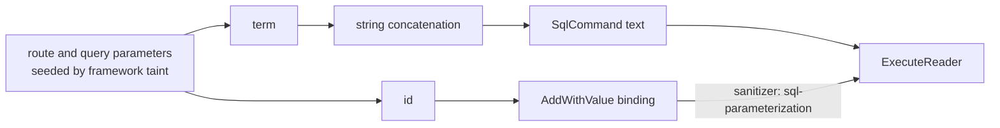

# Lesson 2. SQL injection triage with pattern packs

## Learning objective

In this lesson we analyze a minimal ASP.NET API with both vulnerable and parameterized SQL access, learn how pattern packs shape the analysis, and watch the `data` pack sanitizer suppress parameterized flows.

## Prerequisites

```text
.NET SDK 8.0 or newer
The Dosai repository cloned locally
```

## Create the app

```bash
dotnet new webapi -o /tmp/ordersapi --use-controllers
cd /tmp/ordersapi
dotnet add package Microsoft.Data.SqlClient
```

Replace the generated controller with one that contains a vulnerable method and a safe method:

```csharp
using Microsoft.AspNetCore.Mvc;
using Microsoft.Data.SqlClient;

namespace ordersapi.Controllers;

[ApiController]
[Route("api/[controller]")]
public class OrdersController : ControllerBase
{
    private readonly string _connectionString =
        "Server=localhost;Database=Orders;Trusted_Connection=True;";

    [HttpGet("search")]
    public IActionResult Search(string term)
    {
        using var connection = new SqlConnection(_connectionString);
        connection.Open();
        var sql = "SELECT * FROM Orders WHERE Customer LIKE '" + term + "%'";
        using var command = new SqlCommand(sql, connection);
        using var reader = command.ExecuteReader();
        return Ok(reader.HasRows);
    }

    [HttpGet("byid")]
    public IActionResult ById(string id)
    {
        using var connection = new SqlConnection(_connectionString);
        connection.Open();
        var sql = "SELECT * FROM Orders WHERE OrderId = @id";
        using var command = new SqlCommand(sql, connection);
        command.Parameters.AddWithValue("@id", id);
        using var reader = command.ExecuteReader();
        return Ok(reader.HasRows);
    }
}
```

The first action concatenates `term` into SQL text. The second binds `id` through a parameter. Both are realistic patterns that appear together in real codebases.

## How the patterns line up



The `aspnet` pack adds `FromQuery`, `FromRoute`, and `FromForm` sources, and framework taint seeding marks route and query parameters as sources regardless. The `data` pack adds Dapper and Npgsql sinks plus the `AddWithValue` and `Add` sanitizers. The always-on baseline contributes `SqlCommand`, `ExecuteReader`, and `ExecuteNonQuery` sinks on its own.

## Run with the relevant packs

```bash
dotnet run --project ./Dosai/Dosai.csproj -- dataflows \
  --path /tmp/ordersapi \
  --pattern-packs aspnet,data \
  --o /tmp/orders-dataflows.json \
  --print
```

The always-on baseline loads regardless of the pack list, so `aspnet,data` here means "baseline plus these two packs". The output contains a slice from the `search` action into `ExecuteReader`, and no slice from the `byid` action because `AddWithValue` stops the taint at the parameter binding.

```text
└─ DataFlow dfs1: http → sql (Medium)
   Summary: http data reaches sql sink ExecuteReader.
   Stack (5 frames, 4 transitions):
     at Source/http term [dfn1] in OrdersController.cs:13:33
        code: string term
     via VariableAssignment [dfe1] in OrdersController.cs:16:19 label=sql
     at Assignment sql [dfn2] in OrdersController.cs:16:19
        code: "... WHERE Customer LIKE '" + term + "%'"
     via SinkArgument [dfe3] in OrdersController.cs:18:34 label=commandText
     at Sink/sql ExecuteReader [dfn3] in OrdersController.cs:18:26
        code: command.ExecuteReader()
```

Query the result for the weakness candidates:

```bash
dotnet run --project ./Dosai/Dosai.csproj -- query \
  --input /tmp/orders-dataflows.json \
  --query 'weaknesses[sinkCategory=sql]' \
  --o /tmp/sql-weaknesses.json
```

You get one `SqlInjectionCandidate` with CWE-89 for the `search` action and none for `byid`.

## Tuning checklist

When a real project returns fewer or stranger results than expected, work through this order.

First run with `--print-sources-sinks` to see which patterns matched at all:

```bash
dotnet run --project ./Dosai/Dosai.csproj -- dataflows \
  --path /tmp/ordersapi \
  --print-sources-sinks \
  --o /tmp/orders-dataflows.json
```

Second, check whether the flow crosses a helper method. Dosai records parameter-to-sink summaries for local callees, so a thin repository wrapper preserves taint, but a deeply re-shaped flow may need a custom passthrough pattern. Third, check whether your team wraps parameterization in a custom helper; if so, add it as a [custom sanitizer](dataflow-patterns.md). Fourth, remember that assembly-only inputs cannot match `Code` source patterns against syntax they do not have, so prefer `Method` and `Type` patterns for rules you want to work on binaries too.

## What this lesson taught

Pattern packs are layering, not switches: the always-on baseline catches the classic sinks, optional packs add ecosystem-specific knowledge, and user patterns close project-specific gaps. Parameterization is modeled as a sanitizer, so the difference between the two actions above is visible in the output without any configuration.

## Try next

[Lesson 3](LESSON3.md) takes away the source code and rebuilds the same understanding from a compiled binary.
