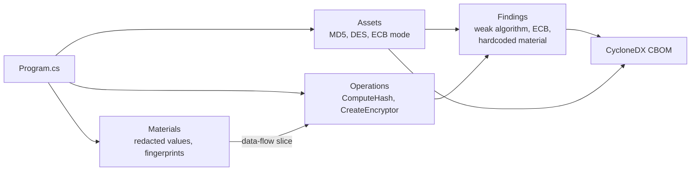

# Lesson 4. Building a CBOM for crypto compliance

## Learning objective

In this lesson we detect weak cryptography and hardcoded key material in a small app, produce a CycloneDX-style CBOM with code-level evidence, and extract an audit-ready findings list with the query command.

## Prerequisites

```text
.NET SDK 8.0 or newer
The Dosai repository cloned locally
```

## Create an app with crypto problems

```bash
dotnet new console -o /tmp/legacycrypto
cat > /tmp/legacycrypto/Program.cs << 'EOF'
using System.Security.Cryptography;
using System.Text;

var apiKey = "c2VjcmV0LWtleS1tYXRlcmlhbC1oZXJl";
var license = "MIIBOgIBAAJBAKjHiO0vAiBvFbT90"; // looks like a PEM fragment

string Checksum(string input)
{
    using var md5 = MD5.Create();
    var bytes = md5.ComputeHash(Encoding.UTF8.GetBytes(input));
    return Convert.ToHexString(bytes);
}

string Protect(string payload)
{
    using var des = DES.Create();
    des.Key = Encoding.UTF8.GetBytes(apiKey, 0, 8);
    des.Mode = CipherMode.ECB;
    using var encryptor = des.CreateEncryptor();
    var bytes = encryptor.TransformFinalBlock(Encoding.UTF8.GetBytes(payload), 0, payload.Length);
    return Convert.ToBase64String(bytes);
}

Checksum(File.ReadAllText(args[0]));
Protect("payload");
EOF
```

The app deliberately bundles several findings: MD5 for checksums, DES with ECB mode, a hardcoded key, and an IV-less legacy cipher setup.

## Run the crypto command

Native Dosai JSON first, because the query engine speaks its collection names:

```bash
dotnet run --project ./Dosai/Dosai.csproj -- crypto \
  --path /tmp/legacycrypto \
  --format dosai \
  --o /tmp/dosai-crypto.json
```

Then the combined CycloneDX-style CBOM with a graph sidecar:

```bash
dotnet run --project ./Dosai/Dosai.csproj -- crypto \
  --path /tmp/legacycrypto \
  --format cyclonedx \
  --o /tmp/dosai-cbom.json \
  --graph-format graphml
```

The second command writes `/tmp/dosai-cbom.json` and `/tmp/dosai-cbom-dataflows.graphml`. The CBOM keeps crypto components and their code evidence in one file, and the sidecar preserves the detailed data-flow paths for full inspection.

## What the evidence model contains



Each collection has a role. Assets are the algorithms, libraries, protocols, and certificates the code touches. Operations are the call sites that use them. Materials are source-visible key, certificate, IV, and secret-like values, and their values are never emitted in the clear: Dosai writes redacted values plus SHA-256 fingerprints, which lets you diff key material across versions without leaking it. Findings carry rule IDs, severity, confidence, CWE mappings, recommendations, and locations.

## Pull the audit list

```bash
dotnet run --project ./Dosai/Dosai.csproj -- query \
  --input /tmp/dosai-crypto.json \
  --query 'findings[severity!=Informational]' \
  --o /tmp/crypto-findings.json

dotnet run --project ./Dosai/Dosai.csproj -- query \
  --input /tmp/dosai-crypto.json \
  --query 'assets[strength=weak]' \
  --o /tmp/weak-assets.json
```

For this app the findings include MD5 use, DES use, ECB mode, and hardcoded material. The `dosai:crypto:family`, `dosai:crypto:strength`, and `dosai:location` properties in the CBOM let downstream BOM tooling correlate each finding back to the exact line.

## Reachability makes it prioritization

If the weak hash sat inside a function called from `Main`, the finding would carry `reachableFromEntryPoint` with entry point IDs, because the crypto command reuses method extraction and call-graph context for best-effort reachability. Reachability never blocks the analysis: when symbol resolution is incomplete, Dosai records diagnostics and continues with file and method-name correlation. Treat the flag as prioritization evidence, not as proof of exploitability.

## How the data-flow slice connects material to operation

The interesting property for auditors is correlation. When a hardcoded key flows into a crypto API, the analyzer attaches the slice ID to both sides:

```text
  Materials                         Operations
  ┌───────────────────────┐        ┌─────────────────────────┐
  │ apiKey                │        │ DES.CreateEncryptor()   │
  │ value: [REDACTED]     │───────▶│ reachable: true         │
  │ fingerprint: 9f2a...  │ slice  │ sourceMaterialIds: [..] │
  │ DataFlowSliceIds: dfs1│ dfs1   │ DataFlowSliceIds: dfs1  │
  └───────────────────────┘        └─────────────────────────┘
```

In the CycloneDX output the same relationship appears as `dosai:crypto:sourceMaterialIds` and `dosai:crypto:sinkOperationIds` properties plus component dependencies, so BOM consumers get the material-to-operation link without a sidecar join.

## Reading the results honestly

Some crypto decisions cannot be proven from syntax. Configuration-driven algorithm selection, reflection, native wrappers, and external key stores hide evidence from any static tool, and the CBOM is intentionally evidence-oriented rather than a strict organizational profile. State in the audit report that the CBOM covers source-visible crypto, and pair it with runtime or configuration review where those gaps matter.

## Try next

[Lesson 5](LESSON5.md) moves from what the code computes to what the code exposes: services, routes, trust zones, and data classification.
