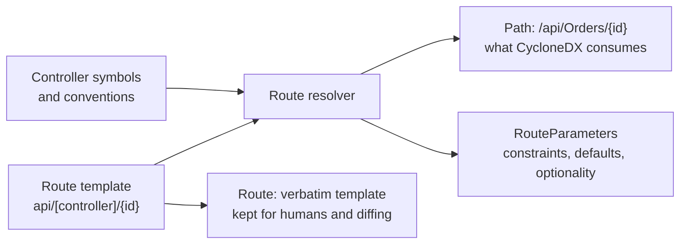

# Lesson 5. Mapping services, routes, and trust zones

## Learning objective

In this lesson we read the service inventory that the `methods` command produces: resolved route paths, trust zones, data classification, and the difference between verbatim templates and resolved paths. This is the artifact an architect or pentester wants before touching the code.

## Prerequisites

```text
.NET SDK 8.0 or newer
The Dosai repository cloned locally
```

## Create an app with two zones

```bash
dotnet new webapi -o /tmp/surface
cat > /tmp/surface/Program.cs << 'EOF'
using Microsoft.AspNetCore.Authorization;

var builder = WebApplication.CreateBuilder(args);
var app = builder.Build();

app.MapGet("/health", () => "ok");

app.MapPost("/api/payments",
    [Authorize] (PaymentRequest request) => Results.Accepted());

app.Run();

public record PaymentRequest(string CardNumber, string CardHolder, decimal Amount);
EOF
```

Two surfaces, two trust zones: `/health` is anonymous and `/api/payments` requires authentication. The payment request DTO carries obviously sensitive member names.

## Run methods

```bash
dotnet run --project ./Dosai/Dosai.csproj -- methods \
  --path /tmp/surface \
  --o /tmp/dosai-methods.json
```

Query the service inventory:

```bash
dotnet run --project ./Dosai/Dosai.csproj -- query \
  --input /tmp/dosai-methods.json \
  --query 'services' \
  --o /tmp/services.json
```

The two services come back with stable bom-refs, kinds, and trust zones. The health endpoint lands in the `public` zone, the payments endpoint in `authenticated`. The payment service also carries a data classification, because `CardNumber` and `CardHolder` are member names the classifier recognizes as `pii`:

```json
{
  "BomRef": "svc:minimal-api:Program/PaymentRequest",
  "Name": "PaymentRequest",
  "Kind": "http",
  "TrustZone": "authenticated",
  "Data": [
    {
      "Classification": "pii",
      "Description": "CardNumber"
    }
  ]
}
```

Every non-unknown classification names the member that triggered it, so the label is auditable back to code. Disable the whole feature with `--no-classify-data` if an engagement does not want it.

## Route resolution: template versus path

Schema 4.0.0 separates what the developer wrote from what the framework will actually serve:

```text
  ApiEndpoint.Route            ApiEndpoint.Path
  what the developer wrote     what the router will serve
  ───────────────────────      ──────────────────────────
  api/[controller]/{id}   →    /api/Orders/{id}
  v{version:apiVersion}/  →    /v1.0/Orders, /v2.0/Orders
  [controller]/[action]   →    /Grants/Index
```

Attribute templates with `[controller]`-style tokens are substituted, constraints are stripped, and segment-versioned routes expand one endpoint per declared `[ApiVersion]`. Conventional routing from `MapControllerRoute` expands per action, capped by `--max-conventional-routes` (default 500). When a template cannot be resolved because it contains non-constant expressions, `Path` stays null at low confidence and `Route` keeps the verbatim text. Never ship a garbled path when you can honestly say unknown.



## Trust zones are computed, not guessed

`TrustZone` values come from evidence: `public` for anonymous inbound, `authenticated` for protected inbound, `internal` for loopback or queue surfaces, `external` for outbound dependencies. The related field `CrossesTrustBoundary` is only set when a positive call-graph path exists from a public inbound service to an external outbound service. No path, no flag; that restraint is the point.

```text
        internet
           │
   ┌───────▼────────┐
   │ public         │   svc:health          TrustZone = public
   └───────┬────────┘
           │ only if the call graph shows a real path
           ▼
   ┌────────────────┐
   │ authenticated  │   svc:payments        TrustZone = authenticated
   └───────┬────────┘
           ▼
   ┌────────────────┐
   │ external       │   payments gateway    TrustZone = external
   └────────────────┘
```

## What the inventory covers

The provider model in `methods` goes far beyond controllers: gRPC services with streaming modes, SignalR hubs, SOAP contracts, queue consumers from MassTransit, NServiceBus, MediatR, and raw clients, Azure Functions and AWS Lambda handlers, scheduled jobs, MCP tools, and LLM inference endpoints with their model identifiers. Each detection carries a confidence tier, and providers never promote a heuristic match to high confidence. Filter on `Confidence` when a review requires only symbol-resolved facts.

## Performance expectations

Framework analysis is keyword-gated, so code without routed surfaces pays effectively nothing. Measured on framework-heavy repositories, the overhead is 0 to 8 percent on `methods` and 5 to 12 percent on `dataflows`, with the worst case a gRPC and minimal-API dense tree.

## Try next

[Lesson 6](LESSON6.md) extends the surface map to AI components and MCP tools, where the entry points are prompts and tool arguments.
