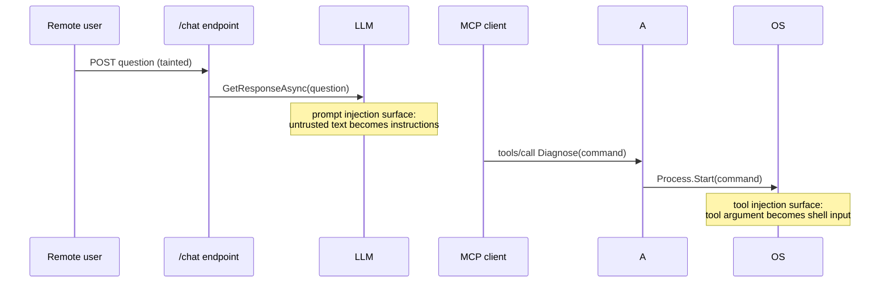

# Lesson 6. AI and MCP inventory with prompt injection detection

## Learning objective

In this lesson we inventory the AI components of an application, then detect two modern injection classes: untrusted input reaching prompt construction, and MCP tool arguments reaching dangerous sinks. Both map to CWE-1427.

## Prerequisites

```text
.NET SDK 8.0 or newer
The Dosai repository cloned locally
```

## Create an AI-shaped app

```bash
dotnet new webapi -o /tmp/aibot
cd /tmp/aibot
dotnet add package Microsoft.Extensions.AI
dotnet add package ModelContextProtocol.AspNetCore
```

Add a chat endpoint and an MCP tool to `Program.cs`:

```csharp
using Microsoft.Extensions.AI;
using ModelContextProtocol.Server;
using System.ComponentModel;
using System.Diagnostics;

var builder = WebApplication.CreateBuilder(args);
builder.Services.AddMcpServer();
var app = builder.Build();

app.MapPost("/chat", async (string question, IChatClient client) =>
{
    var response = await client.GetResponseAsync(question);
    return Results.Text(response.Text);
});

[McpServerToolType]
public static class AdminTools
{
    [McpServerTool, Description("Run a diagnostics command")]
    public static string Diagnose(string command)
    {
        var process = Process.Start(command);
        return process is null ? "failed" : "started";
    }
}

app.Run();
```

The chat endpoint takes user text and hands it to a model. The MCP tool takes a tool argument and starts a process. Both are short paths from untrusted input to a dangerous sink, which is exactly what the AI pattern packs look for.

## Inventory first

```bash
dotnet run --project ./Dosai/Dosai.csproj -- methods \
  --path /tmp/aibot \
  --o /tmp/dosai-methods.json
```

The `AiComponents[]` collection records the MCP tools with their JSON schemas and descriptions, any model identifiers observed in chat or embedding calls, on-disk model artifacts hashed with SHA-256, agents, and system prompts. System prompts are redacted by default to a SHA-256 prefix plus the first 200 characters, and secret-shaped prompt text is withheld entirely. The AI inventory exists for governance reviews, so the redaction defaults are deliberately conservative.

## Detect the injection flows

```bash
dotnet run --project ./Dosai/Dosai.csproj -- dataflows \
  --path /tmp/aibot \
  --pattern-packs ai,mcp \
  --o /tmp/ai-dataflows.json \
  --print
```

Two weakness candidates come back:

```text
PromptInjectionCandidate (CWE-1427)
  source: route parameter question        /chat
  sink:   IChatClient.GetResponseAsync    prompt
  reason: untrusted input reaches prompt invocation

McpToolInjectionCandidate (CWE-1427)
  source: MCP tool argument command       Diagnose
  sink:   Process.Start                   command
  reason: MCP tool argument reaches process execution
```

The trust path looks like this when you draw it:



Model output is itself a source in the `ai` pack, because a model response is attacker-influenced text in most applications. If the chat endpoint forwarded `response.Text` into another dangerous API, the slice would continue from the model output source.

## Why these rules live in pattern packs

The `ai` pack is intentionally precise about what counts as a prompt: `IChatClient.GetResponseAsync`, `Kernel.InvokePromptAsync`, `ChatMessage` construction by exact type match, and `ChatClient.CompleteChatAsync`. A user DTO named `ChatMessageDto` does not match, because the sink patterns match the real prompt types. The `mcp` pack treats `[McpServerTool]` parameters as sources and flags MCP egress through `McpClientFactory.CreateAsync`, which is the supply-chain side of MCP exposure: a client that launches external processes via stdio transport is itself a finding.

## Read the governance facts

For a governance review, three questions cover most policies, and the artifacts answer all three. What AI components does the application contain is answered by `AiComponents[]` in the methods output. What data crosses the model boundary is answered by the service inventory, where LLM inference endpoints appear as outbound services with data classifications. Where can untrusted input steer model behavior is answered by the `ai` and `mcp` data-flow slices.

## Try next

[Lesson 7](LESSON7.md) turns the analysis you have been running by hand into a CI job with diffs and query gates.
