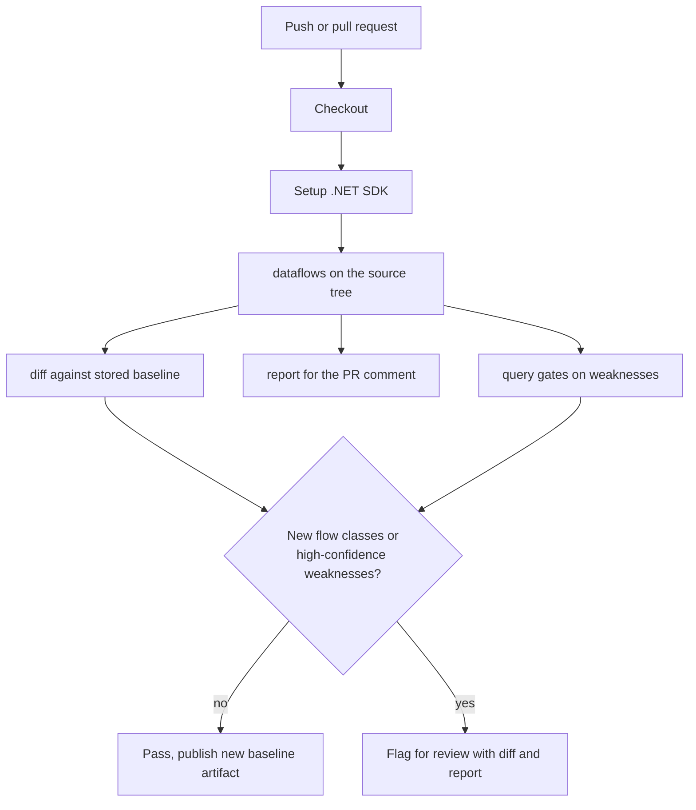

# Lesson 7. Automation in CI with diff, query, and report

## Learning objective

In this lesson we build a pull-request job that analyzes the tree, compares the result against a baseline, applies a query gate, and attaches a human-readable report. The goal is that reviewers see what changed, not every pre-existing finding.

## The shape of the job



## Produce the analysis

The analysis step is the same command you run locally, minus `--print`. CI logs should stay quiet; the JSON is the artifact that everything downstream consumes.

```bash
dotnet run --project ./Dosai -- dataflows \
  --path ./src \
  --o /tmp/dosai-dataflows.json \
  --graph-format gexf \
  --graph-out /tmp/dosai-dataflows.gexf
```

If your project uses wrappers that built-in packs do not know, point `--patterns` at a committed pattern file so CI and local runs behave identically:

```bash
dotnet run --project ./Dosai -- dataflows \
  --path ./src \
  --patterns ./dataflow-patterns.json \
  --o /tmp/dosai-dataflows.json
```

## Diff against the baseline

```bash
dotnet run --project ./Dosai -- diff \
  --old /tmp/baseline-dataflows.json \
  --new /tmp/dosai-dataflows.json \
  --o /tmp/dosai-diff.json
```

The diff is semantic, not textual. Slices are compared as keyed sets using source category, sink category, and sink argument, and statistics are compared separately. That means renaming a variable, reformatting a file, or reordering output does not create churn, while a genuinely new `http → sql` flow class stands out immediately. Store the baseline JSON as a workflow artifact or a committed file, and refresh it only when a human has reviewed the diff.

## Apply a query gate

Gates work best when they encode decisions your team already made. High-confidence candidates are a common gate because their evidence is entry-point-linked:

```bash
dotnet run --project ./Dosai -- query \
  --input /tmp/dosai-dataflows.json \
  --query 'weaknesses[confidence=High]' \
  --o /tmp/high-risk.json
```

Other gates that work well in practice: `slices[sinkCategory=deserialization]` where the team policy is no BinaryFormatter anywhere, `packages[reachable=true]` joined against an advisory list, or `nodes[isSink=true && fileName~=<changed files>]` scoped to the pull request. Validate graph integrity directly against the JSON as well: every edge endpoint must exist as a node, which is a five-line check in any scripting language.

## Report for humans

```bash
dotnet run --project ./Dosai -- report \
  --input /tmp/dosai-dataflows.json \
  --o /tmp/dosai-report.md
```

The report summarizes counts, entry points, weakness candidates, package reachability, and notable slices in deterministic Markdown. Attach it to the pull request; keep the JSON as the canonical record for the diff and the queries.

## A complete GitHub Actions job

```yaml
name: dosai-review
on:
  pull_request:
jobs:
  dataflow-gate:
    runs-on: ubuntu-latest
    steps:
      - uses: actions/checkout@v4
      - uses: actions/setup-dotnet@v4
        with:
          dotnet-version: "8.0.x"
      - uses: actions/checkout@v4
        with:
          repository: owasp-dep-scan/dosai
          path: dosai
      - name: Analyze
        run: |
          dotnet run --project dosai/Dosai -- dataflows \
            --path ./src \
            --o /tmp/dosai-dataflows.json
      - name: Diff against baseline
        run: |
          dotnet run --project dosai/Dosai -- diff \
            --old ./security/baseline-dataflows.json \
            --new /tmp/dosai-dataflows.json \
            --o /tmp/dosai-diff.json
      - name: High-confidence gate
        run: |
          dotnet run --project dosai/Dosai -- query \
            --input /tmp/dosai-dataflows.json \
            --query 'weaknesses[confidence=High]' \
            --o /tmp/high-risk.json
      - name: Report
        run: |
          dotnet run --project dosai/Dosai -- report \
            --input /tmp/dosai-dataflows.json \
            --o /tmp/dosai-report.md
      - uses: actions/upload-artifact@v4
        with:
          name: dosai-results
          path: |
            /tmp/dosai-diff.json
            /tmp/high-risk.json
            /tmp/dosai-report.md
```

A committed baseline (`security/baseline-dataflows.json`) keeps the diff stable across CI runs, and the artifacts carry everything a reviewer needs. The same job doubles as a regression guard for your custom patterns: if a pattern edit accidentally widens matching, the diff shows it as new flow classes.

## What this lesson taught

Deterministic ids, semantic diffs, and a compact query language are the three properties that make static analysis automatable. Determinism makes runs comparable, the diff isolates change, and the query turns policy into a filter expression.

## Try next

[Lesson 8](LESSON8.md) goes back to the analyzer and teaches it a legacy codebase's private vocabulary with custom patterns.
