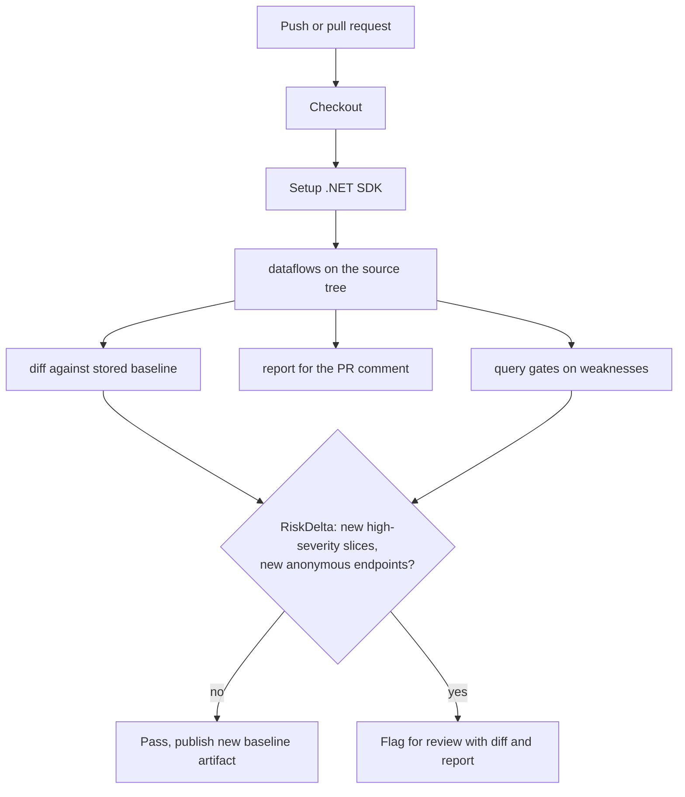

# Lesson 7. Automation in CI with diff, query, and report

## Learning objective

In this lesson we build a pull-request job that analyzes the tree, compares the result against a baseline, applies a query gate, and attaches a human-readable report. The goal is that reviewers see what changed, not every pre-existing finding.

## The shape of the job



## Produce the analysis

The analysis step is the same command you run locally, minus `--print`. CI logs should stay quiet; the JSON is the artifact that everything downstream consumes.

```bash
dotnet run --project ./Dosai -- dataflows \
  --path ./src \
  --o /tmp/dosai-dataflows.json \
  --graph-format gexf \
  --graph-out /tmp/dosai-dataflows.gexf
```

If your project uses wrappers that built-in packs do not know, point `--patterns` at a committed pattern file so CI and local runs behave identically:

```bash
dotnet run --project ./Dosai -- dataflows \
  --path ./src \
  --patterns ./dataflow-patterns.json \
  --o /tmp/dosai-dataflows.json
```

## Diff against the baseline

```bash
dotnet run --project ./Dosai -- diff \
  --old /tmp/baseline-dataflows.json \
  --new /tmp/dosai-dataflows.json \
  --o /tmp/dosai-diff.json
```

The diff is semantic, not textual. Slices are compared as keyed sets using source category, sink category, and sink argument, now with severity attached, and statistics are compared separately. That means renaming a variable, reformatting a file, or reordering output does not create churn, while a genuinely new `http → sql` flow class stands out immediately. Since schema 4.1.0 the diff also reports added and removed entry points, weaknesses, and packages, and closes with a single `RiskDelta` summary built for CI decisions: `NewHighSeveritySlices`, `NewMediumSeveritySlices`, `NewLowSeveritySlices`, `NewAnonymousEndpoints`, `NewWeaknessKinds`, and `NewlyReachablePackages`. A gate can read one object instead of re-deriving counts from the slice lists. Security finding ids are content-derived (kind, file, and line), so findings that reappear after refactoring keep a stable identity across diffs and suppression keys. Store the baseline JSON as a workflow artifact or a committed file, and refresh it only when a human has reviewed the diff.

## Apply a query gate

Gates work best when they encode decisions your team already made. High-severity candidates are the natural gate since severity became a first-class field: injection primitives default to `high`, a pattern can override its category default, and a Low-confidence match is demoted one rank, so a high-severity gate never fires on heuristic evidence alone.

```bash
dotnet run --project ./Dosai -- query \
  --input /tmp/dosai-dataflows.json \
  --query 'weaknesses[severity=high]' \
  --o /tmp/high-risk.json

dotnet run --project ./Dosai -- query \
  --input /tmp/dosai-dataflows.json \
  --query 'weaknesses[severity=high] count' \
  --o /tmp/high-risk-count.json
```

The trailing `count` returns `{"count": n}`, which is the shape a shell gate wants. Other gates that work well in practice: `slices[sinkCategory=deserialization]` where the team policy is no BinaryFormatter anywhere, `exploitChains[exposure=anonymous-http]` to flag anything new that an unauthenticated caller can reach, `packages[reachable=true]` joined against an advisory list, or `nodes[isSink=true && fileName~=<changed files>]` scoped to the pull request. Validate graph integrity directly against the JSON as well: every edge endpoint must exist as a node, which is a five-line check in any scripting language.

One more gate input keeps accepted findings from re-tripping the job every run. Pass `--suppress suppressions.json` to `dataflows` and `agent-context`; an entry matches only when every field present in it matches (file plus line, sliceKey, weaknessId, or category), and an optional `expires` date makes accepted findings resurface automatically, which turns the suppressions file into a review backlog with a built-in clock.

## Report for humans

```bash
dotnet run --project ./Dosai -- report \
  --input /tmp/dosai-dataflows.json \
  --o /tmp/dosai-report.md
```

The report summarizes counts, entry points, weakness candidates with their severities, package reachability, and notable slices in deterministic Markdown, plus three sections added in schema 4.1.0: sanitized flows (the negative evidence showing which sanitizers and guards suppressed what), exploit chains (each entry point, call path, and sink with its exposure), and the attack surface (entry points grouped by exposure, anonymous first, with the weaknesses and chains that reach each group). Attach it to the pull request; keep the JSON as the canonical record for the diff and the queries.

## A complete GitHub Actions job

```yaml
name: dosai-review
on:
  pull_request:
jobs:
  dataflow-gate:
    runs-on: ubuntu-latest
    steps:
      - uses: actions/checkout@v4
      - uses: actions/setup-dotnet@v4
        with:
          dotnet-version: "8.0.x"
      - uses: actions/checkout@v4
        with:
          repository: owasp-dep-scan/dosai
          path: dosai
      - name: Analyze
        run: |
          dotnet run --project dosai/Dosai -- dataflows \
            --path ./src \
            --suppress ./security/suppressions.json \
            --o /tmp/dosai-dataflows.json
      - name: Diff against baseline
        run: |
          dotnet run --project dosai/Dosai -- diff \
            --old ./security/baseline-dataflows.json \
            --new /tmp/dosai-dataflows.json \
            --o /tmp/dosai-diff.json
      - name: High-severity gate
        run: |
          dotnet run --project dosai/Dosai -- query \
            --input /tmp/dosai-dataflows.json \
            --query 'weaknesses[severity=high] count' \
            --o /tmp/high-risk-count.json
      - name: Report
        run: |
          dotnet run --project dosai/Dosai -- report \
            --input /tmp/dosai-dataflows.json \
            --o /tmp/dosai-report.md
      - uses: actions/upload-artifact@v4
        with:
          name: dosai-results
          path: |
            /tmp/dosai-diff.json
            /tmp/high-risk-count.json
            /tmp/dosai-report.md
```

A committed baseline (`security/baseline-dataflows.json`) keeps the diff stable across CI runs, and the artifacts carry everything a reviewer needs. The same job doubles as a regression guard for your custom patterns: if a pattern edit accidentally widens matching, the diff shows it as new flow classes.

## What this lesson taught

Deterministic ids, semantic diffs, and a compact query language are the three properties that make static analysis automatable. Determinism makes runs comparable, the diff isolates change, and the query turns policy into a filter expression.

## Try next

[Lesson 8](LESSON8.md) goes back to the analyzer and teaches it a legacy codebase's private vocabulary with custom patterns.
