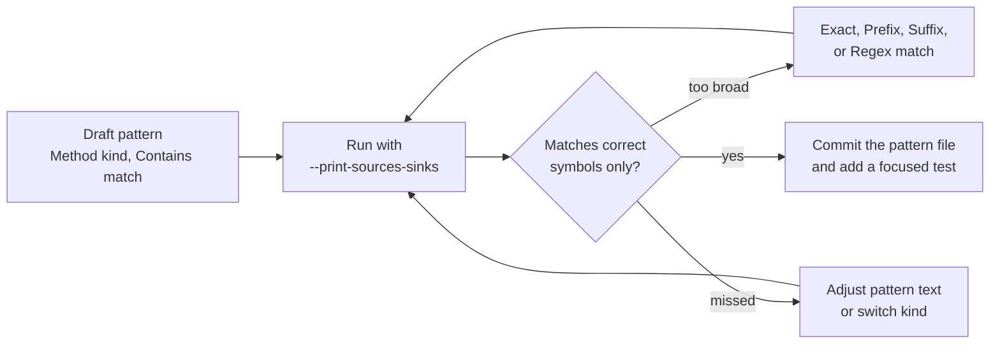

# Lesson 8. Custom patterns for legacy code

## Learning objective

In this lesson we teach Dosai the private vocabulary of a legacy application: a custom input reader, a shell wrapper, a normalization helper, and an allow-list validator. The deliverable is a committed pattern file that future reviews reuse.

## A legacy shape

Older applications rarely call dangerous APIs directly. They wrap them, and wrappers hide flows from any tool that only knows the standard library:

```csharp
public class LegacyInput
{
    public static string ReadUntrusted() =>
        HttpContext.Current.Request.Form["payload"];
}

public class LegacyShell
{
    public static void Exec(string command) =>
        new Process { StartInfo = new ProcessStartInfo("cmd", "/c " + command) }.Start();
}

public static class Guard
{
    public static bool AllowListedCommand(string input) =>
        new[] { "backup", "report", "cleanup" }.Contains(input);
}
```

Without help, `dataflows` sees a source it does not recognize and a sink it does not recognize, so the flow between them stays invisible. The fix is four patterns.

## Write the pattern file

`dataflow-patterns.json`:

```json
{
  "sources": [
    {
      "kind": "Method",
      "match": "Contains",
      "pattern": "LegacyInput.ReadUntrusted",
      "category": "legacy-input",
      "description": "Legacy input helper",
      "taintKinds": ["user-input"],
      "confidence": "High"
    }
  ],
  "sinks": [
    {
      "kind": "Method",
      "match": "Contains",
      "pattern": "LegacyShell.Exec",
      "category": "command",
      "description": "Legacy shell wrapper",
      "confidence": "High"
    }
  ],
  "passthroughs": [
    {
      "kind": "Method",
      "match": "Contains",
      "pattern": "NormalizeCommand",
      "category": "string",
      "description": "Normalization preserves command taint"
    }
  ],
  "sanitizers": [
    {
      "kind": "Method",
      "match": "Contains",
      "pattern": "AllowListedCommand",
      "category": "validation",
      "description": "Allow-list validator suppresses taint in guarded true branches"
    }
  ]
}
```

Three kinds do the heavy lifting. `sources` seed taint where untrusted data enters. `passthroughs` tell the analyzer that a helper returns its input unchanged, so taint survives the wrapper. `sanitizers` both stop direct taint and act as guard validators: inside `if (AllowListedCommand(input))`, the validated true branch suppresses taint while the unvalidated path keeps it.

## Run and inspect

```bash
dotnet run --project ./Dosai/Dosai.csproj -- dataflows \
  --path /path/to/legacy-repo \
  --patterns ./dataflow-patterns.json \
  --o /tmp/legacy-dataflows.json \
  --print-sources-sinks
```

User patterns are merged with the built-ins; they never replace them. `--print-sources-sinks` is your tuning lens: it lists every matched source and sink with category, location, symbol, PURL, and code, which tells you immediately whether a pattern matched, matched too broadly, or missed entirely.

```text
Data-flow sources: 2
SOURCE  legacy-input   InputHelper.cs:14:26   ReadUntrusted   LegacyInput.ReadUntrusted()
SOURCE  http           HomeController.cs:22   term            (string term)
Data-flow sinks: 1
SINK    command        LegacyShell.cs:9:9     Exec            new Process { ... }.Start()
```

## The tuning loop



Kind selection follows a preference order. `Method` is best when the API is a resolved method. `Type` and `Namespace` cover object and family-level rules. `Parameter` seeds handler parameters such as `request` or `input`. `Attribute` covers framework decorations. `Code` matches syntax text and is the last resort, useful when references are unresolved and Roslyn cannot bind symbols. Regex matching is case-sensitive unless you opt in with `(?i)`, and keep regexes simple because they run on every node.

One binary note: assembly-only analysis applies semantic `Method`, `Symbol`, `Type`, `Namespace`, and `Name` patterns to metadata members, while `Code` patterns apply only to IL string literals. Broad short `Name` matches are filtered in binary mode to avoid noise against compiler-generated members, so prefer `Method` or `Type` for rules you want to survive a source-to-binary move.

## What this lesson taught

A pattern file is institutional memory. It encodes what a reviewer learned about the codebase, it works identically on developer machines and CI, and it turns an invisible flow class into a reviewed one. Once the file is committed, [lesson 7](LESSON7.md) picks it up automatically through `--patterns`.
