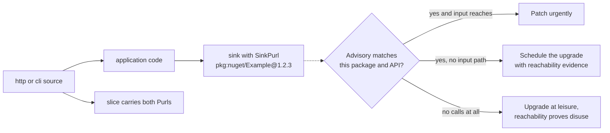

# Lesson 9. Package reachability and blast radius

## Learning objective

In this lesson we trace NuGet packages through code: which dependencies are actually called, where those calls live, and whether untrusted input can reach them. This is the evidence layer between a dependency advisory and a patch decision.

## Prerequisites

```text
.NET SDK 8.0 or newer
The Dosai repository cloned locally
A .NET project with restored dependencies (project.assets.json present)
```

## Where PURLs come from

Dosai reads `project.assets.json` and `*.deps.json`, the files restore and build leave behind, and maps assemblies, modules, packages, and namespace prefixes to NuGet PURLs:

```text
project.assets.json / *.deps.json
        │
        ▼
  PackageUrlResolver
        │
        ├── Methods[].Purl
        ├── MethodCalls[].Purl
        ├── CallGraph.Nodes[].Purl
        ├── CallGraph.Edges[].TargetPurl
        └── DataFlow.Slices[].Purls[]
```

Resolution is a best-effort ladder from exact assembly name down to namespace prefix matching, with a versionless fallback for common `System.*` APIs such as `pkg:nuget/System.Diagnostics.Process`. Enrichment never fails the analysis; a missing PURL is simply a missing field.

## Measure the blast radius

Run both workhorse commands on a restored project:

```bash
dotnet run --project ./Dosai/Dosai.csproj -- methods \
  --path ./src \
  --o /tmp/dosai-methods.json \
  --callgraph-format graphml \
  --callgraph-out /tmp/dosai-callgraph.graphml

dotnet run --project ./Dosai/Dosai.csproj -- dataflows \
  --path ./src \
  --o /tmp/dosai-dataflows.json
```

Now filter for reachable packages and read one record:

```bash
dotnet run --project ./Dosai/Dosai.csproj -- query \
  --input /tmp/dosai-dataflows.json \
  --query 'packages[reachable=true]' \
  --o /tmp/reachable.json
```

```json
{
  "Purl": "pkg:nuget/System.Diagnostics.Process",
  "Reachable": true,
  "ReachabilityKind": "CallGraphEdge",
  "SourceLocations": [
    {
      "Path": "src/Program.cs",
      "FileName": "Program.cs",
      "LineNumber": 10,
      "ColumnNumber": 9,
      "Kind": "CallGraphEdge"
    }
  ]
}
```

The location list is deliberately restricted to source files, and DLL-only fallback locations are suppressed, because occurrence evidence should point at something a reviewer can open. When the only evidence is a VB `Imports`, an F# `open`, or an R `library()` statement, Dosai emits a low-confidence `Dependency` reachability fact rather than pretending it observed a call.

## Three triage questions, three filters

An advisory names a package and an API. Dosai answers the questions that decide urgency.

First, is the package called at all? Filter `PackageReachability` by the PURL and check `Reachable`. A restored but never-called package has a different clock than a reachable one.

Second, where does the call happen? Call graph edges carry `SourcePurl` and `TargetPurl`, so the direct edges into a package are one query away, and the GraphML export opens the neighborhood in yEd or Gephi.

Third, can untrusted input reach it? Data-flow slices carry PURLs on their source and sink nodes:



## A worked triage

```bash
# Which reachable packages touch the network?
dotnet run --project ./Dosai/Dosai.csproj -- query \
  --input /tmp/dosai-dataflows.json \
  --query 'slices[sinkCategory=network]' \
  --o /tmp/network-slices.json

# Which call edges enter a specific package?
dotnet run --project ./Dosai/Dosai.csproj -- query \
  --input /tmp/dosai-methods.json \
  --query 'edges[targetPurl~=Example]' \
  --o /tmp/example-edges.json
```

Reading the network slices tells you whether untrusted input flows toward the affected API. Reading the call edges tells you how central the package is. Together they are the blast-radius picture, and both artifacts can go straight into the risk ticket.

## Correlation, not verdict

PURL enrichment has real limits worth repeating in any report. Packages can share namespace prefixes and Dosai picks the longest prefix of the first discovered package. Binding redirects and assembly unification are not modeled. Source-only dependencies without restore metadata may not resolve. A PURL on a node means correlation, and the verdict still belongs to the reviewer. This is the same division of labor as the rest of the tool: reproducible evidence in, human judgment out.

## Try next

[Lesson 10](LESSON10.md) hands the whole toolbox to an AI agent over MCP, with confinement and prompt-size discipline.
