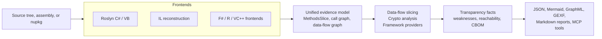

# What is Dosai

Dosai is a .NET source and assembly inspection tool. Point it at a repository, a compiled binary, or a NuGet package and it produces structured facts for security review: methods and dependencies, API endpoints, call graphs, service inventories, source-to-sink data-flow slices, cryptographic evidence, and package reachability. Everything lands in deterministic JSON that scripts, CI gates, and AI agents can query without a second tool.

Two ideas shape the whole tool. First, evidence comes from semantics where possible: Roslyn `IOperation` for C# and VB, IL reconstruction for binaries, and conservative language frontends for F#, R, and VC++. Second, uncertainty is visible. Every fact carries an evidence kind and a confidence, so a reviewer can tell a direct observation from an inferred framework edge.

## The pipeline at a glance



## A thirty-second tour

Clone or open any .NET project, then run the three workhorse commands.

```bash
# Inventory: methods, endpoints, call graph, services, package reachability
dotnet run --project ./Dosai/Dosai.csproj -- methods \
  --path ./src \
  --o /tmp/dosai-methods.json \
  --callgraph-format graphml \
  --callgraph-out /tmp/dosai-callgraph.graphml

# Data flows: source-to-sink slices with weakness candidates
dotnet run --project ./Dosai/Dosai.csproj -- dataflows \
  --path ./src \
  --o /tmp/dosai-dataflows.json \
  --print

# Crypto: assets, materials, findings, and a CycloneDX-style CBOM
dotnet run --project ./Dosai/Dosai.csproj -- crypto \
  --path ./src \
  --o /tmp/dosai-cbom.json \
  --format cyclonedx
```

The `--print` flag renders each slice as a stack-trace-style path, which is the fastest way to understand what the analyzer found:

```text
└─ DataFlow dfs1: cli → command (Medium)
   Summary: cli data reaches command sink Start.
   Stack (3 frames, 3 transitions):
     at Source/cli args [dfn1] in Program.cs:5:5
        code: args
     via VariableAssignment [dfe1] from dfn1 to dfn2 in Program.cs:6:13 label=command
     at Sink/command Start [dfn3] in Program.cs:7:9 [pkg:nuget/System.Diagnostics.Process]
        code: Process.Start(command)
```

## Where to go next

If you review code, the [security analyst guide](security-analysis.md) is the main walkthrough, and the [lessons](LESSON1.md) take you from a first slice to automation. If your work is audit or compliance, read the [compliance guide](compliance.md) for the evidence model and its limits. If you build tools on top of the JSON, the [command reference](commands.md) and the [schema migration guide](migration-4.0.md) describe the contracts. If you want to know how the analyzer works inside, start at the [architecture overview](ARCHITECTURE.md).

Dosai is part of the OWASP dep-scan family. It pairs well with [blint](BLINT-INTEGRATION.md) for binary-level checks and [YARA](YARA-USAGE.md) for rule-based scanning, and its service inventory maps into [cdxgen](https://github.com/cdxgen/cdxgen) CycloneDX BOMs.
