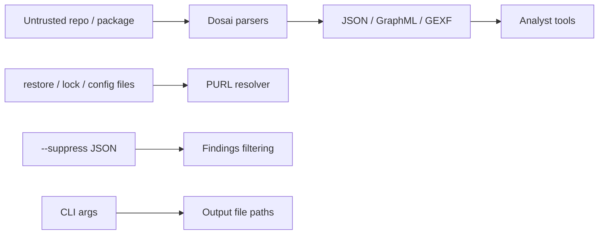

# Dosai Threat Model

## Scope

This threat model covers Dosai as a local/CI analysis tool that parses .NET source code, assemblies, NuGet restore metadata, and package files to produce JSON and graph outputs.

## Assets

| Asset                                     | Security goal                                                                      |
| ----------------------------------------- | ---------------------------------------------------------------------------------- |
| Analyst workstation / CI runner           | Avoid code execution, path traversal, resource exhaustion beyond expected analysis |
| Source code and assemblies under analysis | Preserve confidentiality and integrity                                             |
| Generated JSON/graph outputs              | Maintain accuracy and prevent misleading metadata injection                        |
| Package/PURL metadata                     | Preserve supply-chain correlation correctness                                      |
| Temporary files and output paths          | Avoid unsafe writes/deletes                                                        |

## Trust boundaries



## Entry points

- `methods --path <file|directory|nupkg>`
- `dataflows --path <file|directory>`
- `--patterns <json>` and `--suppress <json>` (repo-supplied files parsed by the tool)
- `--mcp-allowlist <file>` (policy file read by the MCP server)
- `--o`, `--callgraph-out`, `--graph-out`
- assembly loading/reflection for managed assemblies
- source parsing via Roslyn
- PURL source files parsed from the tree: `project.assets.json`, `*.deps.json`, `packages.lock.json`, `paket.lock`, `packages.config`, and `.csproj` package references
- XML/graph consumers downstream

## Threats and mitigations

| Threat                                   | Scenario                                                                     | Existing mitigation                                                                                                                                                                                                                      | Future hardening                                 |
| ---------------------------------------- | ---------------------------------------------------------------------------- | ---------------------------------------------------------------------------------------------------------------------------------------------------------------------------------------------------------------------------------------- | ------------------------------------------------ |
| Arbitrary code execution during analysis | Malicious assembly triggers code execution                                   | IL call graph and data-flow analysis read metadata and method bodies; reflection inventory avoids running target code intentionally                                                                                                      | Prefer metadata-only loading everywhere possible |
| Dependency load confusion                | Analyzer resolves unexpected local assemblies                                | Search paths are local to target/runtime, and `.deps.json` scoping prefers project assemblies in app output directories                                                                                                                  | Add strict mode limiting assembly load roots     |
| Path traversal in nupkg extraction       | Malicious archive entry writes outside temp dir                              | Current extraction should be reviewed for canonical path checks                                                                                                                                                                          | Add explicit full-path containment validation    |
| Resource exhaustion                      | Huge source tree or malformed syntax                                         | Roslyn parsing may consume memory/CPU                                                                                                                                                                                                    | Add timeout/max-file/max-size options            |
| Output injection                         | Source strings appear in GraphML/GEXF                                        | XML output uses escaping; Mermaid labels are escaped                                                                                                                                                                                     | Add tests for more special characters            |
| False confidence                         | Missing refs or inferred runtime behavior produce incomplete graphs          | Invalid-operation fallback captures some legacy cases; evidence kinds separate direct, framework, reflection, and heuristic facts; inferred dispatch edges carry `exact`/`rta-candidate`/`cha-candidate` confidence; diagnostics emitted | Add more confidence scores per edge and slice    |
| PURL misattribution                      | Namespace prefix maps to wrong package, or two sources disagree on a version | Longest-prefix best-effort matching; version conflicts across sources are recorded as diagnostics and `ResolutionFacts` names the source of each purl                                                                                    | Surface conflicts more prominently in reports    |
| Pattern abuse                            | User pattern regex causes backtracking                                       | Regex patterns are supported; catastrophic literal regexes in the analyzed code are themselves reported as ReDoS candidates (CWE-1333)                                                                                                   | Add regex timeout for user patterns              |

## Data-flow specific risks

Dosai data-flow slices are triage artifacts, not proof of exploitability. Exploit chains (schema 4.1.0) connect entry points to sinks through the reconstructed call graph and label the exposure, but they remain static evidence derived from the same graph, not a demonstration that an exploit works.

False positives can occur when:

- validation/sanitization is not modeled or a custom validator has different semantics than a configured sanitizer pattern (suppressed flows are recorded in `SanitizedFlows`, so the negative evidence is visible)
- a variable is tainted by name but constrained by control flow
- syntax fallback captures an unresolved API shape
- inferred framework, DI, dispatch, or reflection evidence over-approximates runtime behavior

False negatives can occur when:

- flow crosses method boundaries that summaries do not model; since schema 4.1.0 summaries iterate to a fixpoint, cover `ref`/`out` writes, and seed lambda and async propagation, so the remaining gap is deep object graphs and unmodeled helpers rather than simple wrappers
- taint is stored in object graphs not tracked field-sensitively; `foreach` variables and element/indexer stores are tracked, but arbitrary aliasing is not
- dynamic/reflection calls hide sink invocations
- dynamic framework dispatch is driven by configuration not visible in source or IL metadata

## Supply-chain/PURL risks

PURL fields correlate symbols to packages using restore/deps metadata. They do not imply vulnerability by themselves.

Recommended analyst workflow:

1. Match `Purls[]` against vulnerability intelligence.
2. Confirm package version from SBOM/package manager.
3. Review slice code and endpoint exposure.
4. Verify exploitability manually.

## Security objectives

- Do not execute analyzed code.
- Do not write outside requested output paths/temp directories.
- Keep graph outputs structurally valid.
- Make uncertainty visible through diagnostics and metadata.
- Preserve enough source location data for human review.

## Non-goals

- Perfect static vulnerability detection.
- Full interprocedural alias analysis.
- Runtime exploit simulation.
- Replacement for SAST, SCA, or manual review.

## Abuse cases

```text
Attacker publishes malicious repo
        │
        ▼
CI runs dosai on PR/source
        │
        ├── tries parser crash / DoS
        ├── tries graph output injection
        ├── tries path traversal in package archive
        └── tries misleading package metadata
```

Dosai should fail closed where feasible: preserve host safety, emit diagnostics, and avoid producing malformed output.

## Prompt and AI inventory handling (schema 4.0.0)

Dosai's AI inventory (`AiComponents[]`) records system prompts found in source. Prompts can
contain secrets and proprietary IP, so the default output is redacted: a SHA-256 prefix and the
first 200 characters only. Candidate prompts that look secret-shaped (connection strings,
key/value credential pairs, PEM blocks, JWT/SAS/PAT token shapes) are withheld entirely and
`--include-prompt-text` cannot override that. Full text for benign prompts is emitted solely
under the explicit `--include-prompt-text` flag, and the MCP `dosai.ai_components` tool follows
the same default (the flag is not reachable through MCP). On-disk model artifacts are hashed
(SHA-256) without being uploaded anywhere; artifacts over 256 MB are inventoried with size but
without a hash so a vendored multi-GB model does not stall every run. Hashes are stable across
runs so BOM diffs are meaningful.

## MCP server data exposure

`dosai mcp` is a JSON-RPC server whose tools analyze **whatever path the client supplies**.
Analysis output carries source-derived text: dataflow nodes embed literal code snippets
(hardcoded secrets included), and endpoint/raw-URL lists. Treat the server as a read-capable
channel into every directory the process can access:

- Run `dosai mcp` only for clients you would trust with read access to those trees.
- Use `mcp --mcp-root DIR` to confine every tool call (and the `input` file of `dosai.query`)
  to paths under `DIR`. With confinement enabled, out-of-root paths fail the call instead of
  being analyzed.
- Use `mcp --mcp-allowlist FILE` to restrict which stdio transport commands are treated as
  policy-approved when MCP transport integrity findings are computed; a missing file disables
  the allowlist (nothing is policy-approved).
- The tool surface is read-oriented (`dosai.methods`, `dosai.dataflows`, `dosai.crypto`,
  `dosai.agent_context`, `dosai.services`, `dosai.ai_components`, `dosai.query`,
  `dosai.exploit_chains`, `dosai.attack_surface`, `dosai.reachability`), and every tool is a
  thin wrapper over one analyzer entry point, so no analysis logic or file writing is reachable
  through the server.
- Prompt _text_ is not exposed through MCP regardless of flags (see above).
