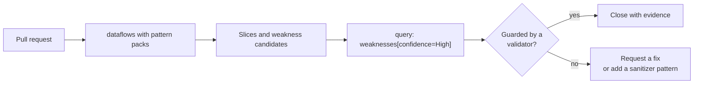
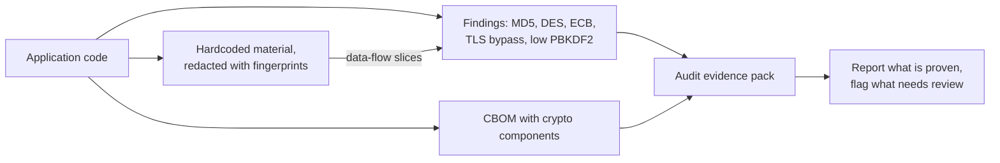
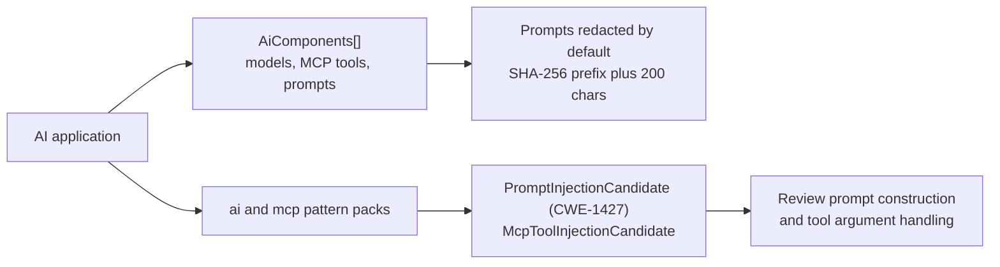
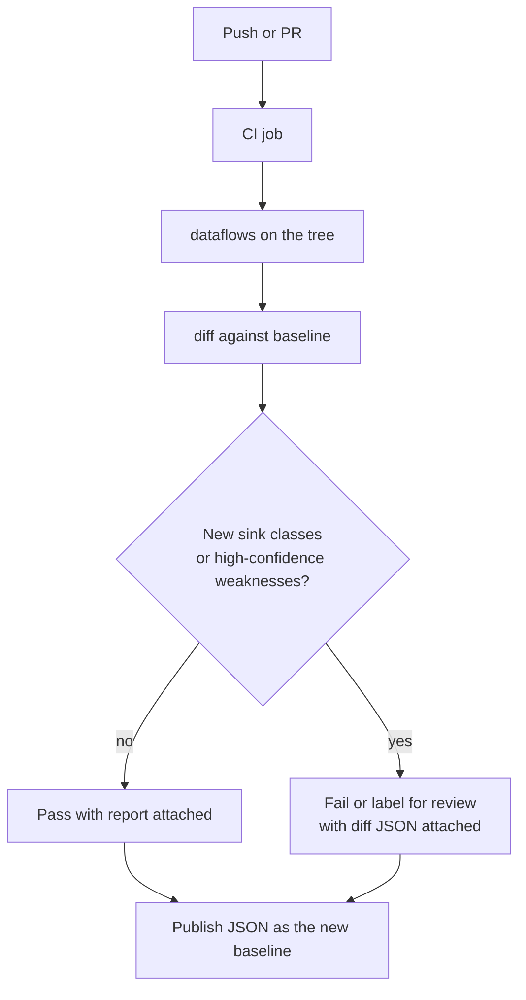

# Use case catalog

These are the workflows Dosai was built for. Each section names the question being asked, the commands that answer it, and how to read the results. The lessons expand several of these into full step-by-step tutorials.

## Triage injection risk in a code review

You are reviewing a pull request that touches request handling and want to know whether any new input can reach a dangerous API. The wrong way is to read every changed file. The right way is to let data-flow analysis connect inputs to sinks and review only the paths it finds.



Run the analysis on the changed tree and filter to what matters:

```bash
dotnet run --project ./Dosai -- dataflows \
  --path ./src \
  --o /tmp/dosai-dataflows.json \
  --print

dotnet run --project ./Dosai -- query \
  --input /tmp/dosai-dataflows.json \
  --query 'weaknesses[confidence=High]' \
  --o /tmp/high-risk.json
```

Each weakness candidate names its CWE, the slice that produced it, the route where known, and the PURLs involved. Read the slice like a stack trace and decide whether the flow is genuinely reachable and genuinely unguarded. When your team has a shared validation helper the analyzer does not know about, teach it once with a custom [sanitizer pattern](dataflow-patterns.md) and the finding class disappears on the next run.

## Decide whether a vulnerable package is reachable

An advisory lands against a NuGet package you depend on. Reachability turns a theoretical risk into a scoped decision: if no untrusted input reaches the vulnerable API, the fix can be scheduled instead of rushed.

```text
  advisory names            Dosai answers             you decide
┌──────────────────┐   ┌──────────────────────┐   ┌─────────────────────┐
│ pkg:nuget/X@1.2  │   │ Is X reachable from  │   │ Patch now, or       │
│ CVE-XXXX-YYYY    │──▶│ an entry point?      │──▶│ schedule, with      │
│ vulnerable API Z │   │ Where is it called?  │   │ evidence attached   │
└──────────────────┘   │ Can input reach Z?   │   └─────────────────────┘
                       └──────────────────────┘
```

Both `methods` and `dataflows` emit `PackageReachability[]` with source locations, and data-flow slices carry PURLs on nodes and edges. Filter for the package and read the slices that mention it:

```bash
dotnet run --project ./Dosai -- query \
  --input /tmp/dosai-dataflows.json \
  --query 'slices[sinkCategory=network]' \
  --o /tmp/network-slices.json
```

Location evidence is deliberately restricted to source files, so the occurrences you get are the ones a reviewer can open. PURLs are correlation metadata, not verdicts; confirm the installed version against your SBOM before acting. [Lesson 9](LESSON9.md) walks the full workflow.

## Produce crypto evidence for an audit

Crypto review asks which algorithms the code actually uses, where key material lives, and whether weak patterns are reachable. The `crypto` command answers in one artifact: a CycloneDX-style CBOM with code-level evidence preserved as properties.



```bash
dotnet run --project ./Dosai/Dosai.csproj -- crypto \
  --path ./src \
  --o /tmp/dosai-cbom.json \
  --format cyclonedx \
  --graph-format graphml
```

Reachability is attached where the call graph supports it, so a finding on a path from a public entry point is flagged and prioritized. Dosai never claims exploitability; it produces reproducible, location-specific evidence and leaves the judgment to the risk owner. [Lesson 4](LESSON4.md) is the hands-on version.

## Map the attack surface before a test

Before a penetration test or architecture review, you need the external surface: which endpoints exist, which are anonymous, which cross a trust boundary, and what data classes flow through them. The `methods` command emits a service inventory with exactly those fields.

```text
                     ┌────────────────────────┐
   internet ────────▶│ public zone            │
                     │  /api/orders  POST     │
                     │  /api/health  GET      │
                     └───────────┬────────────┘
                                 │ call graph path
                                 ▼
                     ┌────────────────────────┐
                     │ external egress        │
                     │  payments-gw.example   │
                     │  pii: cardholder name  │
                     └────────────────────────┘
   CrossesTrustBoundary = true only when a positive path exists
```

```bash
dotnet run --project ./Dosai -- methods \
  --path ./src \
  --o /tmp/dosai-methods.json
```

`Services[]` records every inbound surface, from controllers to queue consumers to MCP tools, with a trust zone of `public`, `authenticated`, `internal`, or `external`. `Data[]` classifies request and response members as `pii`, `credential`, `financial`, or `health`, and every non-unknown label names the member that triggered it. Filter on `Confidence` when the test scope requires only symbol-resolved evidence. [Lesson 5](LESSON5.md) shows the interpretation.

## Govern AI components and MCP tools

AI-enabled applications carry inventory obligations beyond packages: which models are referenced, which MCP tools are exposed, and whether untrusted input can steer a prompt. Dosai inventories these components and ships dedicated taint rules for prompt injection.



```bash
dotnet run --project ./Dosai/Dosai.csproj -- methods \
  --path ./src \
  --o /tmp/dosai-methods.json

dotnet run --project ./Dosai/Dosai.csproj -- dataflows \
  --path ./src \
  --pattern-packs ai,mcp \
  --o /tmp/dosai-ai-flows.json \
  --print
```

Secret-shaped prompt text is withheld even with `--include-prompt-text`, and the MCP tool interface never exposes full prompt text. [Lesson 6](LESSON6.md) covers the governance workflow end to end.

## Gate a pull request with a data-flow diff

Security review scales when the CI job tells reviewers what changed. The `diff` command compares two analysis runs and normalizes away formatting noise, so a gate can answer one question: did the set of source-to-sink flows grow?

```bash
dotnet run --project ./Dosai -- dataflows \
  --path ./src \
  --o /tmp/new-dataflows.json

dotnet run --project ./Dosai -- diff \
  --old /tmp/baseline-dataflows.json \
  --new /tmp/new-dataflows.json \
  --o /tmp/dosai-diff.json
```



Diff identity keys on source category, sink category, and sink argument, so renamed variables do not create noise and genuinely new flow classes stand out. [Lesson 7](LESSON7.md) builds the full job, including baseline storage and query gates.
