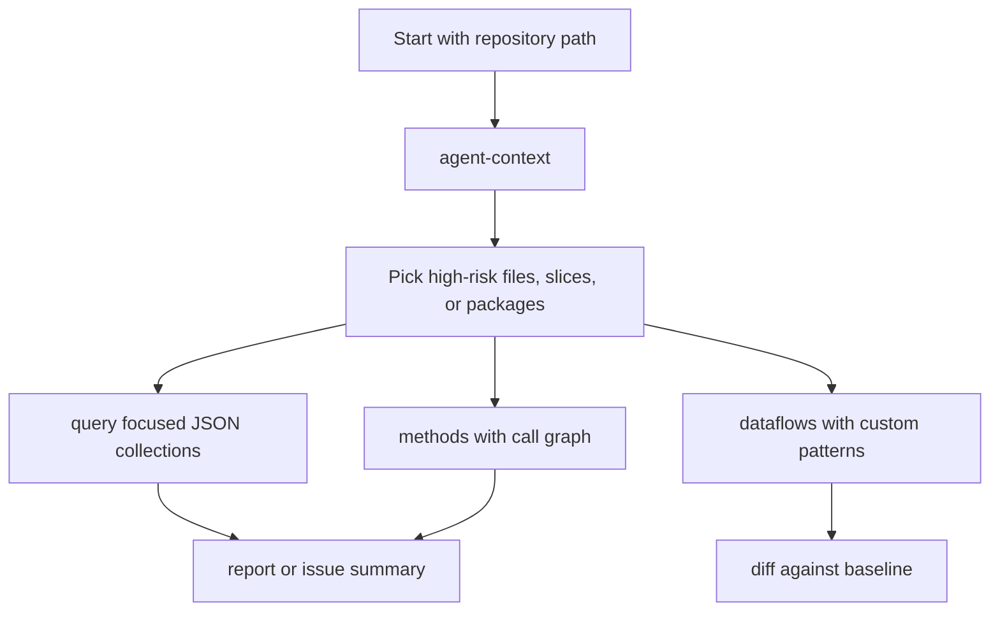

# AI-agent and automation workflows

Dosai v3 exposes compact artifacts and a local MCP-style JSON-RPC server so agents can inspect code, choose follow-up queries, and avoid loading entire source trees into context.

Use this guide when integrating Dosai with AI coding agents, CI bots, or local review scripts.

## Recommended agent loop



The usual flow is:

1. Run `agent-context` for a compact summary.
2. Use `query` to pull only the slices, weaknesses, packages, or crypto findings relevant to the task.
3. Run `methods` only when endpoint inventory, package reachability, or call graph context is needed.
4. Run `dataflows --patterns` when the application uses custom wrappers not covered by built-in pattern packs.
5. Attach `report` output for humans and keep raw JSON for automation.

## CLI workflow

Generate compact context:

```bash
dotnet run --project ./Dosai/Dosai.csproj -- agent-context \
  --path ./src \
  --o /tmp/dosai-agent-context.json \
  --pattern-packs all
```

Generate full data-flow JSON and a graph only when more detail is needed:

```bash
dotnet run --project ./Dosai/Dosai.csproj -- dataflows \
  --path ./src \
  --patterns ./dataflow-patterns.json \
  --o /tmp/dosai-dataflows.json \
  --graph-format gexf \
  --graph-out /tmp/dosai-dataflows.gexf
```

Query high-risk findings for a smaller prompt payload:

```bash
dotnet run --project ./Dosai/Dosai.csproj -- query \
  --input /tmp/dosai-dataflows.json \
  --query 'weaknesses[confidence=High]' \
  --o /tmp/high-risk-weaknesses.json
```

Create a human-readable report:

```bash
dotnet run --project ./Dosai/Dosai.csproj -- report \
  --input /tmp/dosai-dataflows.json \
  --o /tmp/dosai-report.md
```

Compare a new run with a previous baseline:

```bash
dotnet run --project ./Dosai/Dosai.csproj -- diff \
  --old /tmp/baseline-dataflows.json \
  --new /tmp/dosai-dataflows.json \
  --o /tmp/dosai-diff.json
```

## MCP server

The `mcp` command runs a local line-delimited JSON-RPC server over stdin/stdout. It is intended for local agent integrations, not as an authenticated network service.

Start by listing tools:

```bash
printf '{"jsonrpc":"2.0","id":1,"method":"tools/list"}\n' | \
  dotnet run --project ./Dosai/Dosai.csproj -- mcp --path ./src
```

Available tools:

| Tool                  | Purpose                                                            | Key arguments                                        |
| --------------------- | ------------------------------------------------------------------ | ---------------------------------------------------- |
| `dosai.methods`       | Method inventory, API endpoints, call graph, package reachability. | `path`                                               |
| `dosai.dataflows`     | Full source-to-sink data-flow analysis.                            | `path`, `patterns`, `patternPacks`                   |
| `dosai.crypto`        | Crypto assets, operations, materials, protocols, findings, CBOM.   | `path`, `format`                                     |
| `dosai.agent_context` | Compact triage context for agents.                                 | `path`, `patterns`, `patternPacks`                   |
| `dosai.query`         | Filter existing or generated Dosai JSON.                           | `input`, `query`, `path`, `patterns`, `patternPacks` |

Call `dosai.agent_context`:

```bash
printf '{"jsonrpc":"2.0","id":2,"method":"tools/call","params":{"name":"dosai.agent_context","arguments":{"path":"./src","patternPacks":"all"}}}\n' | \
  dotnet run --project ./Dosai/Dosai.csproj -- mcp --path ./src
```

Call `dosai.dataflows` with a custom pattern file:

```bash
printf '{"jsonrpc":"2.0","id":3,"method":"tools/call","params":{"name":"dosai.dataflows","arguments":{"path":"./src","patterns":"./dataflow-patterns.json","patternPacks":"aspnet,data,filesystem"}}}\n' | \
  dotnet run --project ./Dosai/Dosai.csproj -- mcp --path ./src
```

Query an existing JSON file through MCP:

```bash
printf '{"jsonrpc":"2.0","id":4,"method":"tools/call","params":{"name":"dosai.query","arguments":{"input":"/tmp/dosai-dataflows.json","query":"slices[sinkCategory=command]"}}}\n' | \
  dotnet run --project ./Dosai/Dosai.csproj -- mcp --path ./src
```

Request combined CycloneDX crypto output through MCP:

```bash
printf '{"jsonrpc":"2.0","id":5,"method":"tools/call","params":{"name":"dosai.crypto","arguments":{"path":"./src","format":"cyclonedx"}}}\n' | \
  dotnet run --project ./Dosai/Dosai.csproj -- mcp --path ./src
```

MCP responses contain a `result.content[0].text` string. That string is JSON for the selected Dosai artifact. Agents should parse the outer JSON-RPC envelope first, then parse the text payload as JSON.

## Prompt-size strategy

Prefer this ordering when working with large repositories:

1. `agent-context` for summary, relevant files, entry points, high-risk weaknesses, and suggested commands.
2. `query` for exact slices, weaknesses, reachable packages, or crypto findings.
3. `report` for human-readable handoff.
4. `dataflows` full JSON only when paths, graph edges, method summaries, or custom pattern debugging are needed.
5. `methods` only when endpoint inventory, call graph, or package reachability detail is needed.

Avoid pasting full `dataflows` or `methods` JSON into an LLM prompt unless the repository is tiny. Query down to the specific collection first.

## CI and PR automation

A practical PR job can:

```bash
dotnet test ./Dosai.sln

dotnet run --project ./Dosai -- dataflows \
  --path ./src \
  --patterns ./dataflow-patterns.json \
  --o /tmp/dosai-dataflows.json \
  --graph-format gexf \
  --graph-out /tmp/dosai-dataflows.gexf

dotnet run --project ./Dosai -- diff \
  --old /tmp/baseline-dataflows.json \
  --new /tmp/dosai-dataflows.json \
  --o /tmp/dosai-diff.json

dotnet run --project ./Dosai -- query \
  --input /tmp/dosai-dataflows.json \
  --query 'weaknesses[confidence=High]' \
  --o /tmp/high-risk-weaknesses.json
```

Then validate graph edge integrity directly against `Nodes` and `Edges`, and apply project-specific gates to the queried JSON.

## Related docs

- Command reference: `docs/commands.md`
- Query syntax: `docs/query-language.md`
- Data-flow custom patterns: `docs/dataflow-patterns.md`
- Graph exports: `docs/graph-formats.md`
- Crypto and CBOM: `docs/crypto-cbom.md`
