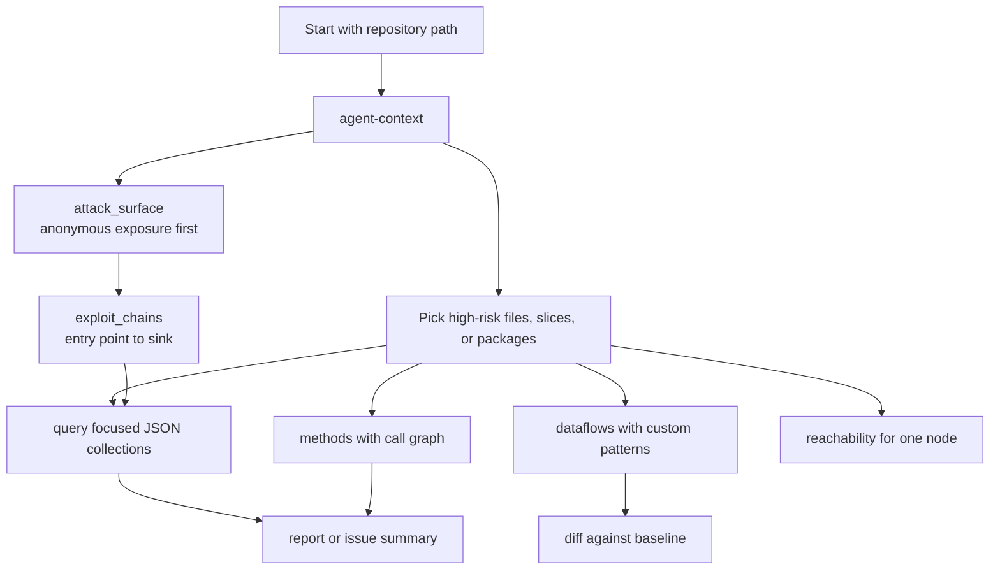

# AI-agent and automation workflows

Dosai exposes compact artifacts and a local MCP-style JSON-RPC server so agents can inspect code, choose follow-up queries, and avoid loading entire source trees into context.

Use this guide when integrating Dosai with AI coding agents, CI bots, or local review scripts.

## Recommended agent loop


```mermaid
flowchart TD
    Start[Start with repository path] --> Context[agent-context]
    Context --> Surface[attack_surface<br/>anonymous exposure first]
    Context --> Decide[Pick high-risk files, slices, or packages]
    Surface --> Chains[exploit_chains<br/>entry point to sink]
    Decide --> Query[query focused JSON collections]
    Chains --> Query
    Decide --> Dataflows[dataflows with custom patterns]
    Decide --> Methods[methods with call graph]
    Decide --> Reach[reachability for one node]
    Query --> Report[report or issue summary]
    Dataflows --> Diff[diff against baseline]
    Methods --> Report
```

The usual flow is:

1. Run `agent-context` for a compact summary that now includes a bounded attack-surface view.
2. Start from exposure, not from flow counts: the attack surface groups entry points anonymous-first with the chains and weaknesses that reach them, and exploit chains give the route-to-sink path for a specific finding.
3. Use `query` to pull only the records relevant to the task: slices, weaknesses, packages, crypto findings, exploit chains, sanitized flows, reachability, recursion clusters, dead code, attack surface, or security findings.
4. Run `methods` only when endpoint inventory, package reachability, or call graph context is needed; `dosai.reachability` with a `nodeId` answers depth, fan-in, and fan-out for a single method without re-serializing the whole slice.
5. Run `dataflows --patterns` when the application uses custom wrappers not covered by built-in pattern packs.
6. Attach `report` output for humans and keep raw JSON for automation.

## CLI workflow

Generate compact context:

```bash
dotnet run --project ./Dosai/Dosai.csproj -- agent-context \
  --path ./src \
  --o /tmp/dosai-agent-context.json \
  --pattern-packs all
```

Generate full data-flow JSON and a graph only when more detail is needed:

```bash
dotnet run --project ./Dosai/Dosai.csproj -- dataflows \
  --path ./src \
  --patterns ./dataflow-patterns.json \
  --o /tmp/dosai-dataflows.json \
  --graph-format gexf \
  --graph-out /tmp/dosai-dataflows.gexf
```

For local human triage, add `--print` to the same command to include stack-trace-style flow paths on stdout. The printed paths show frames with code, file/line/column, symbols, PURLs, and `via ...` edge transitions. Keep `--print` out of most CI jobs unless the console log is intended as a review artifact; the JSON remains easier for agents and scripts to query.

```bash
dotnet run --project ./Dosai/Dosai.csproj -- dataflows \
  --path ./src \
  --patterns ./dataflow-patterns.json \
  --o /tmp/dosai-dataflows.json \
  --print
```

Query high-risk findings for a smaller prompt payload (severity is the triage signal since schema 4.1.0; a Low-confidence pattern match is demoted one rank, so `severity=high` never fires on heuristics alone):

```bash
dotnet run --project ./Dosai/Dosai.csproj -- query \
  --input /tmp/dosai-dataflows.json \
  --query 'weaknesses[severity=high]' \
  --o /tmp/high-risk-weaknesses.json

dotnet run --project ./Dosai/Dosai.csproj -- query \
  --input /tmp/dosai-dataflows.json \
  --query 'exploitChains[exposure=anonymous-http] sort by highSeverityWeaknessCount desc' \
  --o /tmp/anonymous-chains.json
```

Create a human-readable report:

```bash
dotnet run --project ./Dosai/Dosai.csproj -- report \
  --input /tmp/dosai-dataflows.json \
  --o /tmp/dosai-report.md
```

Compare a new run with a previous baseline:

```bash
dotnet run --project ./Dosai/Dosai.csproj -- diff \
  --old /tmp/baseline-dataflows.json \
  --new /tmp/dosai-dataflows.json \
  --o /tmp/dosai-diff.json
```

## MCP server

The `mcp` command runs a local line-delimited JSON-RPC server over stdin/stdout. It is intended for local agent integrations, not as an authenticated network service. Two flags bound what it can do: `--mcp-root DIR` confines every tool call (and the `input` file of `dosai.query`) to paths under `DIR`, and `--mcp-allowlist FILE` names the stdio transport commands that count as policy-approved for MCP transport integrity findings.

Start by listing tools:

```bash
printf '{"jsonrpc":"2.0","id":1,"method":"tools/list"}\n' | \
  dotnet run --project ./Dosai/Dosai.csproj -- mcp --path ./src
```

Available tools:

| Tool                   | Purpose                                                                                      | Key arguments                                        |
| ---------------------- | -------------------------------------------------------------------------------------------- | ---------------------------------------------------- |
| `dosai.methods`        | Method inventory, API endpoints, call graph, reachability, dead code, package reachability.  | `path`                                               |
| `dosai.dataflows`      | Full source-to-sink data-flow analysis with severity, exploit chains, and attack surface.    | `path`, `patterns`, `patternPacks`                   |
| `dosai.crypto`         | Crypto assets, operations, materials, protocols, findings, CBOM.                             | `path`, `format`                                     |
| `dosai.agent_context`  | Compact triage context for agents, including the bounded attack-surface view.                | `path`, `patterns`, `patternPacks`                   |
| `dosai.services`       | `Services[]` with trust zones plus `Frameworks[]` and `ApiEndpoints[]`.                      | `path`                                               |
| `dosai.ai_components`  | `AiComponents[]`: models, MCP tools with JSON Schemas, redacted prompts, agents, embeddings. | `path`                                               |
| `dosai.exploit_chains` | Route-to-sink chains with derived exposure.                                                  | `path`, `patterns`, `patternPacks`                   |
| `dosai.attack_surface` | Entry points grouped by exposure with linked chains and weaknesses.                          | `path`, `patterns`, `patternPacks`                   |
| `dosai.reachability`   | Per-node reachability facts; with `nodeId`, facts for that one node.                         | `path`, `nodeId`                                     |
| `dosai.query`          | Filter existing or generated Dosai JSON.                                                     | `input`, `query`, `path`, `patterns`, `patternPacks` |

Call `dosai.agent_context`:

```bash
printf '{"jsonrpc":"2.0","id":2,"method":"tools/call","params":{"name":"dosai.agent_context","arguments":{"path":"./src","patternPacks":"all"}}}\n' | \
  dotnet run --project ./Dosai/Dosai.csproj -- mcp --path ./src
```

Call `dosai.dataflows` with a custom pattern file:

```bash
printf '{"jsonrpc":"2.0","id":3,"method":"tools/call","params":{"name":"dosai.dataflows","arguments":{"path":"./src","patterns":"./dataflow-patterns.json","patternPacks":"aspnet,data,filesystem"}}}\n' | \
  dotnet run --project ./Dosai/Dosai.csproj -- mcp --path ./src
```

Query an existing JSON file through MCP:

```bash
printf '{"jsonrpc":"2.0","id":4,"method":"tools/call","params":{"name":"dosai.query","arguments":{"input":"/tmp/dosai-dataflows.json","query":"slices[sinkCategory=command]"}}}\n' | \
  dotnet run --project ./Dosai/Dosai.csproj -- mcp --path ./src
```

Request combined CycloneDX crypto output through MCP:

```bash
printf '{"jsonrpc":"2.0","id":5,"method":"tools/call","params":{"name":"dosai.crypto","arguments":{"path":"./src","format":"cyclonedx"}}}\n' | \
  dotnet run --project ./Dosai/Dosai.csproj -- mcp --path ./src
```

MCP responses contain a `result.content[0].text` string. That string is JSON for the selected Dosai artifact. Agents should parse the outer JSON-RPC envelope first, then parse the text payload as JSON.

## Prompt-size strategy

Prefer this ordering when working with large repositories:

1. `agent-context` for summary, relevant files, entry points, high-risk weaknesses, the bounded attack-surface view, and suggested commands.
2. `dosai.attack_surface` or the `attackSurface` query alias for anonymous-first scoping, and `dosai.exploit_chains` / `exploitChains` for the route-to-sink path behind one finding.
3. `dosai.reachability` with a `nodeId`, or the `reachability` alias, for depth, fan-in, fan-out, and dead-code flags of a single method.
4. `query` for exact slices, weaknesses, sanitized flows, reachable packages, or crypto findings; `sort by` and a trailing `count` keep payloads small.
5. `report` for human-readable handoff.
6. `dataflows` full JSON only when paths, graph edges, method summaries, or custom pattern debugging are needed. Add `--print` only for human-readable path review; prefer `query` for prompt payloads.
7. `methods` only when endpoint inventory, call graph, or package reachability detail is needed.

Avoid pasting full `dataflows` or `methods` JSON into an LLM prompt unless the repository is tiny. Query down to the specific collection first.

## CI and PR automation

A practical PR job can:

```bash
dotnet test ./Dosai.sln

dotnet run --project ./Dosai -- dataflows \
  --path ./src \
  --patterns ./dataflow-patterns.json \
  --o /tmp/dosai-dataflows.json \
  --graph-format gexf \
  --graph-out /tmp/dosai-dataflows.gexf

dotnet run --project ./Dosai -- diff \
  --old /tmp/baseline-dataflows.json \
  --new /tmp/dosai-dataflows.json \
  --o /tmp/dosai-diff.json

dotnet run --project ./Dosai -- query \
  --input /tmp/dosai-dataflows.json \
  --query 'weaknesses[severity=high]' \
  --o /tmp/high-risk-weaknesses.json
```

Then validate graph edge integrity directly against `Nodes` and `Edges`, and apply project-specific gates to the queried JSON. Gate on the diff's `RiskDelta` counters (`NewHighSeveritySlices`, `NewAnonymousEndpoints`, `NewlyReachablePackages`) rather than raw flow counts, and carry reviewed-and-accepted findings in a `--suppress` file so the gate stays quiet until an entry expires.

## Related docs

- Command reference: `docs/commands.md`
- Query syntax: `docs/query-language.md`
- Data-flow custom patterns: `docs/dataflow-patterns.md`
- Built-in data-flow pattern packs: `docs/pattern-packs.md`
- Graph exports: `docs/graph-formats.md`
- Crypto and CBOM: `docs/crypto-cbom.md`
- Compliance and audit workflows: `docs/compliance.md`

## Inventory and exposure tools (schema 4.0.0 and 4.1.0)

The `dosai mcp` server also exposes tools for service, AI inventory, and exposure views:

| Tool                   | Payload                                                                                                                                                                 |
| ---------------------- | ----------------------------------------------------------------------------------------------------------------------------------------------------------------------- |
| `dosai.services`       | `Services[]` (inbound surfaces and outbound dependencies with resolved paths, confidence, trust zones, data classifications) plus `Frameworks[]` and `ApiEndpoints[]`   |
| `dosai.ai_components`  | `AiComponents[]`: models (identifiers and hashed on-disk artifacts), MCP tools with JSON Schemas, redacted prompts, agents, embeddings                                  |
| `dosai.exploit_chains` | `ExploitChains[]`: resolved entry point, call path, taint slice, and sink linkages with exposure classification                                                         |
| `dosai.attack_surface` | `AttackSurface[]`: entry points grouped by exposure with the weakness candidates and chains that reach each                                                             |
| `dosai.reachability`   | Per-node reachability facts: which entry points reach a node, at what depth, fan-in/fan-out, and dead-code flags; the optional `nodeId` argument narrows it to one node |

All take the standard `path` argument. Use them after `dosai.methods` to answer "what does this
app expose and to whom" without re-running the full slice.
