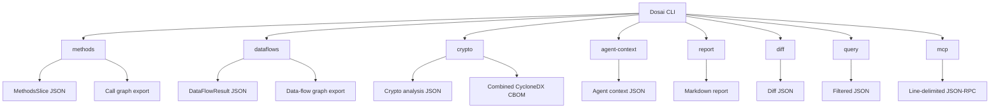
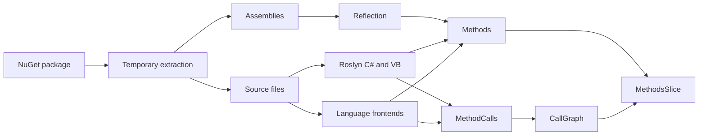
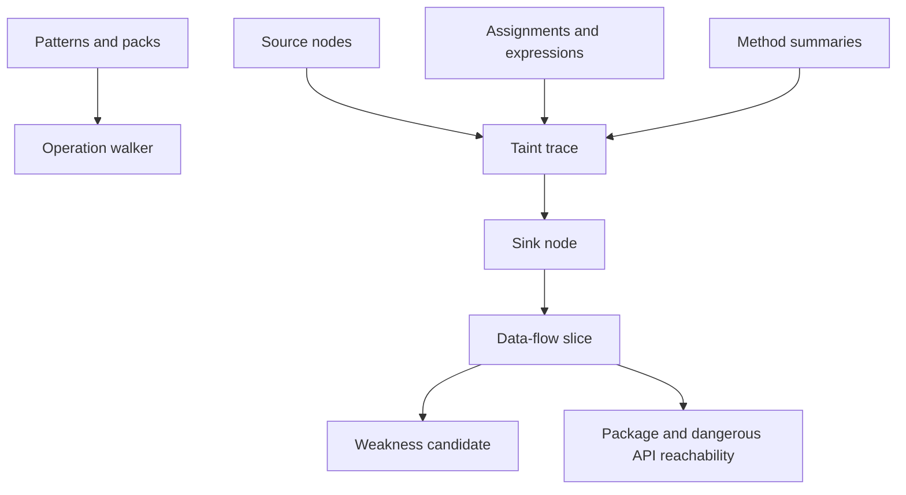
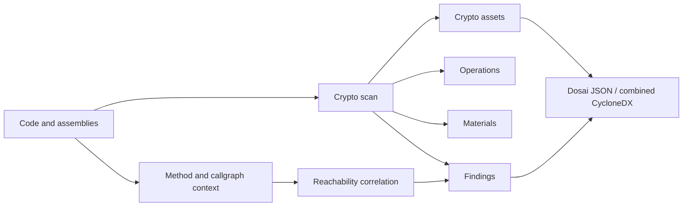
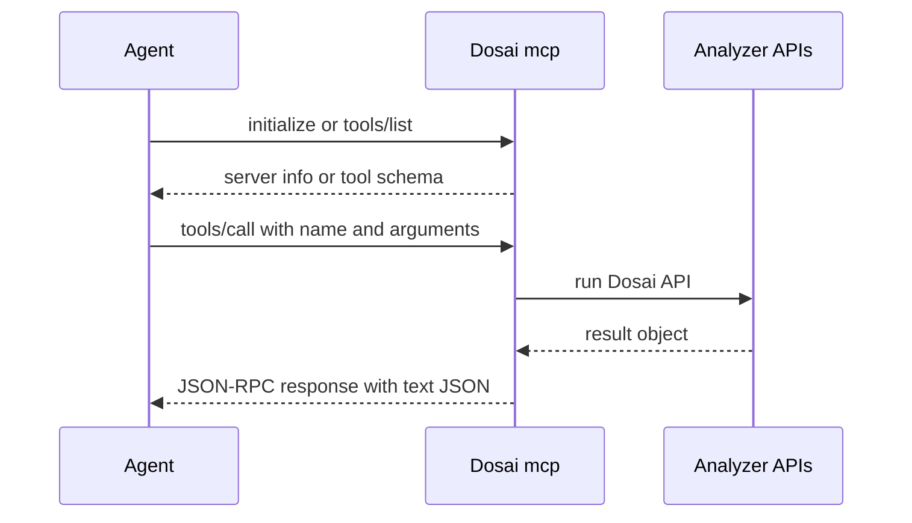

# Dosai command reference

This guide documents each Dosai command from an implementation and security analysis perspective. It explains the command purpose, inputs, output artifacts, core algorithm, strengths, and known limits.

## Command map



The CLI is implemented in `Dosai/CommandLine.cs` with `System.CommandLine`. Commands share a small set of options where possible. `--path` points at a source tree, source file, assembly, executable, or NuGet package where supported. `--o` writes the primary output file and defaults to `dosai.json`.

## `methods`

`methods` builds the structural inventory used by most other analysis features.

```bash
dotnet run --project ./Dosai/Dosai.csproj -- methods \
  --path ./Dosai \
  --o /tmp/dosai-methods.json \
  --callgraph-format graphml \
  --callgraph-out /tmp/dosai-callgraph.graphml
```

Supported call graph formats are `mermaid`, `graphml`, and `gexf`. If `--callgraph-out` is omitted, Dosai derives the output name from `--o` and the selected format.

### Implementation flow

```text
input path
  ├─ .nupkg? extract relevant entries to temp directory
  ├─ assemblies: Reflection and MetadataLoadContext-style inspection
  ├─ C# and VB source: Roslyn syntax trees and semantic models
  ├─ F# source: language frontend with FSharp.Compiler.Service availability marker
  ├─ R source: Rscript getParseData parser when available, managed fallback otherwise
  ├─ VC++/C/C++ source: conservative frontend extraction
  ├─ API endpoint extraction
  ├─ call capture through IOperation where Roslyn is available
  ├─ call graph node and edge normalization
  └─ package URL enrichment
```



### Algorithm and logic

For C# and VB, Dosai creates a compilation across the inspected source set. It adds trusted platform assemblies and managed assemblies found under the inspected root as metadata references. This improves cross-file symbol binding compared with one-file parsing. Method and constructor symbols are converted into stable IDs that include containing type, method name, parameter types, generic type information where available, and return type for non-constructors.

Call graph capture prefers Roslyn `IOperation` rather than syntax-only invocation matching. The operation walker records method calls, constructor calls, property gets and sets, delegate-style calls where represented by operations, and source spans. Every call graph edge is normalized so both endpoints exist as nodes. External calls become external nodes when Dosai cannot map them to a source declaration.

F#, R, and VC++ frontends are intentionally tolerant of incomplete project metadata. F# evidence is marked with `FSharp.Compiler.Service` when the compiler service can be loaded. R uses `Rscript` and `getParseData` when available, which gives parser-level tokens and source locations. VC++ extraction does not require `compile_commands.json`, so it can still produce inventory and call evidence for partial native projects.

### Output

The primary output is `MethodsSlice`. Important collections include `Methods`, `MethodCalls`, `Properties`, `Fields`, `Events`, `Constructors`, `CallGraph`, `ApiEndpoints`, `EntryPoints`, `PackageReachability`, `AssemblyInformation`, and `SourceAssemblyMapping`.

### Strengths

`methods` is the best starting point for repository inventory. It gives stable graph IDs, API endpoint metadata, package URL enrichment, and language frontend evidence from a single command. It is robust against missing references and partial source trees.

### Weaknesses and edge cases

Reflection-based assembly inspection cannot recover local variable flow or source-only context. Roslyn semantic quality depends on available references. F#, R, and VC++ frontends are conservative and may over-approximate calls when full project metadata is absent. VC++ extraction does not yet perform full libclang semantic analysis.

## `dataflows`

`dataflows` builds source-to-sink slices for security triage.

```bash
dotnet run --project ./Dosai/Dosai.csproj -- dataflows \
  --path ./Dosai \
  --o /tmp/dosai-dataflows.json \
  --pattern-packs all \
  --graph-format gexf \
  --graph-out /tmp/dosai-dataflows.gexf
```

Common options are `--patterns`, `--pattern-packs`, `--graph-format`, `--graph-out`, and `--print-sources-sinks`. Supported graph formats are `mermaid`, `graphml`, and `gexf`.

Use `--patterns` to merge project-specific source, sink, passthrough, and sanitizer patterns with Dosai's built-in patterns:

```bash
dotnet run --project ./Dosai/Dosai.csproj -- dataflows \
  --path ./src \
  --patterns ./dataflow-patterns.json \
  --pattern-packs all \
  --o /tmp/dosai-dataflows.json \
  --print-sources-sinks
```

For the JSON schema and examples, see [Data-flow custom patterns](./dataflow-patterns.md).

### Implementation flow

```text
load default patterns
  ├─ apply requested pattern packs
  ├─ merge user patterns
  ├─ build C# and VB compilations
  ├─ collect method summaries
  ├─ walk operations for sources, assignments, calls, sinks, returns
  ├─ add frontend data-flow evidence for F#, R, and VC++
  ├─ derive slices from source traces to sink nodes
  ├─ validate graph-style edge endpoint consistency by construction
  └─ derive transparency facts and weakness candidates
```



### Algorithm and logic

The analyzer uses pattern objects with target, kind, match mode, category, description, taint kinds, sanitizer effects, and confidence. Pattern kinds include symbol, method, type, namespace, name, parameter, attribute, and code. Match modes include contains, exact, prefix, suffix, and regex. User pattern files are deserialized as `DataFlowPatternSet` and merged into the selected built-in pattern packs.

The C# and VB path is operation based. `DataFlowOperationWalker` seeds taint from matched parameters, attributes, request objects, CLI arguments, and source expressions. It propagates taint through local variables, field and property assignments, receiver-sensitive member keys, common expressions, passthrough calls, object creation, return values, and simple interprocedural summaries. Sanitizer patterns stop or suppress taint, and validator guards can suppress taint in guarded true branches. Slices contain node IDs, edge IDs, source and sink categories, PURLs, taint kinds, field paths, confidence, and sink argument metadata.

The method summary pass records parameter-to-return and parameter-to-sink relationships. These summaries allow calls to local helper methods to preserve taint without inlining the callee body every time. Frontend analysis for F#, R, and VC++ adds conservative source-to-sink evidence for common script and native patterns.

The hot path is optimized for full source-tree CI runs. Pattern lists are pre-indexed by commonly queried kind, syntax text is cached and only materialized for code-like matches, duplicate edges are suppressed, and slice edge collection uses an outgoing-edge index instead of scanning every graph edge for every slice. The repository CI smoke test runs `dataflows --path ./Dosai` to catch regressions in this path.

### Output

The primary output is `DataFlowResult`. It contains `Nodes`, `Edges`, `Slices`, `EntryPoints`, `PackageReachability`, `DangerousApiReachability`, `WeaknessCandidates`, `Patterns`, `MethodSummaries`, `Statistics`, and `Diagnostics`.

### Strengths

`dataflows` is practical for CI and security triage. It handles missing references, legacy frameworks, route and CLI entry points, PURL enrichment, graph exports, sanitizer stop-flow, field-sensitive taint where receiver identity is available, and basic interprocedural flow.

### Weaknesses and edge cases

This is not a full SSA or path-sensitive theorem prover. Complex aliasing, reflection, dynamic dispatch, deep collection modeling, and framework-specific lifecycle edges may require conservative approximations. Sanitizers are pattern-driven, so custom validation logic may need project-specific patterns.

## `crypto`

`crypto` detects cryptographic components and emits native Dosai JSON or combined CycloneDX-style CBOM JSON.

```bash
dotnet run --project ./Dosai/Dosai.csproj -- crypto \
  --path ./Dosai \
  --o /tmp/dosai-crypto.json \
  --format dosai
```

```bash
dotnet run --project ./Dosai/Dosai.csproj -- crypto \
  --path ./Dosai \
  --o /tmp/dosai-cbom.json \
  --format cyclonedx
```

### Implementation flow

```text
source discovery
  ├─ build methods and callgraph for reachability context
  ├─ Roslyn operation scan for C# and VB crypto APIs
  ├─ text and frontend scan for F#, R, and VC++ crypto indicators
  ├─ classify algorithm, family, strength, and operation type
  ├─ detect hardcoded key/cert/IV/secret material with redaction and fingerprinting
  ├─ detect misuse rules such as MD5, SHA1, DES, ECB, TLS bypass, low PBKDF2
  ├─ associate findings with method IDs and entry points where possible
  └─ export native JSON or combined CycloneDX CBOM evidence
```



### Algorithm and logic

The analyzer classifies crypto symbols and source text into families such as hash, symmetric encryption, asymmetric encryption, MAC, KDF, RNG, certificate, TLS, and JWT signing. It assigns strength values such as weak, acceptable, strong, or unknown. Known weak or risky patterns create findings with rule IDs, severity, confidence, CWE, recommendation, source location, affected assets, affected operations, and material IDs.

Material detection looks for quoted base64-like, hex-like, PEM-like, key-like, secret-like, IV, nonce, token, and certificate values. Values are not emitted directly. Dosai emits redacted values and SHA-256 fingerprints.

Reachability is best effort. Dosai reuses method extraction, entry point discovery, and callgraph data. It resolves methods by stable ID, file/class/method keys, method-name fallback, and file-level entry point correlation. It also walks callgraph edges forward and uses bounded reverse proximity to catch helper and framework/lambda cases. Crypto analysis continues even if reachability fails.

### Output

Native JSON includes `Assets`, `Operations`, `Materials`, `Protocols`, `Findings`, `Statistics`, and `Diagnostics`. CycloneDX output represents crypto assets, operations, materials, and protocols as components and findings as vulnerability-like entries with Dosai properties, keeping CBOM data and code-level evidence in one artifact.

### Strengths

`crypto` gives code-level CBOM evidence that package scanners cannot infer from dependency metadata alone. It can show actual algorithm use, source locations, hardcoded material fingerprints, weak crypto findings, and reachability from known entry points.

### Weaknesses and edge cases

Some crypto decisions are data-dependent and cannot be proven from syntax alone. Reflection, generated code, configuration-driven algorithms, native wrapper libraries, and external key stores can hide relevant evidence. The CBOM export is intentionally evidence-oriented and may need downstream normalization for strict organizational CBOM profiles.

## `agent-context`

`agent-context` runs data-flow analysis and emits compact context for AI agents or review automation.

```bash
dotnet run --project ./Dosai/Dosai.csproj -- agent-context \
  --path ./Dosai \
  --o /tmp/dosai-agent-context.json \
  --pattern-packs all
```

### Implementation flow

```text
DataFlowAnalyzer.Analyze
  └─ TransparencyBuilder.BuildAgentContext
      ├─ summary
      ├─ entry points
      ├─ high-risk weaknesses
      ├─ high-risk slices
      ├─ reachable packages
      ├─ relevant files
      └─ suggested next commands
```

### Algorithm and logic

The command builds a full `DataFlowResult`, then condenses it through `TransparencyBuilder`. It keeps review-oriented facts rather than full graph detail. This is intended for agents that need a compact representation before choosing where to inspect code.

### Strengths

The output is small enough for automated triage and can point reviewers toward relevant files, entry points, and high-risk flows.

### Weaknesses and edge cases

This command intentionally drops detail. Use `dataflows` when exact node and edge paths matter.

## `report`

`report` converts data-flow JSON into a Markdown report.

```bash
dotnet run --project ./Dosai/Dosai.csproj -- report \
  --input /tmp/dosai-dataflows.json \
  --o /tmp/dosai-report.md
```

### Implementation flow

```text
DataFlowResult JSON -> TransparencyBuilder.ToMarkdownReport -> Markdown file
```

### Algorithm and logic

The command deserializes `DataFlowResult` with enum support and renders a deterministic Markdown summary. It focuses on counts, entry points, weakness candidates, package reachability, and notable slices.

### Strengths

The report is easy to attach to CI runs, pull requests, or manual review tickets.

### Weaknesses and edge cases

Markdown is a presentation artifact. It should not be treated as the canonical machine-readable record. Keep the original JSON for automation.

## `diff`

`diff` compares two data-flow JSON files. It is a Dosai data-flow diff, not a generic JSON patch/diff tool.

```bash
dotnet run --project ./Dosai/Dosai.csproj -- diff \
  --old /tmp/old-dataflows.json \
  --new /tmp/new-dataflows.json \
  --o /tmp/dosai-diff.json
```

### Implementation flow

```text
old DataFlowResult + new DataFlowResult -> TransparencyBuilder.DiffJson -> diff JSON
```

### Algorithm and logic

The command deserializes two `DataFlowResult` objects and computes a deterministic JSON diff using transparency-layer comparison logic. It is designed for CI trend checks and review of analysis changes between commits.

Because it deserializes typed Dosai data-flow output before comparing, it normalizes away JSON object property ordering and ignores unknown added properties. Slice ordering is ignored by converting slices to keyed sets. The current comparison intentionally focuses on source-to-sink slice identity using `SourceCategory`, `SinkCategory`, and `SinkArgument`, plus old/new statistics. It does not produce a generic tree edit script and does not compare arbitrary node, edge, metadata, or property additions/removals.

### Strengths

`diff` helps separate new data-flow classes from existing backlog without the noise produced by raw JSON array ordering or formatting changes.

### Weaknesses and edge cases

Stable diffs depend on stable source/sink categorization and sink argument labels. Large heuristic changes can still produce noisy diffs because the tool is comparing Dosai analysis facts, not raw JSON text.

## `query`

`query` filters Dosai JSON with compact collection filters.

```bash
dotnet run --project ./Dosai/Dosai.csproj -- query \
  --input /tmp/dosai-dataflows.json \
  --query 'slices[sinkCategory=sql]' \
  --o /tmp/sql-slices.json
```

Crypto output can be queried with the same engine:

```bash
dotnet run --project ./Dosai/Dosai.csproj -- query \
  --input /tmp/dosai-crypto.json \
  --query 'findings[ruleId~=MD5]' \
  --o /tmp/md5-findings.json
```

### Query grammar

```text
collection
collection[property=value]
collection[property~=substring]
collection[property!=value]
collection[number>=10]
collection[a=b && c~=d]
```

Collection aliases include `nodes`, `edges`, `slices`, `weaknesses`, `entrypoints`, `packages`, `dangerous`, `summaries`, `assets`, `operations`, `materials`, `protocols`, and `findings`.

### Algorithm and logic

`DosaiQueryEngine` parses the collection name and optional bracketed filters. It resolves case-insensitive JSON property paths, supports nested paths with dot notation, compares arrays by checking whether any element matches, and supports string and numeric comparisons. The result is a JSON array of matching elements.

### Strengths

The engine is small, dependency-free, and useful in shell scripts or CI jobs.

### Weaknesses and edge cases

The query language is intentionally compact. It does not support arbitrary JSONPath, grouping, sorting, joins, or computed expressions.

## `mcp`

`mcp` runs a line-delimited JSON-RPC server over stdin and stdout. It exposes Dosai commands as tools for local agents.

```bash
printf '{"jsonrpc":"2.0","id":1,"method":"tools/list"}\n' | \
  dotnet run --project ./Dosai/Dosai.csproj -- mcp --path ./Dosai
```

Call a tool:

```bash
printf '{"jsonrpc":"2.0","id":2,"method":"tools/call","params":{"name":"dosai.crypto","arguments":{"format":"cyclonedx"}}}\n' | \
  dotnet run --project ./Dosai/Dosai.csproj -- mcp --path ./Dosai
```

### Implementation flow



### Tools

```text
dosai.methods       -> Dosai.GetMethods
dosai.dataflows     -> DataFlowAnalyzer.Analyze
dosai.crypto        -> CryptoAnalyzer.GetCryptoAnalysis
dosai.agent_context -> TransparencyBuilder.BuildAgentContext
dosai.query         -> DosaiQueryEngine.QueryJson
```

### Algorithm and logic

The server reads one JSON-RPC request per line. It supports `initialize`, `tools/list`, and `tools/call`. Tool arguments can override the default `--path`, pattern file, pattern packs, query input, query expression, and crypto format. Results are serialized as MCP-style text content containing JSON.

### Strengths

`mcp` lets local agents call Dosai without shelling out for every subcommand. It also provides a stable tool list and schema surface.

### Weaknesses and edge cases

The server is intentionally simple. It is line-oriented, synchronous, and designed for local stdio use. It is not an authenticated network service and should not be exposed directly on a network boundary.

## Choosing the right command

```text
Need inventory or callgraph?                 methods
Need source-to-sink paths?                   dataflows
Need crypto or CBOM evidence?                crypto
Need compact AI-agent context?               agent-context
Need Markdown for humans?                    report
Need compare two analysis runs?              diff
Need filter JSON in scripts?                 query
Need agent tool access over stdio?           mcp
```

## Recommended CI sequence

```bash
dotnet test ./Dosai.sln

dotnet run --project ./Dosai -- methods \
  --path ./src \
  --o /tmp/dosai-methods.json \
  --callgraph-format graphml \
  --callgraph-out /tmp/dosai-callgraph.graphml

dotnet run --project ./Dosai -- dataflows \
  --path ./src \
  --o /tmp/dosai-dataflows.json \
  --graph-format gexf \
  --graph-out /tmp/dosai-dataflows.gexf

dotnet run --project ./Dosai -- crypto \
  --path ./src \
  --o /tmp/dosai-cbom.json \
  --format cyclonedx
```

This sequence validates compilation, method inventory, graph export integrity, data-flow analysis, and CBOM generation. CI smoke scripts should additionally validate graph edge endpoints and any project-specific slice-count expectations directly against the JSON output.
