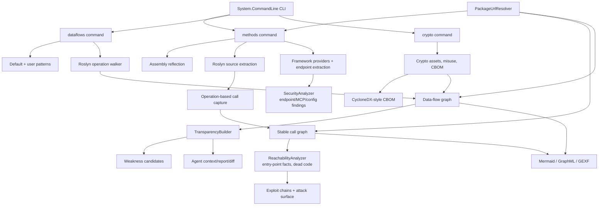
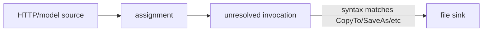

# Dosai Compiler Engineering Notes

This document describes the Roslyn-based implementation details behind the call graph, data-flow, endpoint, crypto, reachability, and PURL analysis in Dosai. It is written for compiler engineers and maintainers who need to evolve Dosai's analysis pipeline.

## Architecture overview


```mermaid
flowchart TD
    CLI[System.CommandLine CLI] --> Methods[methods command]
    CLI --> Dataflows[dataflows command]
    CLI --> Crypto[crypto command]
    Methods --> Reflection[Assembly reflection]
    Methods --> Source[Roslyn source extraction]
    Methods --> Endpoints[Framework providers + endpoint extraction]
    Source --> Calls[Operation-based call capture]
    Calls --> CallGraph[Stable call graph]
    Dataflows --> Patterns[Default + user patterns]
    Dataflows --> DFRoslyn[Roslyn operation walker]
    DFRoslyn --> DFGraph[Data-flow graph]
    Crypto --> CryptoAnalyzer[Crypto assets, misuse, CBOM]
    CryptoAnalyzer --> CBOM[CycloneDX-style CBOM]
    CryptoAnalyzer --> DFGraph
    CallGraph --> Reach[ReachabilityAnalyzer<br/>entry-point facts, dead code]
    Reach --> Exploit[Exploit chains + attack surface]
    Endpoints --> SecFind[SecurityAnalyzer<br/>endpoint/MCP/config findings]
    PURL[PackageUrlResolver] --> Methods
    PURL --> CallGraph
    PURL --> DFGraph
    DFGraph --> Transparency[TransparencyBuilder]
    Transparency --> Weakness[Weakness candidates]
    Transparency --> Agent[Agent context/report/diff]
    CallGraph --> Exporters[Mermaid / GraphML / GEXF]
    DFGraph --> Exporters
```

## Transparency layer

`TransparencyBuilder` derives higher-level review facts from lower-level compiler artifacts:

- `EntryPoint` records from API endpoints and CLI sources, including the compiler-synthesized `<Main>$` of top-level-statement programs.
- `PackageReachability` facts from graph/data-flow PURLs.
- `DangerousApiReachability` facts from sink nodes, with entry-point ids attached by exploit chains.
- `WeaknessCandidate` records from source-to-sink slices, each with a severity.
- `ExploitChain` records linking an entry point through the call graph to a slice and sink, with a derived exposure class.
- `AttackSurface` groups of entry points by exposure with linked chains and weaknesses.
- `SanitizedFlow` records of flows suppressed by sanitizers or validator guards (negative evidence).
- `AgentContext` bundles for AI agents, including a bounded attack-surface view.

This layer intentionally remains deterministic. It does not query vulnerability databases and does not make exploitability claims. It converts semantic evidence into structured facts. Suppressions (`--suppress`) are applied here, with AND semantics per entry and `expires` resurfacing, so reportable findings reflect the post-suppression set.

```text
Roslyn operations -> nodes/edges/slices -> transparency facts -> reports/agent context/diff
```

## Source compilation model

Dosai now creates per-language compilations from all source files in the inspected tree:

- C#: `CSharpCompilation.Create("Dosai.SourceAnalysis.CSharp", ...)`
- VB.NET: `VisualBasicCompilation.Create("Dosai.SourceAnalysis.VisualBasic", ...)`

All C# parsing goes through one helper (`CSharpSourceParser`), which parses with
`LanguageVersion.Preview` - the widest grammar the referenced compiler accepts. Analyzed source
is not ours to constrain: a project can target a language version newer than the compiler Dosai
references, and source that fails to parse disappears from the inventory, call graph, and
data-flow results without an error. C# 15 union declarations are the current example - the
Roslyn 5.9.0 line parses them only under `Preview`, because its `Default` is still C# 14.
Preview only widens the accepted grammar; it does not change the meaning of source that already
parsed.

References are populated from:

1. `typeof(object).Assembly.Location`
2. `TRUSTED_PLATFORM_ASSEMBLIES`
3. managed assemblies under the inspected tree

This improves cross-file symbol resolution compared with one-file compilations. It also lets the data-flow walker observe method calls, constructor calls, property references, field references, and invalid operations with better context.

Top-level statements (the default `dotnet new console` template) have no declared `Main`, so the method inventory reports the compiler-synthesized `<Main>$` like any method, the entry-point list carries a `Cli` entry whose `MethodId` matches the call graph node, and `args` is seeded as a taint source. Declared `Main` variants (`async Task`, `Task<int>`, `int`) follow the same path.

When enumerating source files from a directory, Dosai excludes `bin` and `obj` directories relative to the inspected root. Source-mode checks use the same C#, VB, and F# source enumeration rules so VB-only and F#-only trees are treated as source analysis. Assembly discovery keeps app output directories valid because binary-only users often point directly at `bin/Debug/...` or publish directories.

## Stable method identities

Call graph node IDs are stable signatures rather than lossy `Namespace.Class.Method` strings:

```text
Namespace.Type.Method(ParameterType1,ParameterType2):ReturnType
Namespace.Type<T>..ctor(T)
```

Reasons:

- overload-safe
- generic-aware enough for source and callgraph use
- can map Roslyn calls to declared methods
- can be used as graph node IDs in GraphML/GEXF

## Call graph operation walker

Call graph capture uses Roslyn `IOperation` APIs rather than raw invocation syntax.

Supported operation kinds include:

- `IInvocationOperation`
- `IObjectCreationOperation`
- `IPropertyReferenceOperation`
- assignment context for property set/get detection

The graph builder guarantees that every edge endpoint exists as a node. External targets become external nodes when no source declaration exists. Repeated call sites of the same `(source, target, callType, evidence)` pair collapse into one counted edge (`CallSiteCount`) whose argument and evidence annotations are merged. Assembly call graph edge de-duplication includes evidence kind so direct IL, generated-state, delegate-target, and inferred candidate edges are not accidentally collapsed into one classification. Source and assembly call graphs are merged with dictionary-backed node lookups so duplicate node evidence can be combined without repeatedly scanning large node lists.

Source and binary call graph extraction share a small CHA/RTA-style dispatch resolver. For source, it indexes concrete application types, interface implementations, overrides, and instantiated types observed from object creation operations. The source index is built once per Roslyn compilation and reused by per-file walkers. For assemblies, it matches known methods against decoded type metadata, base types, implemented interfaces, and instantiated IL types. Inferred virtual and interface edges carry a dispatch confidence tier: `exact` when the receiver is sealed or exactly one implementation was instantiated, `rta-candidate`, or `cha-candidate`.

Instantiated-generic IL ids (`Method<args>`) never match a source id exactly because the instantiation rewrites parameter types too, so the merged graph normalizes them onto the source original-definition node keyed by an instantiation-free identity, keeping the original instantiated id in `MethodNode.GenericInstantiation`.

Source-to-assembly mapping prefers exact stable signatures. If a fallback name match is needed, it only maps methods when parameter count, available parameter types, and available return type leave a single unambiguous assembly candidate. Mapped assembly name and module metadata come from the matched on-disk method, not the synthetic Roslyn compilation. This avoids corrupting mappings for overloads and keeps PURL enrichment tied to the compiled representation.

Package reachability is built after method identities and call graph evidence are attached, so evidence kinds and confidence reflect source, IL, inferred, and external-summary observations on nodes as well as edges.

The source walker also emits explicit inferred evidence for common callback and framework patterns. Delegate creation, event subscription, lambda callbacks, DI registrations such as `AddSingleton`, service resolution helpers such as `GetRequiredService`, and simple reflection forms such as `Activator.CreateInstance<T>()` or `typeof(T).GetMethod("Name")` are represented as `FrameworkModel` or `ReflectionHeuristic` edges rather than folded into direct Roslyn calls.

```text
Invocation Operation
        │
        ├── caller symbol ──► SourceId
        ├── target symbol ──► TargetId
        ├── arguments ─────► edge argument metadata
        └── source span ───► CallLocation
```

## Data-flow operation walker

`DataFlowAnalyzer` builds a lightweight taint graph. It is not a full interprocedural SSA engine; it is a pragmatic, symbol-aware slicer designed for security triage.

### Taint state

The walker maintains:

```csharp
Dictionary<string, TaintTrace> _taintedSymbols
```

Keys are normalized Roslyn symbol display strings. Values are ordered node traces.

### Supported propagation

- parameter sources, including `args` of the synthesized `<Main>$` for top-level statements
- local variable initializers
- simple assignments
- compound assignments
- invocation return propagation for passthrough/system/source methods, except boolean-returning validators, which carry decisions rather than payloads
- object creation argument propagation
- binary/interpolated/coalesce/array expression propagation
- lambda parameter seeding when the lambda is passed over a tainted receiver or argument; delegate invocations propagate argument taint; `await` of a tainted task yields the taint of its result
- `ref`/`out` write-back: a call with tainted arguments or receiver taints its out/ref locals, and callee summaries record which parameter indexes are written and which source categories flow into each index
- collection taint: `foreach` loop variables inherit the collection's taint and element or indexer stores (`arr[i] = tainted`, `dict[k] = tainted`) taint the container, while ordinary property stores stay field-sensitive (`obj.Tag = tainted` leaves `obj.Other` clean)
- return edges
- sink argument flows
- sink receiver flows, e.g. `model.File.CopyTo(stream)`
- fallback invalid-operation sink matching for projects with unresolved legacy frameworks
- branch-aware sanitizer guards for validators such as `Regex.IsMatch`, recorded as sanitized flows (negative evidence)

Summaries iterate to a fixpoint (capped rounds), so wrapper-to-wrapper-to-sink chains attribute to the outermost method, and `TaintKinds` survive across summary hops.

### Performance-sensitive implementation details

The data-flow path is expected to run against the full `./Dosai` source tree in CI. Keep these optimizations intact when extending the walker:

- `DataFlowPatternIndex` pre-splits patterns by source/sink/sanitizer role and hot lookup kind so tight loops do not repeatedly filter the full pattern lists.
- `DataFlowOperationWalker.SyntaxText` caches `SyntaxNode.ToString()` results and code text is only requested for code-like pattern kinds.
- `DataFlowGraphBuilder` de-duplicates edges and maintains outgoing edges by source node, allowing `AddSlice` to collect in-slice edge IDs from the trace nodes instead of scanning all graph edges.
- Graph edge endpoint validity remains by construction: nodes are registered before edges, and slice edges are selected from the indexed graph.

### Why invalid-operation support exists

Older ASP.NET/WebForms projects often do not compile cleanly in isolated analysis because framework assemblies are unavailable or target older TFMs. Roslyn still creates `IInvalidOperation` trees. Dosai uses syntax-based sink matching on those invalid operations so high-value flows are not missed.


```mermaid
flowchart LR
    Source[HTTP/model source] --> Assign[assignment]
    Assign --> Invalid[unresolved invocation]
    Invalid -->|syntax matches CopyTo/SaveAs/etc| Sink[file sink]
```

## Assembly IL analysis

Assembly analysis reads managed method bodies without intentionally executing target code. The methods command uses IL call instructions, constructor calls, delegate target loads, event accessors, generated async/iterator state-machine mappings, and the shared dispatch resolver to add binary call graph evidence. Unknown or malformed IL opcodes stop decoding the current method body safely instead of desynchronizing later instruction reads. `switch` operands validate and bound their target count before allocation so malformed IL cannot force large arrays or out-of-range reads. Re-added call graph nodes merge evidence and missing identity fields into existing nodes so generated-state, delegate, source signature, and assembly signature observations are preserved through combined source and binary enrichment. External member-reference nodes use module/file metadata derived from the referenced assembly name instead of the caller assembly path. Portable PDB sequence points are resolved with raw zero-based IL offsets, with display-safe fallback line numbers when no sequence point is available.

The assembly data-flow pass uses a bounded worklist over decoded IL. It follows branch, switch, fallthrough, and exception-region successors. Catch and filter handlers receive exception-object stack state when it is available, while finally and fault handlers preserve local and argument state with handler stack semantics. This lets taint reach sinks that run from exception paths without treating those edges as direct source syntax.

Binary signatures are decoded from metadata blobs for method identity, summary replay, and dispatch matching. The decoder handles common constructed generic types and method specifications, arrays, byrefs, pointers, generic type and method parameters, nested type specifications, and custom modifier wrappers. Assembly data-flow summaries include decoded parameter types in method symbols so overloads with the same arity do not merge, and those symbols are parsed back into namespace, class, and method fields for `MethodIdentity`. IL local and argument operands are normalized so both short and two-byte InlineVar forms participate in delegate tracking and data-flow propagation. Sink slices use stable tainted argument labels such as `arg0` or `receiver` when source expressions are unavailable from IL. Assembly-derived data-flow node de-duplication is scoped by assembly path because metadata tokens and IL offsets are only unique within one binary. The output remains best-effort because some runtime substitutions are not available from IL alone.

Assembly application scoping from `.deps.json` is best-effort. Malformed library entries, including null `type` values, should not fail analysis. Reachability confidence treats generated-state-machine and delegate-target evidence as direct observations because they are derived from IL or Roslyn semantics even though the edge is normalized to user code or callback targets.

Assembly file discovery and application scoping are centralized in `AssemblyScope` so methods, assembly call graph, and assembly data-flow use the same `.deps.json` project-library filter and fallback application-name heuristic. The assembly call graph path folds source-file detection into the same recursive enumeration used to collect candidate assemblies, and methods identity enrichment reuses the source-mode result from source enumeration instead of walking the filesystem again.

## Endpoint extraction

`ApiEndpointAnalyzer` is syntax-oriented by design. It extracts endpoints without requiring successful semantic binding.

Captured forms:

- C# MVC/Web API attributes: `Route`, `HttpGet`, `HttpPost`, `HttpPut`, `HttpDelete`, `HttpPatch`, `HttpHead`, `HttpOptions`
- C# minimal API calls: `MapGet`, `MapPost`, `MapPut`, `MapDelete`, `MapPatch`, `MapMethods`
- VB.NET route/http attributes
- absolute URLs in source files

Endpoint entries are emitted in the default `methods` JSON under `ApiEndpoints`.

## Graph exporters

Call graph and data-flow graph exporters produce:

- Mermaid: human-readable quick diagrams
- GraphML: yEd/Gephi/NetworkX-friendly XML
- GEXF: Gephi-friendly XML

GraphML/GEXF include PURL metadata where available.

## Reachability and dead code

The reachability analyzer runs once over the merged call graph. It performs a bounded forward BFS per entry point (every visited node records which entry points reached it, capped at 16 with an exact `Reachable` flag that never saturates), computes minimum depth, fan-in and fan-out, and Tarjan strongly-connected components for recursion clusters. Bucketed forward-reachable sizes are computed on the SCC condensation in reverse topological order so large graphs stay cheap.

The dead-code report lists source-declared methods and constructors that no entry point reaches and that no keep-alive evidence protects. Keep-alive evidence is reflection or DI/framework-model usage that proves runtime callability: an `AddSingleton<Foo>()` registration, an `Activator.CreateInstance` target, or a `typeof(T).GetMethod(...)` receiver. The report is empty for assembly-only inputs and is suppressed entirely, with a diagnostic, when the reachability budget was exhausted, because an unvisited node is then unknown rather than unreachable.

Crypto analysis consumes the same index: a reachability claim requires a graph path, and the older whole-file fallback is gated off with a diagnostic naming the file.

## PURL enrichment

`PackageUrlResolver` reads, in order of trust:

- `project.assets.json` and `*.deps.json` (restore/build output)
- `packages.lock.json` and `paket.lock` (lock files)
- `packages.config` (legacy)
- direct `.csproj` `<PackageReference>` entries (unrestored trees, lowest confidence)

It maps package libraries and compile/runtime assets to NuGet PURLs such as:

```text
pkg:nuget/Microsoft.Data.SqlClient@5.1.1
```

Resolution uses:

1. assembly/module name
2. compile/runtime DLL asset name
3. package name
4. namespace/type/symbol prefix matching

Version conflicts across sources are recorded as diagnostics, and `ResolutionFacts` exposes which source file produced each purl (name, version, purl, source, confidence). PURLs are best-effort and never fail analysis.

## Weakness candidate model

Weakness candidates are generated from sink categories. Each candidate includes:

- kind and CWE mapping where applicable;
- severity (`info`, `low`, `medium`, `high`) and confidence with confidence reasons;
- source/sink location;
- slice id;
- route/entrypoint when known;
- PURLs and evidence strings.

Severity defaults by sink category (injection primitives are `high`, exposure classes are `medium`, log and ReDoS are `low`); a pattern's optional `Severity` field overrides the default, and a match from a Low-confidence pattern is demoted one rank so heuristic matches cannot trip a high-severity gate on their own. Confidence remains deliberately simple and explainable:

- `High` when the flow is tied to an entrypoint and a sink node.
- `Medium` when the sink is clear but entrypoint correlation is absent.
- `Low` for weaker evidence.

Catastrophically-backtracking literal regexes (`new Regex("(a+)*$")`, `[GeneratedRegex("literal")]`) are additionally detected statically as ReDoS candidates (CWE-1333); `RegexOptions.NonBacktracking` and an explicit match timeout suppress the finding, and overlong patterns get a review-needed diagnostic instead of a silent skip. Security findings derived from framework metadata (endpoint security, MCP transport integrity, configuration security) use content-derived ids (kind, file, and line) so they stay stable across diffs.

## Current limitations

- Data-flow is intraprocedural with fixpoint summaries for parameter-to-return, parameter-to-sink, and ref/out callees; deep object graphs and unmodeled helpers can still hide flows.
- Generic type flow is decoded for common metadata signatures; instantiated-generic call graph nodes are normalized onto source original definitions, but taint is not substituted through every runtime construction.
- Sanitizers are pattern-driven and can stop propagation or suppress validated branches, but custom validation logic may require project-specific patterns.
- Endpoint extraction is intentionally syntax-based and may capture routes from non-runtime code.
- PURL attribution is package-asset and lock/config based; projects whose dependencies appear in no readable source cannot always be attributed.

## Recommended engineering next steps

1. Cache Roslyn compilations and PURL resolver indexes for large monorepos.
2. Extend alias modeling for complex object graphs beyond collections and indexer stores.
3. Extend the CycloneDX CBOM surface with PURL-linked slice properties and SARIF export.
