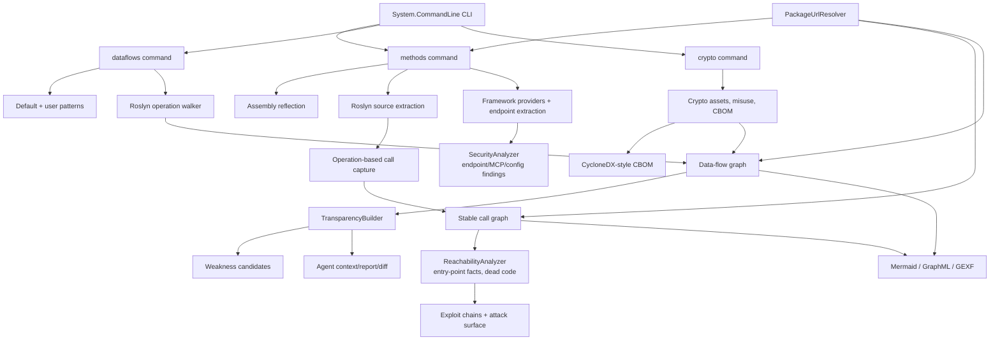
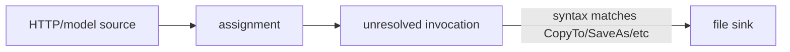

# Dosai Compiler Engineering Notes

This document describes the Roslyn-based implementation details behind the call graph, data-flow, endpoint, crypto, reachability, and PURL analysis in Dosai. It is written for compiler engineers and maintainers who need to evolve Dosai's analysis pipeline.

## Architecture overview


```mermaid
flowchart TD
    CLI[System.CommandLine CLI] --> Methods[methods command]
    CLI --> Dataflows[dataflows command]
    CLI --> Crypto[crypto command]
    Methods --> Reflection[Assembly reflection]
    Methods --> Source[Roslyn source extraction]
    Methods --> Endpoints[Framework providers + endpoint extraction]
    Source --> Calls[Operation-based call capture]
    Calls --> CallGraph[Stable call graph]
    Dataflows --> Patterns[Default + user patterns]
    Dataflows --> DFRoslyn[Roslyn operation walker]
    DFRoslyn --> DFGraph[Data-flow graph]
    Crypto --> CryptoAnalyzer[Crypto assets, misuse, CBOM]
    CryptoAnalyzer --> CBOM[CycloneDX-style CBOM]
    CryptoAnalyzer --> DFGraph
    CallGraph --> Reach[ReachabilityAnalyzer<br/>entry-point facts, dead code]
    Reach --> Exploit[Exploit chains + attack surface]
    Endpoints --> SecFind[SecurityAnalyzer<br/>endpoint/MCP/config findings]
    PURL[PackageUrlResolver] --> Methods
    PURL --> CallGraph
    PURL --> DFGraph
    DFGraph --> Transparency[TransparencyBuilder]
    Transparency --> Weakness[Weakness candidates]
    Transparency --> Agent[Agent context/report/diff]
    CallGraph --> Exporters[Mermaid / GraphML / GEXF]
    DFGraph --> Exporters
```

## Transparency layer

`TransparencyBuilder` derives higher-level review facts from lower-level compiler artifacts:

- `EntryPoint` records from API endpoints and CLI sources, including the compiler-synthesized `<Main>$` of top-level-statement programs.
- `PackageReachability` facts from graph/data-flow PURLs.
- `DangerousApiReachability` facts from sink nodes, with entry-point ids attached by exploit chains.
- `WeaknessCandidate` records from source-to-sink slices, each with a severity.
- `ExploitChain` records linking an entry point through the call graph to a slice and sink, with a derived exposure class.
- `AttackSurface` groups of entry points by exposure with linked chains and weaknesses.
- `SanitizedFlow` records of flows suppressed by sanitizers or validator guards (negative evidence).
- `AgentContext` bundles for AI agents, including a bounded attack-surface view.

This layer intentionally remains deterministic. It does not query vulnerability databases and does not make exploitability claims. It converts semantic evidence into structured facts. Suppressions (`--suppress`) are applied here, with AND semantics per entry and `expires` resurfacing, so reportable findings reflect the post-suppression set.

```text
Roslyn operations -> nodes/edges/slices -> transparency facts -> reports/agent context/diff
```

## Tree framework references and global usings (issue #74)

`FrameworkReferences.ForTree(path)` (used by methods, dataflows and crypto) layers the analyzed
tree's own reference packs on the process-wide set: `TreeFrameworks.Detect` reads the SDK
attribute, explicit `<FrameworkReference>` items, `UseWindowsForms`/`UseWPF`,
project.assets.json's `frameworkReferences` and `*.runtimeconfig.json`, and each named framework
resolves to `packs/<Name>.Ref/<version>/ref/<tfm>` or the NuGet cache copy (gathered together,
so a target-matched pack that only restore downloaded wins over an installed pack of another
major), or, when no pack of any major exists, the installed shared framework. The version is the
exact target major, else the nearest major above, else the nearest below, then the highest patch
with releases over prereleases; a non-exact major always names the version used. A net9.0 web
tree on a machine with only 8.x and 10.x packs therefore binds against the 10.x base and
ASP.NET Core packs, a consistent pair, rather than the newest shared runtime. Exactly one reference per assembly simple
name survives: the pack that matches the analyzed target claims shared names (this is what keeps
.NET 11's nine `Microsoft.Extensions.*` assemblies from colliding with an ASP.NET Core 8/9/10
pack), and every dropped duplicate is reported. A base reference pack owns the corlib: the
process-wide fallback then skips its `System.Private.*` companions, because a second
`System.Private.CoreLib` of another major makes Roslyn report CS0518 for every predefined type.
Missing packs degrade to diagnostics, never failures, and the reference resolution is cached per
scan root so it is deterministic across the run.

`GlobalUsings` resolves the synthetic implicit-usings tree per scan root: the SDK lists verified
from the SDKs' own .props files (base C#, Web's nine, Worker's four, Windows Forms' two; the
11 SDKs add `System.Net.Http.Json` for .NET 11+ targets, and .NET Framework targets drop
`System.Net.Http`), `<Using>` items with `Remove`/`Static`/`Alias` from the project and the
nearest Directory.Build.props/targets, and MSBuild's generated `GlobalUsings.g.cs` as the
authoritative set when it matches the resolved target and is no older than the project. One
compilation carries the union of per-project sets (the documented granularity limitation); the
resolver reports projects whose sets disagree and applies condition-carrying items
unconditionally with a note - a using that resolves nowhere errors alone and never blocks other
bindings.

Assembly inspection's shared-framework probing reads the tree's runtimeconfig files: frameworks
they name (ASP.NET Core, Windows Desktop) are probed at their exact named version, then
newest-first, and only `Microsoft.NETCore.App` directories are filtered by the running-version
floor (their `System.Runtime` can shadow the host's; the other frameworks carry none).

## Source compilation model

Dosai now creates per-language compilations from all source files in the inspected tree:

- C#: `CSharpCompilation.Create("Dosai.SourceAnalysis.CSharp", ...)`
- VB.NET: `VisualBasicCompilation.Create("Dosai.SourceAnalysis.VisualBasic", ...)`

All C# parsing goes through one helper (`CSharpSourceParser`), which parses with
`LanguageVersion.Preview` - the widest grammar the referenced compiler accepts - plus the
`FileBasedProgram` parser feature, so the `#:` directives of file-based apps
(`dotnet run app.cs`) parse as trivia instead of reporting CS9298 on every directive line.
The parse options also define `FrameworkPreprocessorDefines.ModernNet` (`NET`, `NET11_0`, and
the `NETx_0_OR_GREATER` chain), so `#if NET8_0_OR_GREATER`-style multi-target guards analyze as
visible code instead of becoming disabled text; `DEBUG`/`TRACE` and the legacy
`NETFRAMEWORK`/`NETSTANDARD` families stay undefined, matching a Release-shaped build against
the latest .NET target. The F# line frontend's conditional-region tracking resolves conditions
against the same set, so both pipelines select the same branches.
Analyzed source is not ours to constrain: a project can target a language version newer than the
compiler Dosai references, and source that fails to parse disappears from the inventory, call
graph, and data-flow results without an error. C# 15 syntax - union declarations, `closed`
hierarchies, extension indexers, collection expression arguments, labeled `break`/`continue`,
the `unsafe(...)`/pointer-relaxation shapes, and the `safe` modifier on extern members and
explicit-layout fields - is the current example; the Roslyn 5.9.0 line parses them only under
`Preview`, because its `Default` is still C# 14. Preview only widens the accepted grammar; it
does not change the meaning of source that already parsed.

File-based apps are analyzed like any other C# file: the `#:` directives become trivia, the
top-level statements report the compiler-synthesized `<Main>$` entry point, and a `#:package
Id@Version` directive surfaces in `Dependencies[]` (namespace `nuget`, module `FileBasedApp`)
the way `#r "nuget: ..."` does for F# scripts, because a file-based app declares its NuGet
references nowhere else.

Parsing runs on the same dedicated large-stack worker team as the per-file symbol loop
(`DedicatedStack.ForEach`), one file per index, results stored by index: the tree order every
downstream phase relies on stays the file order of a sequential parse. Each file's preprocessor
symbols are those of its **nearest project** at or above it within the scan root
(`TargetFrameworkDetection.ForFile`): the project's own target framework, else the nearest
`Directory.Build.props`, else `Directory.Build.targets`, reduced to the most modern target it
declares. One compilation holds every file, but parse options are per tree, so a net48 project
beside a net8.0 one keeps its `#if NETFRAMEWORK` code while the net8.0 project keeps its
`#if NET8_0` code. The walk is one non-recursive directory listing per directory, memoized, in
place of the earlier one recursive enumeration per distinct source directory (which also got a
project's subdirectories wrong). A file outside every project, or under one whose target is an
MSBuild property reference (`$(NetCoreAppCurrent)`), uses the scan root's detection; a
single-file scan reads its project context from the file's directory. The data-flow and crypto
pipelines and the F# frontend (nearest `.fsproj`) resolve the same way.

Before the compilation is created, reference-assembly source is partitioned out
(`ReferenceSources`): GenAPI API-surface stubs - every member body `throw null`, empty, or
returning `null`/`default`, or a file carrying the `aka.ms/api-review` header - lose their
declarations of types some non-stub file of the tree also declares. dotnet/runtime keeps a
library's API surface under `ref/` beside its implementation under `src/`; compiled together, the
merged type declared every member twice, calls on those members bound ambiguously (CS0229), and
Roslyn resolved the ambiguity differently between runs, so the call graph changed from run to run
(issue #69). A stub that declares nothing else is dropped. One that also declares types nothing
else does is trimmed: the redeclarations' tokens are blanked to spaces with line breaks, comments
and directives kept, so the directive structure is untouched and the types left keep their line
numbers (crypto's line fallback reads the same compiled text). A stub with no implementation
beside it is kept whole. The same syntactic pass reports types still declared
non-partially by more than one file (per-platform or per-target variants that no single build
compiles together). Under `--debug` the compiler's declaration errors are logged as a histogram
by id per run; that pass costs more than half again of the symbol loop, so it is not run
otherwise.

References are populated from:

1. framework references (`FrameworkReferences`, resolved once per process): the host's
   `TRUSTED_PLATFORM_ASSEMBLIES` in the core library's directory for a framework-dependent Dosai
   (a non-bundled host also lists Dosai's own dependencies, which no released build references);
   for a self-contained single-file Dosai, which has no framework files on disk (issue #67), the
   bundled runtime's own assemblies, loaded by the names the build embedded from its reference
   pack plus the `System.Private.*` implementations those facades forward to, and referenced
   through their in-memory metadata; otherwise the newest installed
   `Microsoft.NETCore.App` shared framework of any version. With none, a `Diagnostics` entry
   says so, and the unresolved-call diagnostic stops recommending a restore
2. managed assemblies under the inspected tree
3. package assemblies from NuGet restore output (`project.assets.json`)

This improves cross-file symbol resolution compared with one-file compilations. It also lets the data-flow walker observe method calls, constructor calls, property references, field references, and invalid operations with better context.

Top-level statements (the default `dotnet new console` template) have no declared `Main`, so the method inventory reports the compiler-synthesized `<Main>$` like any method, the entry-point list carries a `Cli` entry whose `MethodId` matches the call graph node, and `args` is seeded as a taint source. Declared `Main` variants (`async Task`, `Task<int>`, `int`) follow the same path.

When enumerating source files from a directory, Dosai excludes `bin` and `obj` directories relative to the inspected root. Source-mode checks use the same C#, VB, and F# source enumeration rules so VB-only and F#-only trees are treated as source analysis. Assembly discovery keeps app output directories valid because binary-only users often point directly at `bin/Debug/...` or publish directories.

Members declared in a C# 14+ `extension` block are contained in a compiler-synthesized nested type whose metadata name is empty, so the inventory, the method-call records, and the call graph all walk outward to the nearest named type and attribute them to the enclosing static class. Extension indexer accessors are not declared members of the inventory (indexers are absent from `Methods[]` and `Properties[]` in source mode generally), so their call graph node is created from the use site; the outward walk is what keeps its class name populated.

All recursive discovery enumerations (sources, assemblies, framework files, metadata references) share `SafeFileRead.EnumerateAllFilesSafe`: a lazy per-directory recursive walker that skips an unreadable or over-long subtree, keeps enumerating its siblings, and reports the skip through the caller's diagnostics channel where one exists (`Diagnostics[]` for the metadata reference sweep and assembly discovery) or a stderr warning otherwise. Warnings never go to stdout, which the MCP server reserves for its JSON-RPC stream, and repeats of the same message are suppressed. Symbolic links and junctions are followed, because linked source and dependency directories are a normal repository layout; a link that re-enters an already visited directory is skipped, so cycles terminate, and a depth ceiling bounds pathological nesting. Enumeration stays lazy so callers filter as they stream, and each analysis makes one pass per tree rather than one per requested extension.

## Stable method identities

Call graph node IDs are stable signatures rather than lossy `Namespace.Class.Method` strings:

```text
Namespace.Type.Method(ParameterType1,ParameterType2):ReturnType
Namespace.Type<T>..ctor(T)
```

Reasons:

- overload-safe
- generic-aware enough for source and callgraph use
- can map Roslyn calls to declared methods
- can be used as graph node IDs in GraphML/GEXF

## Call graph operation walker

Call graph capture uses Roslyn `IOperation` APIs rather than raw invocation syntax.

Supported operation kinds include:

- `IInvocationOperation`
- `IObjectCreationOperation`
- `IPropertyReferenceOperation`
- assignment context for property set/get detection

Every block, initializer, constructor initializer and top-level statement (every statement in VB) is handed to the walker as a root. Nested roots already sit inside their parent's operation tree, so the walker visits each operation once per file; a call is recorded once, not once per enclosing block.

Every string rendered from a symbol during source analysis - method signatures, containing
assembly/module/namespace displays, argument-type displays, error-format method names,
interface-name lists - goes through one per-run `SourceRenderCache`. A method's signature was
previously rendered once per call site it contains, its containing-assembly display once per
member of its type; the cache renders each distinct symbol once and returns the same string
instance everywhere, so a graph holding millions of call records keeps one string per distinct
member instead of one per mention. The cache is keyed by symbol **reference** through a
`ConditionalWeakTable`: Roslyn's symbol hash code is not cached on the symbol (each hash walks
the containing-symbol chain), so a hash-keyed table slowed the worker loop, and a strong table
would pin every symbol - and through constructed generics, per-callsite instantiations - for
the whole run; weak reference keys cost nothing to drop and still dedup everything, because
one compilation hands out one instance per source and metadata symbol. The per-file relative
path is likewise computed once per file, not per record.

Deep nesting has two limits. All Roslyn operation work runs on a `DedicatedStack` thread (256 MB reserved on 64-bit), and walkers stop descending at a depth budget or when the stack runs low. The call-graph walker's budget follows the stack, so every call of a long fluent chain, head included, reaches the graph. The data-flow and crypto walkers render each visited call's source text and stop at 1,024 levels. Separately, the Roslyn operation factory builds a member's whole operation tree with unguarded recursion, so `OperationDepthGuard` keeps any member nesting deeper than the stack can carry (about 131,000 syntax levels on 64-bit) away from `GetOperation`. That member is skipped and its file is named in `Diagnostics`, instead of the process terminating with no output. Files shorter than the limit cannot exceed it and are never walked for the check.

The graph builder guarantees that every edge endpoint exists as a node. External targets become external nodes when no source declaration exists. Repeated call sites of the same `(source, target, callType, evidence)` pair collapse into one counted edge (`CallSiteCount`) whose argument and evidence annotations are merged. Assembly call graph edge de-duplication includes evidence kind so direct IL, generated-state, delegate-target, and inferred candidate edges are not accidentally collapsed into one classification. Source and assembly call graphs are merged with dictionary-backed node lookups so duplicate node evidence can be combined without repeatedly scanning large node lists.

Source and binary call graph extraction share a small CHA/RTA-style dispatch resolver. For source, it indexes concrete application types, interface implementations, overrides, and instantiated types observed from object creations. Instantiation evidence is **symbol-exact**: the created type's symbol (and, for a constructed generic, its original definition) marks exactly that type instantiated, because every symbol below the scan resolves through the one compilation. The string aliases this replaced also matched any same-named type in another namespace, which promoted unrelated types to RTA rank (`My.Own.Task` marking `System.Threading.Tasks.Task` instantiated). The index is built once per Roslyn compilation (its object-creation scan runs per syntax tree on the worker team and reads the created type with `GetTypeInfo` rather than building an operation tree; that still binds the creation's enclosing statement - for a creation heading a fluent chain, the whole chain, which is super-linear to bind - so creations inside members `OperationDepthGuard` skips are skipped here too. `GetTypeInfo` also knows the created type when the constructor call fails to bind, where the operation form was an `IInvalidOperation`, so `new T(unresolvedArgument)` - routine in unrestored trees - counts as instantiating `T`), buckets concrete types by interface and base-type original definition, and memoizes each (target, receiver) lookup for the per-file walkers. Only virtual invocations get candidates - `base.M()` runs exactly the bound method - and a call site keeps at most 16, instantiated types first. Interface implementations resolve through `FindImplementationForInterfaceMember` with the member as the interface declares it (`ConstructedFrom`): handed a generic method constructed with a call's type arguments, Roslyn throws. For assemblies, it matches known methods against decoded type metadata, base types, implemented interfaces, and instantiated IL types. Inferred virtual and interface edges carry a dispatch confidence tier: `exact` when the static receiver type is sealed or a struct, `rta-candidate` when the implementing type is instantiated in the compilation, or `cha-candidate`.

Instantiated-generic IL ids (`Method<args>`) never match a source id exactly because the instantiation rewrites parameter types too, so the merged graph normalizes them onto the source original-definition node keyed by an instantiation-free identity, keeping the original instantiated id in `MethodNode.GenericInstantiation`.

Source-to-assembly mapping prefers exact stable signatures. If a fallback name match is needed, it only maps methods when parameter count, available parameter types, and available return type leave a single unambiguous assembly candidate. Mapped assembly name and module metadata come from the matched on-disk method, not the synthetic Roslyn compilation. This avoids corrupting mappings for overloads and keeps PURL enrichment tied to the compiled representation.

Package reachability is built after method identities and call graph evidence are attached, so evidence kinds and confidence reflect source, IL, inferred, and external-summary observations on nodes as well as edges.

Anonymous and local functions are call-graph nodes of their own: the enclosing member has a `DelegateInvoke` edge to each lambda it creates, and the lambda's calls come from the lambda. Their ids are named after the member that declares them (`Dosai.NestedFunctionName`): `Ns.Type.<Run>lambda2():void` for the second anonymous function in the type's members named `Run` (all overloads and partial parts, in source order), `Ns.Type.<Run>Helper():int` for a local function, `Ns.Type.<Run>query1(...)` for the implicit lambdas of a query expression's clauses (located by the clause, since Visual Basic gives them no declaring syntax). The ordinals come from syntax, indexed once per (type, member name), so the id is the same in every run and for every worker count; a lambda's own symbol name is empty, and without this every same-shaped lambda of a type was one node.

The source walker also emits explicit inferred evidence for common callback and framework patterns. Delegate creation, event subscription, lambda callbacks, DI registrations such as `AddSingleton`, service resolution helpers such as `GetRequiredService`, and simple reflection forms such as `Activator.CreateInstance<T>()` or `typeof(T).GetMethod("Name")` are represented as `FrameworkModel` or `ReflectionHeuristic` edges rather than folded into direct Roslyn calls.

```text
Invocation Operation
        │
        ├── caller symbol ──► SourceId
        ├── target symbol ──► TargetId
        ├── arguments ─────► edge argument metadata
        └── source span ───► CallLocation
```

## Data-flow operation walker

`DataFlowAnalyzer` builds a lightweight taint graph. It is not a full interprocedural SSA engine; it is a pragmatic, symbol-aware slicer designed for security triage.

### Taint state

The walker maintains:

```csharp
Dictionary<string, TaintTrace> _taintedSymbols
```

Keys are normalized Roslyn symbol display strings. Values are ordered node traces.

### Supported propagation

- parameter sources, including `args` of the synthesized `<Main>$` for top-level statements
- local variable initializers
- simple assignments
- compound assignments
- invocation return propagation for passthrough/system/source methods, except boolean-returning validators, which carry decisions rather than payloads
- object creation argument propagation
- binary/interpolated/coalesce/array expression propagation
- lambda parameter seeding when the lambda is passed over a tainted receiver or argument; delegate invocations propagate argument taint; `await` of a tainted task yields the taint of its result
- `ref`/`out` write-back: a call with tainted arguments or receiver taints its out/ref locals, and callee summaries record which parameter indexes are written and which source categories flow into each index
- collection taint: `foreach` loop variables inherit the collection's taint and element or indexer stores (`arr[i] = tainted`, `dict[k] = tainted`) taint the container, while ordinary property stores stay field-sensitive (`obj.Tag = tainted` leaves `obj.Other` clean)
- return edges
- sink argument flows
- sink receiver flows, e.g. `model.File.CopyTo(stream)`
- fallback invalid-operation sink matching for projects with unresolved legacy frameworks
- branch-aware sanitizer guards for validators such as `Regex.IsMatch`, recorded as sanitized flows (negative evidence)

Summaries iterate to a fixpoint (capped rounds), so wrapper-to-wrapper-to-sink chains attribute to the outermost method, and `TaintKinds` survive across summary hops.

### Performance-sensitive implementation details

The data-flow path is expected to run against the full `./Dosai` source tree in CI. Keep these optimizations intact when extending the walker:

- `DataFlowPatternIndex` pre-splits patterns by source/sink/sanitizer role and hot lookup kind so tight loops do not repeatedly filter the full pattern lists.
- `DataFlowOperationWalker.SyntaxText` caches `SyntaxNode.ToString()` results and code text is only requested for code-like pattern kinds.
- `DataFlowGraphBuilder` de-duplicates edges and maintains outgoing edges by source node, allowing `AddSlice` to collect in-slice edge IDs from the trace nodes instead of scanning all graph edges.
- Graph edge endpoint validity remains by construction: nodes are registered before edges, and slice edges are selected from the indexed graph.

### Why invalid-operation support exists

Older ASP.NET/WebForms projects often do not compile cleanly in isolated analysis because framework assemblies are unavailable or target older TFMs. Roslyn still creates `IInvalidOperation` trees. Dosai uses syntax-based sink matching on those invalid operations so high-value flows are not missed.


```mermaid
flowchart LR
    Source[HTTP/model source] --> Assign[assignment]
    Assign --> Invalid[unresolved invocation]
    Invalid -->|syntax matches CopyTo/SaveAs/etc| Sink[file sink]
```

## Assembly IL analysis

Assembly analysis reads managed method bodies without intentionally executing target code. The methods command uses IL call instructions, constructor calls, delegate target loads, event accessors, generated async/iterator state-machine mappings, and the shared dispatch resolver to add binary call graph evidence. Unknown or malformed IL opcodes stop decoding the current method body safely instead of desynchronizing later instruction reads. `switch` operands validate and bound their target count before allocation so malformed IL cannot force large arrays or out-of-range reads. Re-added call graph nodes merge evidence and missing identity fields into existing nodes so generated-state, delegate, source signature, and assembly signature observations are preserved through combined source and binary enrichment. External member-reference nodes use module/file metadata derived from the referenced assembly name instead of the caller assembly path. Portable PDB sequence points are resolved with raw zero-based IL offsets, with display-safe fallback line numbers when no sequence point is available.

The assembly data-flow pass uses a bounded worklist over decoded IL. It follows branch, switch, fallthrough, and exception-region successors. Catch and filter handlers receive exception-object stack state when it is available, while finally and fault handlers preserve local and argument state with handler stack semantics. This lets taint reach sinks that run from exception paths without treating those edges as direct source syntax.

Opcode-level taint semantics mirror the source walker's expression rules. Value-re-packaging conversions preserve their operand's taint: `castclass`, `isinst`, `box`, `unbox`/`unbox.any`, `ldlen` (the length derives from the array), the unary `neg`/`not`, and the `conv.*` family. The `add`-family arithmetic and bitwise opcodes combine their operands' taint, matching source-mode binary expressions; comparisons do not, because a bool result does not carry the operand value. `ldloca`/`ldarga` push an address marker instead of taint - a call sees the pointee's taint for that argument or receiver position, `ldind`/`ldobj` read the pointee, `stind`/`stobj` write it, and a by-ref/out parameter writes the callee-side combined taint back into the addressed local or argument slot. That write-back is what makes compiler-lowered positional patterns visible: `state is GateOpen(var cmd)` and every union or closed-hierarchy switch arm become `isinst` followed by a `Deconstruct` call taking `ldloca cmd`. It also over-approximates by design: IL does not say which parameter a callee copied into which `out` slot, so every by-ref slot receives the union of the arguments and receiver. `ldelema` is treated as an element load rather than an address, because an array element has no slot to write back into; the array's taint is forwarded as the element's value instead.

Binary signatures are decoded from metadata blobs for method identity, summary replay, and dispatch matching. The decoder handles common constructed generic types and method specifications, arrays, byrefs, pointers, generic type and method parameters, nested type specifications, and custom modifier wrappers. Assembly data-flow summaries include decoded parameter types in method symbols so overloads with the same arity do not merge, and those symbols are parsed back into namespace, class, and method fields for `MethodIdentity`. IL local and argument operands are normalized so both short and two-byte InlineVar forms participate in delegate tracking and data-flow propagation. Sink slices use stable tainted argument labels such as `arg0` or `receiver` when source expressions are unavailable from IL. Assembly-derived data-flow node de-duplication is scoped by assembly path because metadata tokens and IL offsets are only unique within one binary. The output remains best-effort because some runtime substitutions are not available from IL alone.

Assembly application scoping from `.deps.json` is best-effort. Malformed library entries, including null `type` values, should not fail analysis. Reachability confidence treats generated-state-machine and delegate-target evidence as direct observations because they are derived from IL or Roslyn semantics even though the edge is normalized to user code or callback targets.

Assembly file discovery and application scoping are centralized in `AssemblyScope` so methods, assembly call graph, and assembly data-flow use the same `.deps.json` project-library filter and fallback application-name heuristic. The assembly call graph path folds source-file detection into the same recursive enumeration used to collect candidate assemblies, and methods identity enrichment reuses the source-mode result from source enumeration instead of walking the filesystem again.

## Endpoint extraction

`ApiEndpointAnalyzer` is syntax-oriented by design. It extracts endpoints without requiring successful semantic binding.

Captured forms:

- C# MVC/Web API attributes: `Route`, `HttpGet`, `HttpPost`, `HttpPut`, `HttpDelete`, `HttpPatch`, `HttpHead`, `HttpOptions`
- C# minimal API calls: `MapGet`, `MapPost`, `MapPut`, `MapDelete`, `MapPatch`, `MapMethods`
- VB.NET route/http attributes
- absolute URLs in source files

Endpoint entries are emitted in the default `methods` JSON under `ApiEndpoints`.

## Graph exporters

Call graph and data-flow graph exporters produce:

- Mermaid: human-readable quick diagrams
- GraphML: yEd/Gephi/NetworkX-friendly XML
- GEXF: Gephi-friendly XML

GraphML/GEXF include PURL metadata where available.

All six exporter formats (`CallGraphExporter`/`DataFlowExporter` x mermaid/graphml/gexf) render into a `TextWriter`; the historical string overloads wrap a `StringWriter` and stay for tests and in-memory callers. The CLI writes every graph sidecar and graph export through a `StreamWriter` over the target file, and the crypto command serializes both its formats straight to a `FileStream` - none of these outputs is ever materialised as one contiguous string anymore. That mattered twice (issue #75): the crypto JSON of a large tree passed the .NET array limit inside `System.Text.Json`'s pooled buffer and crashed the command with `OutOfMemoryException`, and multi-hundred-megabyte graph strings needlessly bounded peak memory. The writer path produces byte-identical files to `File.WriteAllText(Export(...))` (same UTF-8 no-BOM encoding, same newlines); `GraphExporters_TextWriterOverloads_WriteTheStringOverloadsBytesExactly` and `CryptoExport_StreamPathIsByteIdenticalToTheStringPath` guard that equivalence.

The crypto output's size is bounded further by `--crypto-dataflows full|slices|none` (default `full`): the correlation that stamps `DataFlowSliceIds` onto materials, operations, and findings always runs, and the detail level then decides how much of the data-flow graph is retained on the result for serialization - `slices` keeps only slice-referenced nodes and edges (with the nested statistics recomputed over what is retained) and prunes every other id list inside `CryptoDataFlows` to the retained graph (`PackageReachability`/`DangerousApiReachability` entries left with no id evidence are dropped; weakness and exploit-chain node refs are nulled, findings kept; `SanitizedFlows` keep retained sources), `none` drops `CryptoDataFlows` entirely while keeping the slice-id properties and `Statistics.CryptoDataFlowSliceCount` (captured before the drop). Consumers that read only `Assets`/`Operations`/`Materials` - cdxgen - should pass `none`; their Node-side reader cannot parse files past the ~512 MB string limit, which used to silently discard every dosai crypto component on large trees. The detail applies to the JSON only: `CryptoAnalyzer.ApplyDataFlowDetail` is a separate step the CLI runs after writing graph sidecars, so sidecars always carry the full graph.

Two independent guards keep the streaming writers honest (a dropped closing quote in the data-flow Mermaid labels survived the first version, which had compared the new code with itself): `Dosai.Tests/GraphExportReference.cs` is a verbatim copy of the 7292446 exporter implementations compared byte-for-byte over nasty labels, dangling endpoints and reachability facts, and `Dosai.Tests/Goldens/` holds CLI-produced bytes from the 7292446 build for all six formats plus the CycloneDX golden (per-run values masked).

## Reachability and dead code

The reachability analyzer runs once over the merged call graph. It performs a bounded forward BFS per entry point (every visited node records which entry points reached it, capped at 16 with an exact `Reachable` flag that never saturates), computes minimum depth, fan-in and fan-out, and Tarjan strongly-connected components for recursion clusters. Bucketed forward-reachable sizes are computed on the SCC condensation in reverse topological order so large graphs stay cheap: a bucket only distinguishes counts up to 1,000, so each component keeps the components it reaches only until their node count passes that cap. Graphs too large for the per-component bitsets the condensation used to allocate keep the budgeted per-node walk and its diagnostics.

Every one of these walks runs over a dense integer graph built once from the sorted edge list (ids mapped to ints, forward rows in edge order), with per-walk stamps instead of id-keyed hash sets; the entry-point walks run on the worker team and fold into the facts in entry-point order, so the result is the same for any worker count. On a full `dotnet/runtime` scan (768k nodes, 2.36M collapsed edges, 1,521 entry points) this took the computation from about 44 s to 1.5 s with byte-identical output.

The dead-code report lists source-declared methods and constructors that no entry point reaches and that no keep-alive evidence protects. Keep-alive evidence is reflection or DI/framework-model usage that proves runtime callability: an `AddSingleton<Foo>()` registration, an `Activator.CreateInstance` target, or a `typeof(T).GetMethod(...)` receiver. The report is empty for assembly-only inputs and is suppressed entirely, with a diagnostic, when the reachability budget was exhausted, because an unvisited node is then unknown rather than unreachable.

Crypto analysis consumes the same index: a reachability claim requires a graph path, and the older whole-file fallback is gated off with a diagnostic naming the file.

## PURL enrichment

`PackageUrlResolver` reads, in order of trust:

- `project.assets.json` and `*.deps.json` (restore/build output)
- `packages.lock.json` and `paket.lock` (lock files)
- `packages.config` (legacy)
- direct `.csproj` `<PackageReference>` entries (unrestored trees, lowest confidence)

It maps package libraries and compile/runtime assets to NuGet PURLs such as:

```text
pkg:nuget/Microsoft.Data.SqlClient@5.1.1
```

Resolution uses:

1. assembly/module name
2. compile/runtime DLL asset name
3. package name
4. namespace/type/symbol prefix matching

Every record resolves in its own project (the project its file belongs to), so projects that restore different versions of a package each keep theirs; version splits across projects and disagreements between one project's sources are reported in the output's `Diagnostics`, and `ResolutionFacts` exposes which source and project produced each purl (name, version, purl, source, confidence, project). PURLs are best-effort and never fail analysis.

## Weakness candidate model

Weakness candidates are generated from sink categories. Each candidate includes:

- kind and CWE mapping where applicable;
- severity (`info`, `low`, `medium`, `high`) and confidence with confidence reasons;
- source/sink location;
- slice id;
- route/entrypoint when known;
- PURLs and evidence strings.

Severity defaults by sink category (injection primitives are `high`, exposure classes are `medium`, log and ReDoS are `low`); a pattern's optional `Severity` field overrides the default, and a match from a Low-confidence pattern is demoted one rank so heuristic matches cannot trip a high-severity gate on their own. Confidence remains deliberately simple and explainable:

- `High` when the flow is tied to an entrypoint and a sink node.
- `Medium` when the sink is clear but entrypoint correlation is absent.
- `Low` for weaker evidence.

Catastrophically-backtracking literal regexes (`new Regex("(a+)*$")`, `[GeneratedRegex("literal")]`) are additionally detected statically as ReDoS candidates (CWE-1333); `RegexOptions.NonBacktracking` and an explicit match timeout suppress the finding, and overlong patterns get a review-needed diagnostic instead of a silent skip. Security findings derived from framework metadata (endpoint security, MCP transport integrity, configuration security) use content-derived ids (kind, file, and line) so they stay stable across diffs.

## Scaling and memory

The phases below order how a `methods` run spends time and memory on very large trees
(issue #65 measured `dotnet/runtime`-scale scans; the numbers there: parsing 1/6 of the run,
the dispatch index and the per-file symbol loop most of the rest, and a long graph-assembly
tail after symbol analysis had finished during which the heap kept climbing):

- **Graph assembly allocates no key strings.** Call-site de-duplication and the canonical
  edge/node orderings run through `GraphAssembly`: an `EdgeSiteKey` struct (source, target,
  file, line, column, call-type tag, evidence-kind tag) replaces one concatenated
  ~200-byte string per edge, and stable in-place sorts (runs sorted on the worker team, then
  merged along merge paths with the left run first on ties, so the order is the sequential
  stable sort's) replace `OrderBy` chains. At millions of edges the old key
  strings alone were gigabytes of garbage allocated exactly in the tail, and duplicate call
  sites used to allocate their edge object before the de-duplication discarded it - dedup now
  happens on the call record before the edge exists. String legs compare by reference first
  (ids rendered through the `SourceRenderCache` and per-file names are single instances) and
  fall back to ordinal comparison, so keys built from non-pooled strings behave exactly like
  the concatenated form.
- **The compilations are released before the IL phase.** Framework analysis and the security
  analyzer - the only compilation consumers - run immediately after source analysis, inside
  one helper (`AnalyzeSourcesAndFrameworks`) that returns only their results; the syntax trees
  (the largest object the pipeline ever holds) and the framework context's per-file text cache
  are unreachable once it returns, before the assembly call graph, enrichment, reachability
  and serialization, instead of surviving behind those phases. The helper frame is the
  mechanism: a local in the once-run slice builder stays reported live until it returns (it
  runs at Tier-0, and the security-analysis lambda captured the context into a closure), so
  reassigning one did not free anything. `GetMethodsSlice_ReleasesSourceCompilationsBeforeTheIlPhase`
  checks the compilations themselves through weak references. On the issue's
  112k-file tree this is what moves the memory wall out of the run's way: the death happened
  entering `assembly-call-graph` with tens of GB still pinned by trees.
- **Per-file collectors and dispatch indexes are dropped as soon as they are merged**, so the
  per-file list backing arrays - a near-copy of every record collected - do not sit next to
  the merged graph until the method returns.
- **Server GC.** Parse, the dispatch index and the symbol loop all run on a worker team; with
  the previous workstation-GC default a single GC thread fell behind a dozen allocating
  workers (visible as CPU collapsing to one core "while the GC was under pressure"). Server
  GC keeps reclamation parallel to allocation. On .NET 9 and later it runs with dynamic heap
  count adaptation (DATAS) by default, so small scans do not pay for one heap per core;
  `DOTNET_gcServer=0` restores workstation GC for a host that needs it. The peak working set
  is set during symbol analysis, where a large share of the heap is garbage the server GC has
  not yet collected; a host short on memory can trade time for it with
  `DOTNET_GCConserveMemory=7` (on `dotnet/runtime`: 20.8 GB peak to 17.0 GB, about 7% more
  time; lower levels made no difference there).
- `DOSAI_DEBUG_GC=1` forces a full compacting collection before each `--debug` phase-end heap
  read, so heap figures compare runs without GC-timing noise.
- **No phase after source analysis runs a per-item loop on one thread.** Package-URL
  enrichment resolves its lists in chunks on the worker team (the resolver only reads its
  tables and probes them by span), the F#, R and C/C++ frontends analyze files on the team
  and append results in file order, and the framework providers no longer walk every syntax
  tree per node kind: declarations come from a walk that skips statements and expressions,
  and invocation loops skip trees whose invocations carry none of the names they act on. On
  `dotnet/runtime` these took enrichment from 4.8 s to 0.9 s, the frontends from 7.3 s to
  2.6 s and framework analysis from 44 s to 11 s, with byte-identical output.
- **The output is serialized on the worker team.** One serializer call over the whole slice
  ran on one core for the entire phase. `ParallelJsonWriter` writes the slice's top levels from
  the serializer's own contract and hands each large list to the workers in chunks, appending
  the chunks in order straight to the file; the bytes are identical to the single call's, and
  memory stays at a few chunks per worker.

## Current limitations

- Data-flow is intraprocedural with fixpoint summaries for parameter-to-return, parameter-to-sink, and ref/out callees; deep object graphs and unmodeled helpers can still hide flows.
- Generic type flow is decoded for common metadata signatures; instantiated-generic call graph nodes are normalized onto source original definitions, but taint is not substituted through every runtime construction.
- Sanitizers are pattern-driven and can stop propagation or suppress validated branches, but custom validation logic may require project-specific patterns.
- Endpoint extraction is intentionally syntax-based and may capture routes from non-runtime code.
- PURL attribution is package-asset and lock/config based; projects whose dependencies appear in no readable source cannot always be attributed.

## Recommended engineering next steps

1. Cache Roslyn compilations and PURL resolver indexes for large monorepos.
2. Extend alias modeling for complex object graphs beyond collections and indexer stores.
3. Extend the CycloneDX CBOM surface with PURL-linked slice properties and SARIF export.
