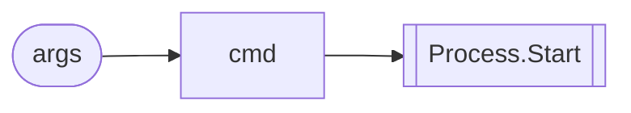

# Graph Export Formats

Dosai exports call graphs and data-flow graphs as Mermaid, GraphML, and GEXF.

## Choosing a format

| Format  | Best for                             | Notes                                          |
| ------- | ------------------------------------ | ---------------------------------------------- |
| Mermaid | Markdown, PR reviews, quick diagrams | Compact, readable, not ideal for large graphs  |
| GraphML | yEd, NetworkX, custom XML pipelines  | Rich attributes, directed graphs               |
| GEXF    | Gephi exploration                    | Rich attributes and interactive graph analysis |

## Call graph export

```bash
dotnet run --project ./Dosai -- methods \
  --path /repo \
  --o dosai.json \
  --callgraph-format graphml \
  --callgraph-out callgraph.graphml
```

Call graph edge model:

```text
Caller method node ── MethodCall/PropertySet/ConstructorCall ──► Target method node
```

Call graph node attributes:

- `id`
- `label`
- `kind`
- `file`
- `external`
- `purl`

Call graph edge attributes:

- `callType`
- `sourcePurl`
- `targetPurl`
- `location`

## Data-flow export

```bash
dotnet run --project ./Dosai -- dataflows \
  --path /repo \
  --o dataflows.json \
  --graph-format gexf \
  --graph-out dataflows.gexf
```

Data-flow graph model:

```text
Source node ── Assignment/Expression/CallReturn ──► Transform node ── SinkArgument/SinkReceiver ──► Sink node
```

Data-flow node attributes:

- `kind`
- `symbol`
- `type`
- `purl`
- `file`
- `method`
- `line`
- `category`
- `source`
- `sink`
- `code`

Data-flow edge attributes:

- `kind`
- `label`
- `sourcePurl`
- `targetPurl`

## Mermaid examples



## Graph validation

The CI workflow validates that:

- every graph edge source exists as a node
- every graph edge target exists as a node
- GraphML/GEXF XML parses successfully

The vulnerable-repo smoke workflow additionally asserts minimum slice counts for intentionally vulnerable projects.
