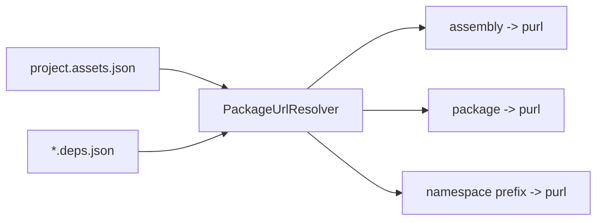

# Supply-chain PURL Enrichment

Dosai now enriches source, call graph, and data-flow records with NuGet Package URL (PURL) metadata where it can infer package identity.

## NuGet PURL format

Dosai emits NuGet PURLs according to the package-url NuGet type rules:

```text
pkg:nuget/<PackageName>@<Version>
```

Example:

```text
pkg:nuget/EnterpriseLibrary.Common@6.0.1304
```

NuGet has no namespace component. Package names are case-preserving and generally case-insensitive in ecosystem tooling; Dosai preserves the package casing from lock/deps files.

## Data sources

`PackageUrlResolver` reads:

- `project.assets.json`
- `*.deps.json`

These files are produced by restore/build and contain package libraries plus compile/runtime assets.



## Resolution order

Given an assembly/module/symbol/type, Dosai tries:

1. assembly name, e.g. `Microsoft.Data.SqlClient`
2. module/DLL name, e.g. `Microsoft.Data.SqlClient.dll`
3. package name and last package segment
4. namespace/type/symbol prefix matching

Resolution is best-effort. Missing PURLs do not fail analysis.

## Where PURLs appear

### Default `methods` JSON

- `Methods[].Purl`
- `MethodCalls[].Purl`
- `Dependencies[].Purl`
- `AssemblyInformation[].Purl`
- `Properties[].Purl`
- `Fields[].Purl`
- `Events[].Purl`
- `Constructors[].Purl`
- `SourceAssemblyMapping[].Purl`

### Call graph

- `CallGraph.Nodes[].Purl`
- `CallGraph.Edges[].SourcePurl`
- `CallGraph.Edges[].TargetPurl`

### Data flows

- `Nodes[].Purl`
- `Edges[].SourcePurl`
- `Edges[].TargetPurl`
- `Slices[].SourcePurl`
- `Slices[].SinkPurl`
- `Slices[].Purls[]`

### Graph exports

GraphML/GEXF exports include PURL node/edge attributes for both call graphs and data-flow graphs.

## Pattern-provided PURLs

Custom data-flow source/sink patterns can specify `purl` directly:

```json
{
  "sources": [
    {
      "kind": "Method",
      "pattern": "Input.Get",
      "category": "custom-source",
      "purl": "pkg:nuget/Input.Package@1.0.0"
    }
  ],
  "sinks": [
    {
      "kind": "Method",
      "pattern": "Dangerous.Exec",
      "category": "custom-sink",
      "purl": "pkg:nuget/Dangerous.Package@2.0.0"
    }
  ]
}
```

Pattern-provided PURLs take precedence over resolver-derived PURLs for matching source/sink nodes.

## Analyst use cases

1. **Vulnerable package reachability**
   - Filter data-flow slices where `Slices[].Purls[]` contains a vulnerable package PURL.

2. **External attack surface to dependency sink**
   - Join `ApiEndpoints` with data-flow sources in the same file/method.
   - Inspect slices whose sink PURL maps to an affected NuGet package.

3. **Supply-chain blast-radius triage**
   - Use call graph `TargetPurl` to find direct call edges into a package.
   - Use data-flow `SinkPurl` to prioritize calls reached by untrusted input.

## ASCII data model

```text
project.assets.json / *.deps.json
        │
        ▼
  PackageUrlResolver
        │
        ├── Methods[].Purl
        ├── MethodCalls[].Purl
        ├── CallGraph.Nodes[].Purl
        ├── CallGraph.Edges[].TargetPurl
        └── DataFlow.Slices[].Purls[]
```

## Limitations

- Source-only dependencies without restore metadata may not resolve.
- Multiple packages can expose the same namespace prefix; Dosai chooses the longest prefix and first discovered package.
- Runtime binding redirects and assembly unification are not modeled.
- PURL enrichment is not a vulnerability verdict; it is correlation metadata.
