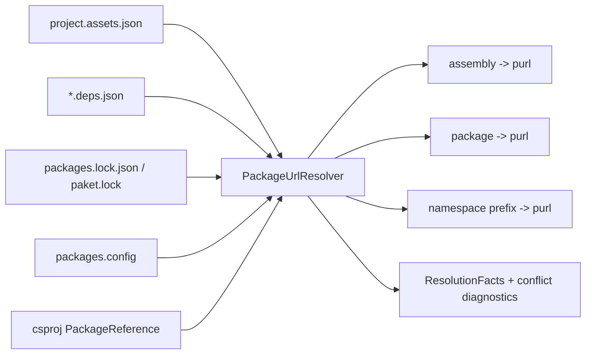

# Supply-chain PURL Enrichment

Dosai now enriches source, call graph, and data-flow records with NuGet Package URL (PURL) metadata where it can infer package identity.

## NuGet PURL format

Dosai emits NuGet PURLs according to the package-url NuGet type rules:

```text
pkg:nuget/<PackageName>@<Version>
```

Example:

```text
pkg:nuget/EnterpriseLibrary.Common@6.0.1304
```

NuGet has no namespace component. Package names are case-preserving and generally case-insensitive in ecosystem tooling; Dosai preserves the package casing from lock/deps files.

## Data sources

`PackageUrlResolver` reads sources in order of trust:

1. `project.assets.json` (restore output)
2. `*.deps.json` (build output)
3. `packages.lock.json` (NuGet lock file, schema 4.1.0)
4. `paket.lock` (Paket lock file, schema 4.1.0)
5. `packages.config` (legacy packages config, schema 4.1.0)
6. direct `.csproj` `<PackageReference>` entries (schema 4.1.0)

The first two are produced by restore/build and contain package libraries plus compile/runtime assets. The remaining four let unrestored trees, source-only checkouts, and CI caches that skip restore still resolve packages. Lock files are reproducible, so they outrank the config and project-file fallbacks; direct `<PackageReference>` parsing is the lowest-confidence source because floating versions and Directory.Build.props indirection are invisible to it.

When two sources disagree on the version of the same package, the resolver keeps the most-trusted answer and records the conflict as a diagnostic. `ResolutionFacts` exposes, per package, which source file produced the purl (name, version, purl, source, confidence), so downstream tools can weigh the evidence.


```mermaid
flowchart LR
    Assets[project.assets.json] --> Resolver[PackageUrlResolver]
    Deps[*.deps.json] --> Resolver
    Locks[packages.lock.json / paket.lock] --> Resolver
    Config[packages.config] --> Resolver
    Csproj[csproj PackageReference] --> Resolver
    Resolver --> AssemblyMap[assembly -> purl]
    Resolver --> PackageMap[package -> purl]
    Resolver --> NamespacePrefix[namespace prefix -> purl]
    Resolver --> Facts[ResolutionFacts + conflict diagnostics]
```

## Resolution order

Given an assembly/module/symbol/type, Dosai tries:

1. assembly name, e.g. `Microsoft.Data.SqlClient`
2. module/DLL name, e.g. `Microsoft.Data.SqlClient.dll`
3. package name and last package segment
4. namespace/type/symbol prefix matching
5. best-effort framework symbol fallback for common `System.*` APIs

Resolution is best-effort. Missing PURLs do not fail analysis.

The `System.*` fallback is intentionally versionless because framework APIs often come from the target framework or shared framework rather than a restored NuGet package. Examples include:

| Symbol prefix                         | Emitted PURL                                        |
| ------------------------------------- | --------------------------------------------------- |
| `System.Diagnostics.Process`          | `pkg:nuget/System.Diagnostics.Process`              |
| `System.IO.File`, `Directory`, `Path` | `pkg:nuget/System.IO.FileSystem`                    |
| `System.Net.Http`                     | `pkg:nuget/System.Net.Http`                         |
| `System.Text.Json`                    | `pkg:nuget/System.Text.Json`                        |
| `System.Security.Cryptography`        | `pkg:nuget/System.Security.Cryptography.Algorithms` |
| `System.Type`, `System.String`        | `pkg:nuget/System.Runtime`                          |

Package metadata from `project.assets.json` or `*.deps.json` still takes precedence when a concrete restored package is known.

## Where PURLs appear

### Default `methods` JSON

- `Methods[].Purl`
- `MethodCalls[].Purl`
- `Dependencies[].Purl`
- `AssemblyInformation[].Purl`
- `Properties[].Purl`
- `Fields[].Purl`
- `Events[].Purl`
- `Constructors[].Purl`
- `SourceAssemblyMapping[].Purl`

### Call graph

- `CallGraph.Nodes[].Purl`
- `CallGraph.Edges[].SourcePurl`
- `CallGraph.Edges[].TargetPurl`

### Data flows

- `Nodes[].Purl`
- `Edges[].SourcePurl`
- `Edges[].TargetPurl`
- `Slices[].SourcePurl`
- `Slices[].SinkPurl`
- `Slices[].Purls[]`

### Graph exports

GraphML/GEXF exports include PURL node/edge attributes for both call graphs and data-flow graphs.

### Reachable package occurrence locations

`methods` and `dataflows` also emit `PackageReachability[]` facts. Each fact can include `SourceLocations[]` entries that help SBOM and vulnerability tools correlate a reachable PURL to concrete source evidence:

```json
{
  "Purl": "pkg:nuget/System.Diagnostics.Process",
  "Reachable": true,
  "ReachabilityKind": "CallGraphEdge",
  "SourceLocations": [
    {
      "Path": "src/Program.cs",
      "FileName": "Program.cs",
      "LineNumber": 10,
      "ColumnNumber": 9,
      "Kind": "CallGraphEdge"
    }
  ]
}
```

Dosai only emits source-file locations for package reachability occurrences (`.cs`, `.csx`, `.vb`, `.fs`, `.fsx`, `.r`, `.rmd`, `.qmd`). Assembly-only fallback paths such as `Package.dll` are suppressed because they are usually poor occurrence evidence for source-oriented SBOMs. For `methods`, dependency/import records with `Dependencies[].Purl` produce low-confidence `Dependency` reachability facts when no stronger call graph evidence is available, covering C#/VB imports, F# `open`, and R `library`/`require` usage. For data-flow slices, locations are attached only when the node or edge carries the same PURL, with a source/sink fallback for pattern-provided PURLs. This keeps unrelated source nodes in the same slice from being reported as occurrences of a dependency package.

### Printed data-flow traces

When `dataflows --print` is used, PURLs are included inline on stack-trace-style frames and transitions, for example:

```text
via SinkArgument [dfe3] from dfn2 to dfn3 in Program.cs:7:23 label=fileName targetPurl=pkg:nuget/System.Diagnostics.Process
at Sink/command Start [dfn3] in Program.cs:7:9 [pkg:nuget/System.Diagnostics.Process]
```

## Pattern-provided PURLs

Custom data-flow source/sink patterns can specify `purl` directly:

```json
{
  "sources": [
    {
      "kind": "Method",
      "pattern": "Input.Get",
      "category": "custom-source",
      "purl": "pkg:nuget/Input.Package@1.0.0"
    }
  ],
  "sinks": [
    {
      "kind": "Method",
      "pattern": "Dangerous.Exec",
      "category": "custom-sink",
      "purl": "pkg:nuget/Dangerous.Package@2.0.0"
    }
  ]
}
```

Pattern-provided PURLs take precedence over resolver-derived PURLs for matching source/sink nodes.

## Analyst use cases

1. **Vulnerable package reachability**
   - Filter data-flow slices where `Slices[].Purls[]` contains a vulnerable package PURL.

2. **External attack surface to dependency sink**
   - Join `ApiEndpoints` with data-flow sources in the same file/method.
   - Inspect slices whose sink PURL maps to an affected NuGet package.

3. **Supply-chain blast-radius triage**
   - Use call graph `TargetPurl` to find direct call edges into a package.
   - Use data-flow `SinkPurl` to prioritize calls reached by untrusted input.

## ASCII data model

```text
project.assets.json / *.deps.json        (restore/build output)
packages.lock.json / paket.lock          (lock files)
packages.config / csproj references      (fallbacks)
        │
        ▼
  PackageUrlResolver
        │
        ├── Methods[].Purl
        ├── MethodCalls[].Purl
        ├── CallGraph.Nodes[].Purl
        ├── CallGraph.Edges[].TargetPurl
        ├── DataFlow.Slices[].Purls[]
        └── ResolutionFacts + diagnostics (which source, which version)
```

## Limitations

- Dependencies that appear in none of the readable sources (for example transitives in an unrestored tree with no lock file) may not resolve.
- Multiple packages can expose the same namespace prefix; Dosai chooses the longest prefix and first discovered package, and version conflicts across sources are reported as diagnostics.
- Runtime binding redirects and assembly unification are not modeled.
- PURL enrichment is not a vulnerability verdict; it is correlation metadata.
