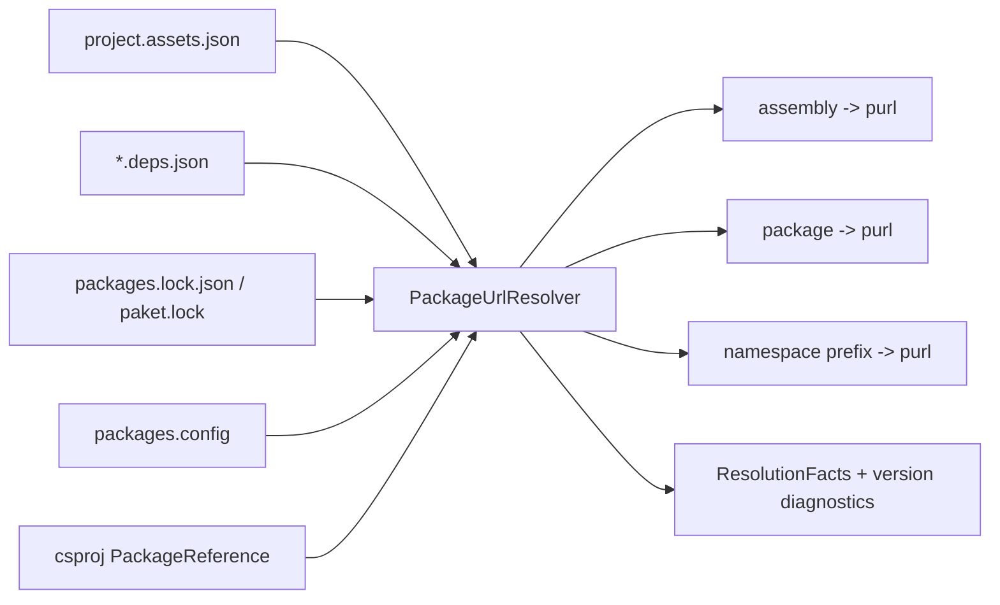

# Supply-chain PURL Enrichment

Dosai now enriches source, call graph, and data-flow records with NuGet Package URL (PURL) metadata where it can infer package identity.

## NuGet PURL format

Dosai emits NuGet PURLs according to the package-url NuGet type rules:

```text
pkg:nuget/<PackageName>@<Version>
```

Example:

```text
pkg:nuget/EnterpriseLibrary.Common@6.0.1304
```

NuGet has no namespace component. Package names are case-preserving and generally case-insensitive in ecosystem tooling; Dosai preserves the package casing from lock/deps files.

## Data sources

`PackageUrlResolver` reads sources in order of trust:

1. `packages.lock.json` (NuGet lock file, schema 4.1.0)
2. `paket.lock` (Paket lock file, schema 4.1.0)
3. `packages.config` (legacy packages config, schema 4.1.0)
4. `project.assets.json` (restore output)
5. `*.deps.json` (build output)
6. direct `.csproj` `<PackageReference>` entries (schema 4.1.0)

Lock files are reproducible, so they outrank everything else. Restore and build output contain package libraries plus compile/runtime assets, and the lock, config and project-file sources let unrestored trees, source-only checkouts, and CI caches that skip restore still resolve packages. Direct `<PackageReference>` parsing is the lowest-confidence source because floating versions and Directory.Build.props indirection are invisible to it. Files of one kind are read in path order, so the result never depends on the file system's enumeration order.

### One version per project

Every source belongs to a project: the project its restore output names (`project.restore.projectPath`, which also covers artifacts layouts that move `obj/` out of the project, and their `bin/<project>/` build output beside it), otherwise the nearest directory at or above the source that holds a `.csproj`, `.vbproj` or `.fsproj`. A `paket.lock`, and any source outside every project, applies to the whole tree. A record with a file - a method, call site, `using` directive, member, call-graph edge or data-flow node - resolves against its own project's packages first, at every resolution step, so two projects that restore two versions of one package each report their own version (issue #72). Records without a project of their own, and call-graph nodes, which are shared by every project that calls them, carry the tree-wide answer: the first source read. A project whose package closure is known - it has restore output (`project.assets.json`, `*.deps.json`), a `packages.lock.json` or a `packages.config` - never falls through to the tree-wide answer: a package missing from that closure is not one the project uses, and taking another project's would give a framework call the purl of an old package of the same assembly name (issue #82: `Microsoft.AspNetCore.Http.Abstractions` 2.1.1, or `System.Runtime` 4.3.1, restored by a sibling library). Such a record resolves in its project alone and then takes the versionless `System.*` fallback, the same answer the project gets scanned on its own. A project with only `<PackageReference>` items lists its direct references, not its closure, so it keeps the tree-wide fallback. A call-graph node whose every call site sits in such a project, and whose sites agree, carries their answer instead of the tree-wide one. Call-graph edges sit at one call site and resolve both endpoints in that site's project, so `PackageReachability` lists one entry per version, each with only its own project's locations.

Both reports (`methods` and `dataflows`) say where versions split, in `Diagnostics`:

```text
Package Moq resolves to 2 versions across projects: 4.15.1 (ProjA), 4.18.0 (ProjB). Each project's records carry its own version; records outside those projects, and call-graph nodes shared by them, carry 4.15.1.
```

When two sources of the same project disagree on a version, the resolver keeps the most-trusted answer for that project and records the disagreement:

```text
PURL version ambiguity for Moq in ProjB: csproj says 4.17.6; keeping 4.18.0 from project.assets.json.
```

The resolver's `ResolutionFacts` (a library API, not part of either report) lists every fact it read: name, version, purl, source kind, confidence, and the project it belongs to.

### Restore output as a source of reference assemblies

`project.assets.json` does double duty for unbuilt trees. Beyond purl facts, `packageFolders` plus each target's `compile` entries name the same package DLLs the compiler would reference, inside the NuGet packages cache. `NuGetRestoreCache` resolves those paths and every metadata-reference builder adds them, so a restored checkout without `bin/` output still gets full Roslyn binding: call edges keep `SourceRoslynDirect` evidence, and package reachability stays at `ExternalCallGraphNode`/High instead of collapsing to the dependency-only fallback. Cache assemblies load from bytes (`MetadataReference.CreateFromImage`), so nothing in the shared packages folder is locked for the process lifetime. Trees without restore output can opt into `--restore` (or `--build`), which runs the corresponding `dotnet` command before analysis; see `docs/commands.md`.

When neither build output nor cache assemblies are available, call sites that fail to bind are recorded with `SourceUnresolved` evidence instead of silently disappearing. A package purl is attributed only when the receiver's own qualification states the namespace (`Newtonsoft.Json.JsonConvert.SerializeObject`); namespaces are never guessed from the file's `using` directives, because attributing an unresolved call to whatever package the file imports would fabricate reachability for innocent packages. Affected packages get a `ConfidenceReasons` entry explaining that semantic binding was unavailable, and `Diagnostics` names how many call sites failed to bind and what the restore output resolved.


```mermaid
flowchart LR
    Assets[project.assets.json] --> Resolver[PackageUrlResolver]
    Deps[*.deps.json] --> Resolver
    Locks[packages.lock.json / paket.lock] --> Resolver
    Config[packages.config] --> Resolver
    Csproj[csproj PackageReference] --> Resolver
    Resolver --> AssemblyMap[assembly -> purl]
    Resolver --> PackageMap[package -> purl]
    Resolver --> NamespacePrefix[namespace prefix -> purl]
    Resolver --> Facts[ResolutionFacts + version diagnostics]
```

## Resolution order

Given an assembly/module/symbol/type, Dosai tries, in the record's own project first and then across the tree (the tree step is skipped for a project whose package closure is known; see above):

1. assembly name, e.g. `Microsoft.Data.SqlClient` from `Microsoft.Data.SqlClient, Version=5.2.0.0, ...`, matched against the assemblies packages ship, then against package names
2. module/DLL name, e.g. `Microsoft.Data.SqlClient.dll` (only an assembly file extension is dropped; `Castle.Core` stays `Castle.Core`)
3. the longest package (or packaged assembly) name that the symbol, else the type name, else the namespace equals or continues with a dot: `Serilog.Sinks.Console.ConsoleSink` belongs to `Serilog.Sinks.Console`, not `Serilog`
4. best-effort framework symbol fallback for common `System.*` APIs

Matching is by whole names only. A package's last name segment is not an alias for it: `System.Console` code is not `Serilog.Sinks.Console`'s, and `Azure.*` SDK code is not `Microsoft.Data.SqlClient.Extensions.Azure`'s. Restore placeholders such as `_._` are not assemblies.

Resolution is best-effort. Missing PURLs do not fail analysis.

The `System.*` fallback is intentionally versionless because framework APIs often come from the target framework or shared framework rather than a restored NuGet package. Examples include:

| Symbol prefix                         | Emitted PURL                                        |
| ------------------------------------- | --------------------------------------------------- |
| `System.Diagnostics.Process`          | `pkg:nuget/System.Diagnostics.Process`              |
| `System.IO.File`, `Directory`, `Path` | `pkg:nuget/System.IO.FileSystem`                    |
| `System.Net.Http`                     | `pkg:nuget/System.Net.Http`                         |
| `System.Text.Json`                    | `pkg:nuget/System.Text.Json`                        |
| `System.Security.Cryptography`        | `pkg:nuget/System.Security.Cryptography.Algorithms` |
| `System.Type`, `System.String`        | `pkg:nuget/System.Runtime`                          |

Package metadata from `project.assets.json` or `*.deps.json` still takes precedence when a concrete restored package is known.

## Where PURLs appear

### Default `methods` JSON

- `Methods[].Purl`
- `MethodCalls[].Purl`
- `Dependencies[].Purl`
- `AssemblyInformation[].Purl`
- `Properties[].Purl`
- `Fields[].Purl`
- `Events[].Purl`
- `Constructors[].Purl`
- `SourceAssemblyMapping[].Purl`

### Call graph

- `CallGraph.Nodes[].Purl`
- `CallGraph.Edges[].SourcePurl`
- `CallGraph.Edges[].TargetPurl`

### Data flows

- `Nodes[].Purl`
- `Edges[].SourcePurl`
- `Edges[].TargetPurl`
- `Slices[].SourcePurl`
- `Slices[].SinkPurl`
- `Slices[].Purls[]`

### Graph exports

GraphML/GEXF exports include PURL node/edge attributes for both call graphs and data-flow graphs.

### Reachable package occurrence locations

`methods` and `dataflows` also emit `PackageReachability[]` facts. Each fact can include `SourceLocations[]` entries that help SBOM and vulnerability tools correlate a reachable PURL to concrete source evidence:

```json
{
  "Purl": "pkg:nuget/System.Diagnostics.Process",
  "Reachable": true,
  "ReachabilityKind": "CallGraphEdge",
  "SourceLocations": [
    {
      "Path": "src/Program.cs",
      "FileName": "Program.cs",
      "LineNumber": 10,
      "ColumnNumber": 9,
      "Kind": "CallGraphEdge"
    }
  ]
}
```

Dosai only emits source-file locations for package reachability occurrences (`.cs`, `.csx`, `.vb`, `.fs`, `.fsx`, `.r`, `.rmd`, `.qmd`). Assembly-only fallback paths such as `Package.dll` are suppressed because they are usually poor occurrence evidence for source-oriented SBOMs. For `methods`, dependency/import records with `Dependencies[].Purl` produce low-confidence `Dependency` reachability facts when no stronger call graph evidence is available, covering C#/VB imports, F# `open`, and R `library`/`require` usage. For data-flow slices, locations are attached only when the node or edge carries the same PURL, with a source/sink fallback for pattern-provided PURLs. This keeps unrelated source nodes in the same slice from being reported as occurrences of a dependency package.

### Printed data-flow traces

When `dataflows --print` is used, PURLs are included inline on stack-trace-style frames and transitions, for example:

```text
via SinkArgument [dfe3] from dfn2 to dfn3 in Program.cs:7:23 label=fileName targetPurl=pkg:nuget/System.Diagnostics.Process
at Sink/command Start [dfn3] in Program.cs:7:9 [pkg:nuget/System.Diagnostics.Process]
```

## Pattern-provided PURLs

Custom data-flow source/sink patterns can specify `purl` directly:

```json
{
  "sources": [
    {
      "kind": "Method",
      "pattern": "Input.Get",
      "category": "custom-source",
      "purl": "pkg:nuget/Input.Package@1.0.0"
    }
  ],
  "sinks": [
    {
      "kind": "Method",
      "pattern": "Dangerous.Exec",
      "category": "custom-sink",
      "purl": "pkg:nuget/Dangerous.Package@2.0.0"
    }
  ]
}
```

Pattern-provided PURLs take precedence over resolver-derived PURLs for matching source/sink nodes.

## Analyst use cases

1. **Vulnerable package reachability**
   - Filter data-flow slices where `Slices[].Purls[]` contains a vulnerable package PURL.

2. **External attack surface to dependency sink**
   - Join `ApiEndpoints` with data-flow sources in the same file/method.
   - Inspect slices whose sink PURL maps to an affected NuGet package.

3. **Supply-chain blast-radius triage**
   - Use call graph `TargetPurl` to find direct call edges into a package.
   - Use data-flow `SinkPurl` to prioritize calls reached by untrusted input.

## ASCII data model

```text
project.assets.json / *.deps.json        (restore/build output)
packages.lock.json / paket.lock          (lock files)
packages.config / csproj references      (fallbacks)
        │
        ▼
  PackageUrlResolver
        │
        ├── Methods[].Purl
        ├── MethodCalls[].Purl
        ├── CallGraph.Nodes[].Purl
        ├── CallGraph.Edges[].TargetPurl
        ├── DataFlow.Slices[].Purls[]
        └── Diagnostics: versions split across projects, sources disagreeing in one
```

## Limitations

- Dependencies that appear in none of the readable sources (for example transitives in an unrestored tree with no lock file) may not resolve.
- Multiple packages can expose the same namespace prefix; Dosai chooses the longest prefix and the first source read. Version splits across projects and disagreements inside one project are reported as diagnostics.
- A call-graph node is shared by every project that calls it, so it carries one version (the tree-wide answer) even when projects restore different ones; the edges into it carry each call site's own version. Only a node whose call sites all sit in projects with a known closure and agree carries their answer instead.
- Runtime binding redirects and assembly unification are not modeled.
- PURL enrichment is not a vulnerability verdict; it is correlation metadata.
